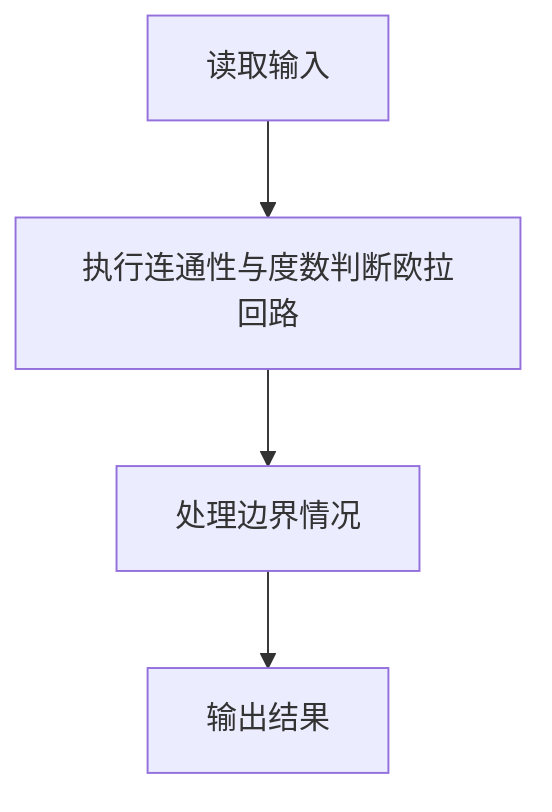
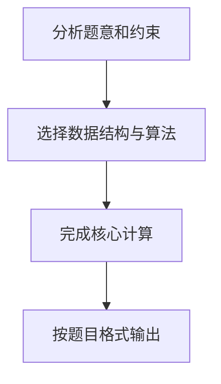

## 7-32 哥尼斯堡的“七桥问题”

- **分值：** 25分

## 题目描述

哥尼斯堡是位于普累格河上的一座城市，它包含两个岛屿及连接它们的七座桥，如下图所示。


可否走过这样的七座桥，而且每桥只走过一次？瑞士数学家欧拉(Leonhard Euler，1707—1783)最终解决了这个问题，并由此创立了拓扑学。

这个问题如今可以描述为判断欧拉回路是否存在的问题。欧拉回路是指不令笔离开纸面，可画过图中每条边仅一次，且可以回到起点的一条回路。现给定一个无向图，问是否存在欧拉回路？

## 输入格式

输入第一行给出两个正整数，分别是节点数 n （1\le n\le 1000）和边数 m；随后的 m 行对应 m 条边，每行给出一对正整数，分别是该条边直接连通的两个节点的编号（节点从1到 n 编号）。

## 输出格式

若欧拉回路存在则输出 1，否则输出 0。

## 输入样例1
```
6 10
1 2
2 3
3 1
4 5
5 6
6 4
1 4
1 6
3 4
3 6
```

## 输出样例1
```
1
```

## 输入样例2
```
5 8
1 2
1 3
2 3
2 4
2 5
5 3
5 4
3 4
```

## 输出样例2
```
0
```

## 解题思路

本题采用连通性与度数判断欧拉回路，围绕题目给出的数据结构和约束完成核心计算，并处理边界情况。

## 代码流程说明

1. 读取题目规定的输入数据。
2. 使用连通性与度数判断欧拉回路完成主要处理。
3. 处理边界情况并整理结果。
4. 按指定格式输出结果。

## 代码实现


```javascript
const fs = require("fs");
const raw = fs.readFileSync(0, "utf8");
const tokens = raw.trim() ? raw.trim().split(/\s+/) : [];
let at = 0;

// 欧拉回路存在当且仅当所有非零度结点连通且每个结点度数为偶数。
const n = Number(tokens[at++]),
  m = Number(tokens[at++]),
  graph = Array.from({ length: n + 1 }, () => []),
  degree = Array(n + 1).fill(0);
for (let i = 0; i < m; i++) {
  const u = Number(tokens[at++]),
    v = Number(tokens[at++]);
  graph[u].push(v);
  graph[v].push(u);
  degree[u]++;
  degree[v]++;
}
const start = degree.findIndex((d, i) => i > 0 && d > 0),
  seen = Array(n + 1).fill(false),
  queue = start < 0 ? [] : [start];
for (let h = 0; h < queue.length; h++) {
  const u = queue[h];
  seen[u] = true;
  for (const v of graph[u]) if (!seen[v]) queue.push(v);
}
console.log(
  degree.every((d, i) => i === 0 || !d || seen[i]) &&
    degree.every((d) => d % 2 === 0)
    ? "1"
    : "0",
);
```

## 代码流程图



## 解题流程图


