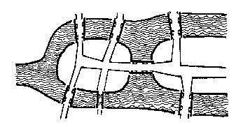

哥尼斯堡是位于普累格河上的一座城市，它包含两个岛屿及连接它们的七座桥，如下图所示。


可否走过这样的七座桥，而且每桥只走过一次？瑞士数学家欧拉(Leonhard Euler，1707—1783)最终解决了这个问题，并由此创立了拓扑学。

这个问题如今可以描述为判断欧拉回路是否存在的问题。欧拉回路是指不令笔离开纸面，可画过图中每条边仅一次，且可以回到起点的一条回路。现给定一个无向图，问是否存在欧拉回路？

输入格式:
输入第一行给出两个正整数，分别是节点数 n （1≤n≤1000）和边数 m；随后的 m 行对应 m 条边，每行给出一对正整数，分别是该条边直接连通的两个节点的编号（节点从1到 n 编号）。

输出格式:
若欧拉回路存在则输出 1，否则输出 0。

输入样例1:
```in
6 10
1 2
2 3
3 1
4 5
5 6
6 4
1 4
1 6
3 4
3 6
```
输出样例1:
```out
1
```
输入样例2:
```in
5 8
1 2
1 3
2 3
2 4
2 5
5 3
5 4
3 4
```
输出样例2:
```out
0
```
