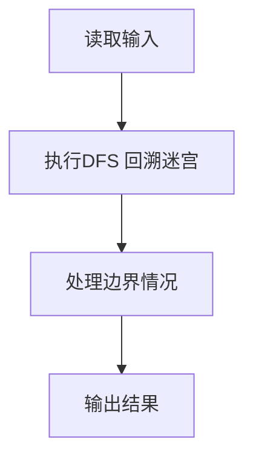
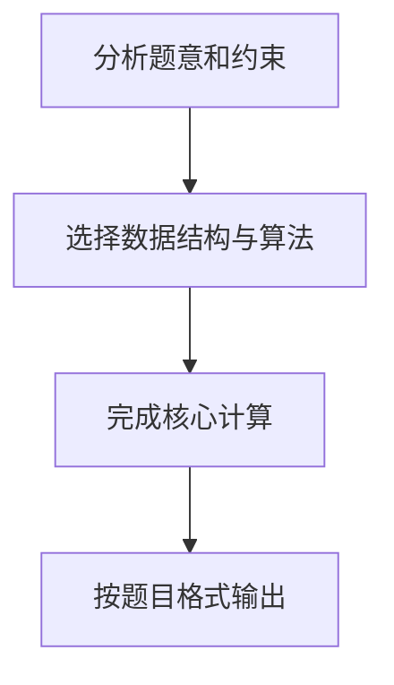

## 7-33 地下迷宫探索

- **分值：** 30分

## 题目描述

地道战是在抗日战争时期，在华北平原上抗日军民利用地道打击日本侵略者的作战方式。地道网是房连房、街连街、村连村的地下工事，如下图所示。


我们在回顾前辈们艰苦卓绝的战争生活的同时，真心钦佩他们的聪明才智。在现在和平发展的年代，对多数人来说，探索地下通道或许只是一种娱乐或者益智的游戏。本实验案例以探索地下通道迷宫作为内容。

假设有一个地下通道迷宫，它的通道都是直的，而通道所有交叉点（包括通道的端点）上都有一盏灯和一个开关。请问你如何从某个起点开始在迷宫中点亮所有的灯并回到起点？


## 输入格式

输入第一行给出三个正整数，分别表示地下迷宫的节点数N（1<N\le 1000，表示通道所有交叉点和端点）、边数M（\le 3000，表示通道数）和探索起始节点编号S（节点从1到N编号）。随后的M行对应M条边（通道），每行给出一对正整数，分别是该条边直接连通的两个节点的编号。

## 输出格式

若可以点亮所有节点的灯，则输出从S开始并以S结束的包含所有节点的序列，序列中相邻的节点一定有边（通道）；否则虽然不能点亮所有节点的灯，但还是输出点亮部分灯的节点序列，最后输出0，此时表示迷宫不是连通图。

由于深度优先遍历的节点序列是不唯一的，为了使得输出具有唯一的结果，我们约定以节点小编号优先的次序访问（点灯）。在点亮所有可以点亮的灯后，以原路返回的方式回到起点。

## 输入样例1
```
6 8 1
1 2
2 3
3 4
4 5
5 6
6 4
3 6
1 5
```

## 输出样例1
```
1 2 3 4 5 6 5 4 3 2 1
```

## 输入样例2
```
6 6 6
1 2
1 3
2 3
5 4
6 5
6 4
```

## 输出样例2
```
6 4 5 4 6 0
```

## 解题思路

本题采用DFS 回溯迷宫，围绕题目给出的数据结构和约束完成核心计算，并处理边界情况。

## 代码流程说明

1. 读取题目规定的输入数据。
2. 使用DFS 回溯迷宫完成主要处理。
3. 处理边界情况并整理结果。
4. 按指定格式输出结果。

## 代码实现


```c
/*
 * 实现原理：
 * 1. 使用邻接表存储图结构，每个节点维护一个邻接节点列表
 * 2. 对每个节点的邻接列表按编号从小到大排序，确保小编号优先访问
 * 3. 使用深度优先搜索(DFS)遍历图，访问节点时将其加入路径
 * 4. DFS回溯时也将节点加入路径，实现"原路返回"的效果
 * 5. 使用visited数组记录已访问的节点，统计访问数量判断是否连通
 * 6. 若访问数量等于总节点数，输出路径；否则路径末尾输出0表示非连通图
 */

#include <stdio.h>
#include <stdlib.h>

#define MAX_NODES 1001  // 节点最大数量，节点编号从1到N

// 邻接表节点结构体
typedef struct AdjNode {
    int vertex;           // 邻接节点编号
    struct AdjNode *next; // 下一个邻接节点
} AdjNode;

// 邻接表头结构体
typedef struct AdjList {
    AdjNode *head;        // 链表头指针
} AdjList;

// 全局变量
AdjList graph[MAX_NODES]; // 图的邻接表
int visited[MAX_NODES];   // 访问标记数组
int path[MAX_NODES * 2];  // 存储路径，最多2*N个节点（去程+回程）
int path_len;             // 当前路径长度
int visit_count;          // 已访问节点数

// 比较函数，用于qsort排序
int cmp(const void *a, const void *b) {
    return *(int *)a - *(int *)b;
}

// 添加边到邻接表
void add_edge(int u, int v) {
    // 创建v节点
    AdjNode *new_node = (AdjNode *)malloc(sizeof(AdjNode));
    new_node->vertex = v;
    new_node->next = NULL;
    
    // 将v插入到u的邻接表头部
    if (graph[u].head == NULL) {
        graph[u].head = new_node;
    } else {
        new_node->next = graph[u].head;
        graph[u].head = new_node;
    }
}

// DFS遍历函数
void dfs(int start) {
    visited[start] = 1;          // 标记为已访问
    visit_count++;               // 访问计数加1
    path[path_len++] = start;    // 将当前节点加入路径
    
    // 收集当前节点的所有邻接节点
    int neighbors[MAX_NODES];
    int neighbor_count = 0;
    AdjNode *p = graph[start].head;
    while (p != NULL) {
        neighbors[neighbor_count++] = p->vertex;
        p = p->next;
    }
    
    // 对邻接节点按编号从小到大排序
    qsort(neighbors, neighbor_count, sizeof(int), cmp);
    
    // 遍历所有邻接节点
    for (int i = 0; i < neighbor_count; i++) {
        int v = neighbors[i];
        if (!visited[v]) {       // 如果邻接节点未被访问
            dfs(v);              // 递归访问
            path[path_len++] = start;  // 回溯时将当前节点加入路径
        }
    }
}

int main() {
    int N, M, S;
    // 读取节点数N、边数M、起始节点S
    scanf("%d %d %d", &N, &M, &S);
    
    // 初始化邻接表
    for (int i = 1; i <= N; i++) {
        graph[i].head = NULL;
        visited[i] = 0;
    }
    
    // 读取M条边并构建邻接表
    for (int i = 0; i < M; i++) {
        int u, v;
        scanf("%d %d", &u, &v);
        add_edge(u, v);  // 添加u->v的边
        add_edge(v, u);  // 添加v->u的边（无向图）
    }
    
    // 初始化路径长度和访问计数
    path_len = 0;
    visit_count = 0;
    
    // 从起始节点S开始DFS遍历
    dfs(S);
    
    // 输出路径中的所有节点
    for (int i = 0; i < path_len; i++) {
        if (i > 0) {
            printf(" ");  // 节点之间用空格分隔
        }
        printf("%d", path[i]);
    }
    
    // 如果未访问所有节点，输出0表示非连通图
    if (visit_count != N) {
        printf(" 0");
    }
    printf("\n");
    
    return 0;
}
```

## 代码流程图



## 解题流程图


