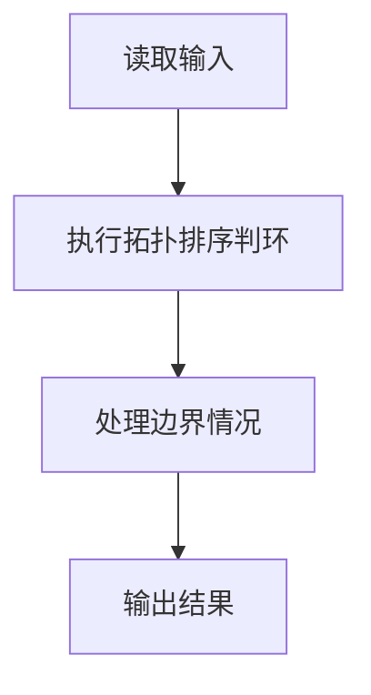
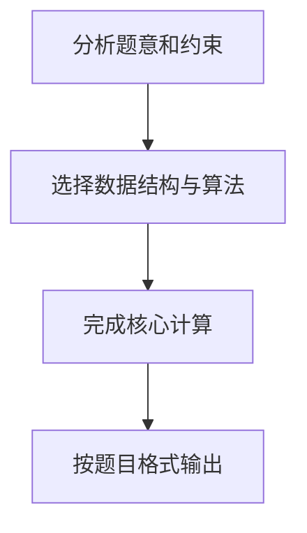

假定一个工程项目由一组子任务构成，子任务之间有的可以并行执行，有的必须在完成了其它一些子任务后才能执行。“任务调度”包括一组子任务、以及每个子任务可以执行所依赖的子任务集。

比如完成一个专业的所有课程学习和毕业设计可以看成一个本科生要完成的一项工程，各门课程可以看成是子任务。有些课程可以同时开设，比如英语和 C 程序设计，它们没有必须先修哪门的约束；有些课程则不可以同时开设，因为它们有先后的依赖关系，比如 C 程序设计和数据结构两门课，必须先学习前者。

但是需要注意的是，对一组子任务，并不是任意的任务调度都是一个可行的方案。比如方案中存在“子任务 a 依赖于子任务 b，子任务 b 依赖于子任务 c，子任务 c 又依赖于子任务 a”，那么这三个任务哪个都不能先执行，这就是一个不可行的方案。你现在的工作是写程序判定任何一个给定的任务调度是否可行。

输入格式:
输入说明：输入第一行给出子任务数 n（≤100），子任务按 1~$$n编号。随后n行，每行给出一个子任务的依赖集合：首先给出依赖集合中的子任务数k，随后给出k$$ 个子任务编号，整数之间都用空格分隔。

输出格式:
如果方案可行，则输出 1，否则输出 0。

输入样例1:
```in
12
0
0
2 1 2
0
1 4
1 5
2 3 6
1 3
2 7 8
1 7
1 10
1 7
```
输出样例1:
```out
1
```
输入样例2:
```in
5
1 4
2 1 4
2 2 5
1 3
0```
```
输出样例2:
```out
0
```

## 解题思路

本题采用拓扑排序判环，围绕题目给出的数据结构和约束完成核心计算，并处理边界情况。

## 代码流程说明

1. 读取题目规定的输入数据。
2. 使用拓扑排序判环完成主要处理。
3. 处理边界情况并整理结果。
4. 按指定格式输出结果。

## 代码实现


```c
/*
 * 实现原理：
 * 1. 问题本质：判断有向图中是否存在环。任务依赖关系构成有向图，若存在环则任务调度不可行
 * 2. 算法选择：采用拓扑排序(Kahn算法)判断有向图是否存在环
 * 3. Kahn算法步骤：
 *    a. 计算每个节点的入度
 *    b. 将入度为0的节点加入队列
 *    c. 从队列取出节点，将其邻接节点的入度减1，若入度变为0则加入队列
 *    d. 重复直到队列为空
 *    e. 若处理的节点数等于总节点数，则无环(可行)；否则有环(不可行)
 * 4. 输入处理：第i行表示任务i的依赖集合，即存在从依赖任务指向任务i的边
 */

#include <stdio.h>
#include <stdlib.h>

#define MAX_NODES 101  // 子任务数最多100，编号从1到100

// 邻接表节点结构体
typedef struct AdjNode {
    int vertex;           // 邻接节点编号
    struct AdjNode *next; // 下一个邻接节点
} AdjNode;

// 邻接表头结构体
typedef struct AdjList {
    AdjNode *head;        // 链表头指针
} AdjList;

// 队列结构体（用于Kahn算法）
typedef struct Queue {
    int data[MAX_NODES];  // 队列数据
    int front;            // 队头指针
    int rear;             // 队尾指针
} Queue;

// 初始化队列
void init_queue(Queue *q) {
    q->front = 0;
    q->rear = 0;
}

// 判断队列是否为空
int is_empty(Queue *q) {
    return q->front == q->rear;
}

// 入队
void enqueue(Queue *q, int val) {
    q->data[q->rear++] = val;
}

// 出队
int dequeue(Queue *q) {
    return q->data[q->front++];
}

// 添加边到邻接表（u -> v，表示任务v依赖任务u）
void add_edge(AdjList *graph, int u, int v) {
    AdjNode *new_node = (AdjNode *)malloc(sizeof(AdjNode));
    new_node->vertex = v;
    new_node->next = NULL;
    
    // 将v插入到u的邻接表头部
    if (graph[u].head == NULL) {
        graph[u].head = new_node;
    } else {
        new_node->next = graph[u].head;
        graph[u].head = new_node;
    }
}

void free_graph(AdjList *graph, int n) {
    for (int i = 1; i <= n; i++) {
        AdjNode *p = graph[i].head;
        while (p != NULL) {
            AdjNode *next = p->next;
            free(p);
            p = next;
        }
    }
}

int main() {
    int n;  // 子任务数
    scanf("%d", &n);
    
    AdjList graph[MAX_NODES];  // 邻接表存储图
    int in_degree[MAX_NODES] = {0};  // 入度数组
    Queue q;  // 队列
    
    // 初始化邻接表
    for (int i = 1; i <= n; i++) {
        graph[i].head = NULL;
    }
    
    // 读取每个任务的依赖关系
    for (int i = 1; i <= n; i++) {
        int k;  // 依赖的任务数
        scanf("%d", &k);
        
        for (int j = 0; j < k; j++) {
            int dep;  // 依赖的任务编号
            scanf("%d", &dep);
            // 添加边 dep -> i（任务i依赖任务dep）
            add_edge(graph, dep, i);
            in_degree[i]++;  // 任务i的入度加1
        }
    }
    
    // 初始化队列
    init_queue(&q);
    
    // 将所有入度为0的节点加入队列
    for (int i = 1; i <= n; i++) {
        if (in_degree[i] == 0) {
            enqueue(&q, i);
        }
    }
    
    int count = 0;  // 记录处理的节点数
    
    // Kahn算法主循环
    while (!is_empty(&q)) {
        int u = dequeue(&q);  // 取出队头节点
        count++;  // 处理节点数加1
        
        // 遍历u的所有邻接节点
        AdjNode *p = graph[u].head;
        while (p != NULL) {
            int v = p->vertex;
            in_degree[v]--;  // 邻接节点v的入度减1
            
            if (in_degree[v] == 0) {  // 如果v的入度变为0
                enqueue(&q, v);  // 将v加入队列
            }
            p = p->next;
        }
    }
    
    // 如果处理的节点数等于总节点数，说明无环，任务调度可行
    if (count == n) {
        printf("1\n");
    } else {  // 否则存在环，任务调度不可行
        printf("0\n");
    }

    free_graph(graph, n);
    return 0;
}
```

## 代码流程图



## 解题流程图


