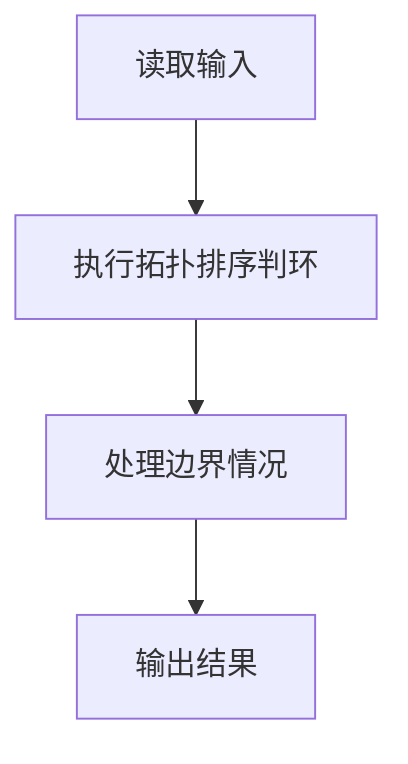
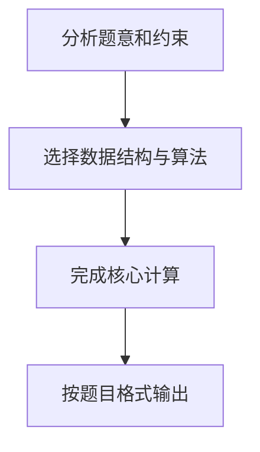

## 7-34 任务调度的合理性

- **分值：** 25分

## 题目描述

假定一个工程项目由一组子任务构成，子任务之间有的可以并行执行，有的必须在完成了其它一些子任务后才能执行。“任务调度”包括一组子任务、以及每个子任务可以执行所依赖的子任务集。

比如完成一个专业的所有课程学习和毕业设计可以看成一个本科生要完成的一项工程，各门课程可以看成是子任务。有些课程可以同时开设，比如英语和 C 程序设计，它们没有必须先修哪门的约束；有些课程则不可以同时开设，因为它们有先后的依赖关系，比如 C 程序设计和数据结构两门课，必须先学习前者。

但是需要注意的是，对一组子任务，并不是任意的任务调度都是一个可行的方案。比如方案中存在“子任务 a 依赖于子任务 b，子任务 b 依赖于子任务 c，子任务 c 又依赖于子任务 a”，那么这三个任务哪个都不能先执行，这就是一个不可行的方案。你现在的工作是写程序判定任何一个给定的任务调度是否可行。

## 输入格式

输入说明：输入第一行给出子任务数 n（\le 100），子任务按 1 ~ n 编号。随后 n 行，每行给出一个子任务的依赖集合：首先给出依赖集合中的子任务数 k，随后给出 k 个子任务编号，整数之间都用空格分隔。

## 输出格式

如果方案可行，则输出 1，否则输出 0。

## 输入样例1
```
12
0
0
2 1 2
0
1 4
1 5
2 3 6
1 3
2 7 8
1 7
1 10
1 7
```

## 输出样例1
```
1
```

## 输入样例2
```
5
1 4
2 1 4
2 2 5
1 3
0
```

## 输出样例2
```
0
```

## 解题思路

本题采用拓扑排序判环，围绕题目给出的数据结构和约束完成核心计算，并处理边界情况。

## 代码流程说明

1. 读取题目规定的输入数据。
2. 使用拓扑排序判环完成主要处理。
3. 处理边界情况并整理结果。
4. 按指定格式输出结果。

## 代码实现


```javascript
const fs = require("fs");
const raw = fs.readFileSync(0, "utf8");
const tokens = raw.trim() ? raw.trim().split(/\s+/) : [];
let at = 0;

// Kahn 拓扑排序：每处理一个依赖完成的任务，就释放它的后继任务。
const n = Number(tokens[at++]),
  graph = Array.from({ length: n + 1 }, () => []),
  indegree = Array(n + 1).fill(0);
for (let i = 1; i <= n; i++) {
  const k = Number(tokens[at++]);
  for (let j = 0; j < k; j++) {
    const prerequisite = Number(tokens[at++]);
    graph[prerequisite].push(i);
    indegree[i]++;
  }
}
const queue = [];
for (let i = 1; i <= n; i++) if (!indegree[i]) queue.push(i);
for (let h = 0; h < queue.length; h++)
  for (const v of graph[queue[h]]) if (--indegree[v] === 0) queue.push(v);
console.log(queue.length === n ? "1" : "0");
```

## 代码流程图



## 解题流程图


