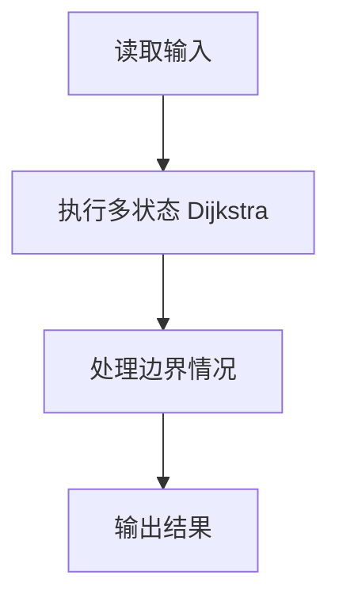
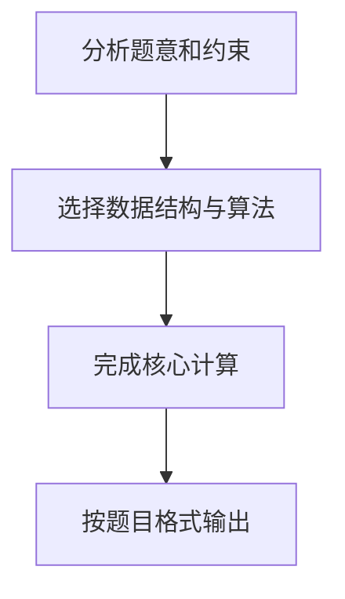

作为一个城市的应急救援队伍的负责人，你有一张特殊的全国地图。在地图上显示有多个分散的城市和一些连接城市的快速道路。每个城市的救援队数量和每一条连接两个城市的快速道路长度都标在地图上。当其他城市有紧急求助电话给你的时候，你的任务是带领你的救援队尽快赶往事发地，同时，一路上召集尽可能多的救援队。

输入格式:
输入第一行给出 4 个正整数 n、m、s、d，其中 n（2≤n≤500）是城市的个数，顺便假设城市的编号为 0 ~ (n−1)；m 是快速道路的条数；s 是出发地的城市编号；d是目的地的城市编号。

第二行给出 n 个正整数，其中第 i 个数是第 i 个城市的救援队的数目，数字间以空格分隔。随后的 m 行中，每行给出一条快速道路的信息，分别是：城市 1、城市 2、快速道路的长度，中间用空格分开，数字均为整数且不超过 500。输入保证救援可行且最优解唯一。

输出格式:
第一行输出最短路径的条数和能够召集的最多的救援队数量。第二行输出从 s 到 d 的路径中经过的城市编号。数字间以空格分隔，输出结尾不能有多余空格。

输入样例:
```in
4 5 0 3
20 30 40 10
0 1 1
1 3 2
0 3 3
0 2 2
2 3 2
```

输出样例:
```out
2 60
0 1 3
```

## 解题思路

本题采用多状态 Dijkstra，围绕题目给出的数据结构和约束完成核心计算，并处理边界情况。

## 代码流程说明

1. 读取题目规定的输入数据。
2. 使用多状态 Dijkstra完成主要处理。
3. 处理边界情况并整理结果。
4. 按指定格式输出结果。

## 代码实现


```c
/*
 * 实现原理：
 * 1. 问题本质：带权无向图的最短路径问题，需同时求最短路径条数和最大救援队数量
 * 2. 算法选择：采用Dijkstra算法求解单源最短路径
 * 3. Dijkstra算法扩展：
 *    a. dist[]：存储从起点到各城市的最短距离
 *    b. count[]：存储从起点到各城市的最短路径条数
 *    c. teams[]：存储从起点到各城市能召集的最多救援队数量
 *    d. path[]：存储路径前驱节点，用于重构路径
 * 4. 松弛操作时的更新规则：
 *    a. 若新路径更短：更新距离，继承路径条数和救援队数
 *    b. 若新路径长度相等：累加路径条数，取救援队数的最大值
 * 5. 使用邻接矩阵存储图，方便快速访问边权
 */

#include <stdio.h>
#include <string.h>

#define MAX_N 501        // 城市最大数量
#define INF 0x3f3f3f3f   // 无穷大，表示不可达

int main() {
    int n, m, s, d;
    // 读取城市数n、道路数m、起点s、终点d
    scanf("%d %d %d %d", &n, &m, &s, &d);
    
    int rescue[MAX_N];  // 每个城市的救援队数量
    // 读取每个城市的救援队数量
    for (int i = 0; i < n; i++) {
        scanf("%d", &rescue[i]);
    }
    
    // 邻接矩阵存储图，graph[i][j]表示城市i到j的道路长度
    int graph[MAX_N][MAX_N];
    // 初始化邻接矩阵为无穷大
    memset(graph, 0x3f, sizeof(graph));
    // 对角线元素为0（自己到自己）
    for (int i = 0; i < n; i++) {
        graph[i][i] = 0;
    }
    
    // 读取m条道路信息
    for (int i = 0; i < m; i++) {
        int u, v, len;
        scanf("%d %d %d", &u, &v, &len);
        // 无向图，双向赋值
        graph[u][v] = len;
        graph[v][u] = len;
    }
    
    int dist[MAX_N];    // 最短距离数组
    int count[MAX_N];   // 最短路径条数数组
    int teams[MAX_N];   // 最大救援队数量数组
    int path[MAX_N];    // 路径前驱数组
    int visited[MAX_N]; // 访问标记数组
    
    // 初始化数组
    memset(dist, 0x3f, sizeof(dist));
    memset(count, 0, sizeof(count));
    memset(teams, 0, sizeof(teams));
    memset(path, -1, sizeof(path));
    memset(visited, 0, sizeof(visited));
    
    // 起点初始化
    dist[s] = 0;              // 起点到自身距离为0
    count[s] = 1;             // 起点到自身路径数为1
    teams[s] = rescue[s];     // 起点的救援队数量
    
    // Dijkstra算法主循环
    for (int i = 0; i < n; i++) {
        // 找到未访问的距离最小的节点
        int u = -1;
        int min_dist = INF;
        for (int j = 0; j < n; j++) {
            if (!visited[j] && dist[j] < min_dist) {
                min_dist = dist[j];
                u = j;
            }
        }
        
        if (u == -1) break;  // 所有可达节点已处理
        visited[u] = 1;      // 标记为已访问
        
        // 松弛操作：更新所有邻接节点
        for (int v = 0; v < n; v++) {
            if (!visited[v] && graph[u][v] != INF) {
                if (dist[u] + graph[u][v] < dist[v]) {
                    // 情况1：新路径更短
                    dist[v] = dist[u] + graph[u][v];
                    count[v] = count[u];          // 继承路径条数
                    teams[v] = teams[u] + rescue[v];  // 累加救援队数
                    path[v] = u;                  // 记录前驱
                } else if (dist[u] + graph[u][v] == dist[v]) {
                    // 情况2：路径长度相等
                    count[v] += count[u];         // 累加路径条数
                    if (teams[u] + rescue[v] > teams[v]) {
                        teams[v] = teams[u] + rescue[v];  // 更新最大救援队数
                        path[v] = u;              // 更新前驱以保证最优路径
                    }
                }
            }
        }
    }
    
    // 输出最短路径条数和最多救援队数量
    printf("%d %d\n", count[d], teams[d]);
    
    // 重构路径：从终点回溯到起点
    int route[MAX_N];  // 存储路径
    int route_len = 0;
    int cur = d;
    while (cur != -1) {
        route[route_len++] = cur;
        cur = path[cur];
    }
    
    // 反向输出路径（从起点到终点）
    for (int i = route_len - 1; i >= 0; i--) {
        if (i != route_len - 1) {
            printf(" ");  // 城市之间用空格分隔
        }
        printf("%d", route[i]);
    }
    printf("\n");
    
    return 0;
}
```

## 代码流程图



## 解题流程图


