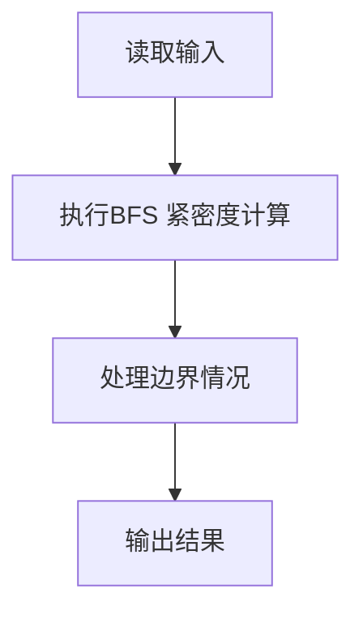
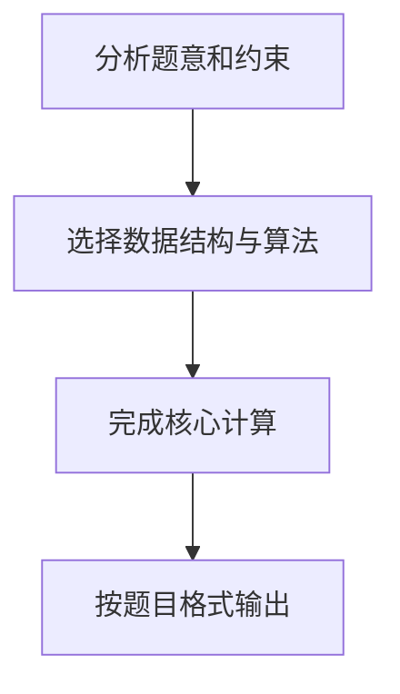

## 7-36 社交网络图中结点的“重要性”计算

- **分值：** 30分

## 题目描述

在社交网络中，个人或单位（结点）之间通过某些关系（边）联系起来。他们受到这些关系的影响，这种影响可以理解为网络中相互连接的结点之间蔓延的一种相互作用，可以增强也可以减弱。而结点根据其所处的位置不同，其在网络中体现的重要性也不尽相同。

“紧密度中心性”是用来衡量一个结点到达其它结点的“快慢”的指标，即一个有较高中心性的结点比有较低中心性的结点能够更快地（平均意义下）到达网络中的其它结点，因而在该网络的传播过程中有更重要的价值。在有 n 个结点的网络中，结点 v_i 的“紧密度中心性” Cc(v_i) 数学上定义为 v_i 到其余所有结点 v_j (j\ne i) 的最短距离 d(v_i, v_j) 的平均值的倒数：


对于非连通图，所有结点的紧密度中心性都是 0。

给定一个无权的无向图以及其中的一组结点，计算这组结点中每个结点的紧密度中心性。

## 输入格式

输入第一行给出两个正整数 n 和 m，其中 n（\le 10^3）是图中结点个数，顺便假设结点从 1 到 n 编号；m（\le 10^4）是边的条数。随后的 m 行中，每行给出一条边的信息，即该边连接的两个结点编号，中间用空格分隔。最后一行给出需要计算紧密度中心性的这组结点的个数 k（\le 100）以及 k 个结点编号，用空格分隔。

## 输出格式

按照 `Cc(i)=x.xx` 的格式输出 k 个给定结点的紧密度中心性，每个输出占一行，结果保留到小数点后 2 位。

## 输入样例
```
9 14
1 2
1 3
1 4
2 3
3 4
4 5
4 6
5 6
5 7
5 8
6 7
6 8
7 8
7 9
3 3 4 9
```

## 输出样例
```
Cc(3)=0.47
Cc(4)=0.62
Cc(9)=0.35
```

## 解题思路

本题采用BFS 紧密度计算，围绕题目给出的数据结构和约束完成核心计算，并处理边界情况。

## 代码流程说明

1. 读取题目规定的输入数据。
2. 使用BFS 紧密度计算完成主要处理。
3. 处理边界情况并整理结果。
4. 按指定格式输出结果。

## 代码实现


```c
/*
 * 实现原理：
 * 1. 问题本质：计算无向无权图中指定结点的紧密度中心性
 * 2. 紧密度中心性公式：Cc(v_i) = (n-1) / Σ(d(v_i, v_j))，其中j≠i
 *    - n为结点总数
 *    - d(v_i, v_j)为结点v_i到v_j的最短距离
 *    - 非连通图中，所有结点的紧密度中心性为0
 * 3. 算法选择：使用BFS（广度优先搜索）计算单源最短路径
 *    - BFS适合无权图的最短路径计算，时间复杂度O(n+m)
 *    - 对每个查询结点执行一次BFS
 * 4. 图的存储：使用邻接表存储图，节省空间且便于遍历邻接结点
 * 5. 计算步骤：
 *    a. 构建图的邻接表
 *    b. 对每个查询结点执行BFS，计算到所有其他结点的最短距离之和
 *    c. 根据公式计算紧密度中心性
 *    d. 输出结果，保留两位小数
 */

#include <stdio.h>
#include <stdlib.h>
#include <string.h>

#define MAX_N 1001  // 结点最大数量

// 邻接表节点结构体
typedef struct AdjNode {
    int vertex;           // 邻接结点编号
    struct AdjNode *next; // 下一个邻接结点
} AdjNode;

// 邻接表头结构体
typedef struct AdjList {
    AdjNode *head;        // 链表头指针
} AdjList;

// 队列结构体（用于BFS）
typedef struct Queue {
    int data[MAX_N];      // 队列数据
    int front;            // 队头指针
    int rear;             // 队尾指针
} Queue;

// 初始化队列
void init_queue(Queue *q) {
    q->front = 0;
    q->rear = 0;
}

// 判断队列是否为空
int is_empty(Queue *q) {
    return q->front == q->rear;
}

// 入队
void enqueue(Queue *q, int val) {
    q->data[q->rear++] = val;
}

// 出队
int dequeue(Queue *q) {
    return q->data[q->front++];
}

// 添加边到邻接表（无向图，双向添加）
void add_edge(AdjList *graph, int u, int v) {
    // 添加 u -> v
    AdjNode *new_node = (AdjNode *)malloc(sizeof(AdjNode));
    new_node->vertex = v;
    new_node->next = NULL;
    
    if (graph[u].head == NULL) {
        graph[u].head = new_node;
    } else {
        new_node->next = graph[u].head;
        graph[u].head = new_node;
    }
    
    // 添加 v -> u
    new_node = (AdjNode *)malloc(sizeof(AdjNode));
    new_node->vertex = u;
    new_node->next = NULL;
    
    if (graph[v].head == NULL) {
        graph[v].head = new_node;
    } else {
        new_node->next = graph[v].head;
        graph[v].head = new_node;
    }
}

void free_graph(AdjList *graph, int n) {
    int i;

    for (i = 1; i <= n; i++) {
        AdjNode *p = graph[i].head;
        while (p != NULL) {
            AdjNode *next = p->next;
            free(p);
            p = next;
        }
    }
}

// BFS计算从start到所有结点的最短距离，并返回距离之和
int bfs(AdjList *graph, int n, int start) {
    int dist[MAX_N];      // 存储从start到各结点的最短距离
    int visited[MAX_N];   // 访问标记数组
    Queue q;              // BFS队列
    
    // 初始化距离数组为-1（表示未访问）
    memset(dist, -1, sizeof(dist));
    memset(visited, 0, sizeof(visited));
    init_queue(&q);
    
    // 起点初始化
    dist[start] = 0;      // 起点到自身距离为0
    visited[start] = 1;   // 标记为已访问
    enqueue(&q, start);   // 入队
    
    // BFS主循环
    while (!is_empty(&q)) {
        int u = dequeue(&q);  // 取出队头结点
        
        // 遍历u的所有邻接结点
        AdjNode *p = graph[u].head;
        while (p != NULL) {
            int v = p->vertex;
            if (!visited[v]) {  // 如果邻接结点未被访问
                dist[v] = dist[u] + 1;  // 更新距离
                visited[v] = 1;         // 标记为已访问
                enqueue(&q, v);        // 入队
            }
            p = p->next;
        }
    }
    
    // 计算距离之和
    int sum = 0;
    for (int i = 1; i <= n; i++) {
        if (dist[i] == -1) {  // 如果有结点不可达，说明图不连通
            return -1;        // 返回-1表示不连通
        }
        sum += dist[i];
    }
    
    return sum;
}

int main() {
    int n, m;
    // 读取结点数n和边数m
    scanf("%d %d", &n, &m);
    
    AdjList graph[MAX_N];  // 邻接表存储图
    
    // 初始化邻接表
    for (int i = 1; i <= n; i++) {
        graph[i].head = NULL;
    }
    
    // 读取m条边
    for (int i = 0; i < m; i++) {
        int u, v;
        scanf("%d %d", &u, &v);
        add_edge(graph, u, v);  // 添加无向边
    }
    
    int k;
    // 读取查询结点个数k
    scanf("%d", &k);
    
    // 处理每个查询结点
    for (int i = 0; i < k; i++) {
        int node;
        scanf("%d", &node);
        
        // BFS计算距离之和
        int sum_dist = bfs(graph, n, node);
        
        double cc;
        if (sum_dist == -1 || n <= 1) {
            cc = 0.0;  // 图不连通，紧密度中心性为0
        } else {
            // 紧密度中心性 = (n-1) / 距离之和
            cc = (double)(n - 1) / sum_dist;
        }
        
        // 输出结果，保留两位小数
        printf("Cc(%d)=%.2f\n", node, cc);
    }

    free_graph(graph, n);

    return 0;
}
```

## 代码流程图



## 解题流程图


