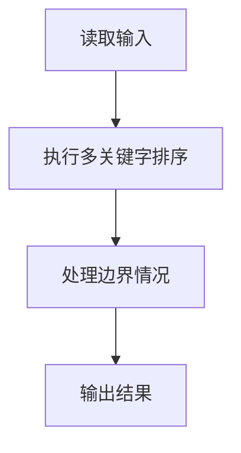
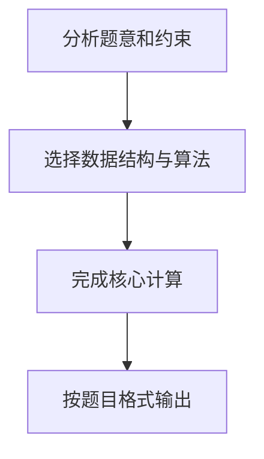

# 7-37 模拟EXCEL排序

- **分值：** 25分

## 题目描述

Excel可以对一组纪录按任意指定列排序。现请编写程序实现类似功能。

## 输入格式

输入的第一行包含两个正整数 $$n$$ ($$\le 10^5$$) 和 $$c$$，其中 $$n$$ 是纪录的条数，$$c$$ 是指定排序的列号。之后有 $$n$$ 行，每行包含一条学生纪录。每条学生纪录由学号（6 位数字，保证没有重复的学号）、姓名（不超过 8 位且不包含空格的字符串）、成绩（[0, 100] 内的整数）组成，相邻属性用 1 个空格隔开。

## 输出格式

在 $$n$$ 行中输出按要求排序后的结果，即：当 $$c=1$$ 时，按学号递增排序；当 $$c=2$$ 时，按姓名的非递减字典序排序；当 $$c=3$$ 时，按成绩的非递减排序。当若干学生具有相同姓名或者相同成绩时，则按他们的学号递增排序。

## 输入样例
```
3 1
000007 James 85
000010 Amy 90
000001 Zoe 60
```

## 输出样例
```
000001 Zoe 60
000007 James 85
000010 Amy 90
```

### 算法提示

1. **数据结构**：使用结构体（或类）存储每条学生记录
2. **排序策略**：
   - 使用语言内置的排序函数（如 C++ 的 `sort`、Python 的 `sorted`）
   - 自定义比较函数或 lambda 表达式实现多级排序
3. **性能注意**：
   - 输入规模可达 10⁵，需注意输入读取效率
   - C/C++ 建议使用 `scanf`，Python 建议使用 `sys.stdin`
4. **稳定排序**：学号作为次要排序键，确保排序结果的唯一性

## 解题思路

本题采用多关键字排序，围绕题目给出的数据结构和约束完成核心计算，并处理边界情况。

## 代码流程说明

1. 读取题目规定的输入数据。
2. 使用多关键字排序完成主要处理。
3. 处理边界情况并整理结果。
4. 按指定格式输出结果。

## 代码实现


```c
/*
 * 实现原理：
 * 1. 问题本质：多关键字排序问题，根据指定列号对学生记录进行排序
 * 2. 排序规则：
 *    - c=1：按学号递增排序（学号唯一）
 *    - c=2：按姓名非递减字典序排序，姓名相同时按学号递增排序
 *    - c=3：按成绩非递减排序，成绩相同时按学号递增排序
 * 3. 数据结构：使用结构体存储学生记录（学号、姓名、成绩）
 * 4. 算法选择：使用qsort函数进行排序，自定义比较函数实现多级排序
 * 5. 输入输出：使用scanf/printf进行高效的输入输出，适合大规模数据
 */

#include <stdio.h>
#include <stdlib.h>
#include <string.h>

#define MAX_N 100001  // 最大记录条数（10^5 + 1）

// 学生记录结构体
typedef struct Student {
    char id[7];      // 学号，6位数字，加1位结束符
    char name[9];    // 姓名，最多8位字符，加1位结束符
    int score;       // 成绩，0-100的整数
} Student;

Student students[MAX_N];  // 存储所有学生记录
int sort_column;          // 全局变量，存储当前排序的列号

// 比较函数，用于qsort
int cmp(const void *a, const void *b) {
    Student *sa = (Student *)a;
    Student *sb = (Student *)b;
    
    switch (sort_column) {
        case 1:
            // c=1：按学号递增排序
            return strcmp(sa->id, sb->id);
        case 2:
            // c=2：按姓名排序，姓名相同时按学号排序
            {
                int name_cmp = strcmp(sa->name, sb->name);
                if (name_cmp != 0) {
                    return name_cmp;
                }
            }
            // 姓名相同，按学号递增排序
            return strcmp(sa->id, sb->id);
        case 3:
            // c=3：按成绩排序，成绩相同时按学号排序
            if (sa->score != sb->score) {
                return sa->score - sb->score;
            }
            // 成绩相同，按学号递增排序
            return strcmp(sa->id, sb->id);
        default:
            return 0;
    }
}

int main() {
    int n, c;
    // 读取记录条数n和排序列号c
    scanf("%d %d", &n, &c);
    
    sort_column = c;  // 设置全局排序列号
    
    // 读取n条学生记录
    for (int i = 0; i < n; i++) {
        scanf("%s %s %d", students[i].id, students[i].name, &students[i].score);
    }
    
    // 使用qsort进行排序
    qsort(students, n, sizeof(Student), cmp);
    
    // 输出排序后的结果
    for (int i = 0; i < n; i++) {
        printf("%s %s %d\n", students[i].id, students[i].name, students[i].score);
    }
    
    return 0;
}
```

## 代码流程图



## 解题流程图


