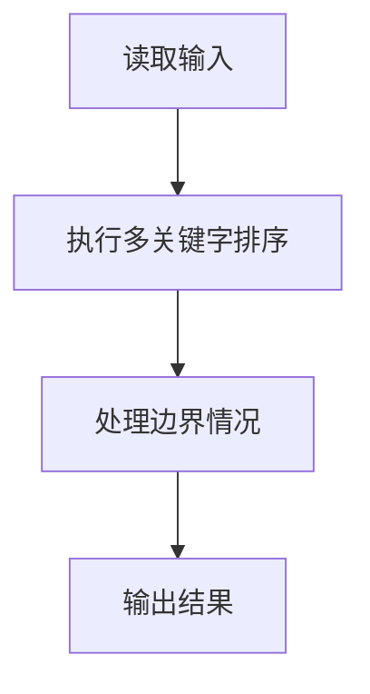
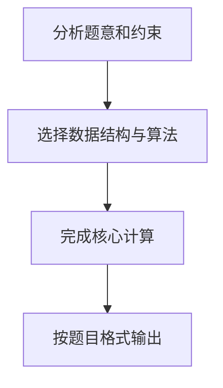

## 7-37 模拟EXCEL排序

- **分值：** 25分

## 题目描述

Excel可以对一组纪录按任意指定列排序。现请编写程序实现类似功能。

## 输入格式

输入的第一行包含两个正整数 n (\le 10^5) 和 c，其中 n 是纪录的条数，c 是指定排序的列号。之后有 n 行，每行包含一条学生纪录。每条学生纪录由学号（6 位数字，保证没有重复的学号）、姓名（不超过 8 位且不包含空格的字符串）、成绩（[0, 100] 内的整数）组成，相邻属性用 1 个空格隔开。

## 输出格式

在 n 行中输出按要求排序后的结果，即：当 c=1 时，按学号递增排序；当 c=2 时，按姓名的非递减字典序排序；当 c=3 时，按成绩的非递减排序。当若干学生具有相同姓名或者相同成绩时，则按他们的学号递增排序。

## 输入样例
```
3 1
000007 James 85
000010 Amy 90
000001 Zoe 60
```

## 输出样例
```
000001 Zoe 60
000007 James 85
000010 Amy 90
```

## 算法提示

1. **数据结构**：使用结构体（或类）存储每条学生记录
2. **排序策略**：
   - 使用语言内置的排序函数（如 C++ 的 `sort`、Python 的 `sorted`）
   - 自定义比较函数或 lambda 表达式实现多级排序
3. **性能注意**：
   - 输入规模可达 10⁵，需注意输入读取效率
   - JavaScript 建议使用 `fs.readFileSync(0, 'utf8')`，Python 建议使用 `sys.stdin`
4. **稳定排序**：学号作为次要排序键，确保排序结果的唯一性

## 解题思路

本题采用多关键字排序，围绕题目给出的数据结构和约束完成核心计算，并处理边界情况。

## 代码流程说明

1. 读取题目规定的输入数据。
2. 使用多关键字排序完成主要处理。
3. 处理边界情况并整理结果。
4. 按指定格式输出结果。

## 代码实现


```javascript
const fs = require("fs");
const raw = fs.readFileSync(0, "utf8");
const tokens = raw.trim() ? raw.trim().split(/\s+/) : [];
let at = 0;

// 按指定列排序，比较相等时用学号保证结果稳定且确定。
const n = Number(tokens[at++]),
  column = Number(tokens[at++]),
  rows = [];
for (let i = 0; i < n; i++) {
  const id = tokens[at++],
    name = tokens[at++],
    score = Number(tokens[at++]);
  rows.push({ id, name, score });
}
rows.sort((a, b) => {
  const ka = column === 1 ? a.id : column === 2 ? a.name : a.score,
    kb = column === 1 ? b.id : column === 2 ? b.name : b.score;
  const cmp = typeof ka === "number" ? ka - kb : ka.localeCompare(kb);
  return cmp || a.id.localeCompare(b.id);
});
console.log(rows.map((r) => `${r.id} ${r.name} ${r.score}`).join("\n"));
```

## 代码流程图



## 解题流程图


