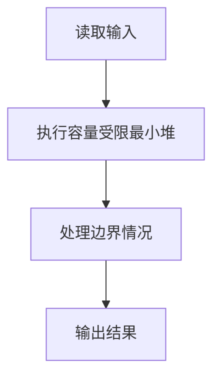
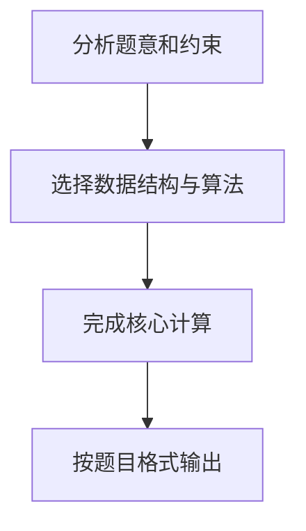

## 7-38 寻找大富翁

- **分值：** 25分

## 题目描述

胡润研究院的调查显示，截至2017年底，中国个人资产超过1亿元的高净值人群达15万人。假设给出N个人的个人资产值，请快速找出资产排前M位的大富翁。

## 输入格式

输入首先给出两个正整数N（\le 10^6）和M（\le 10），其中N为总人数，M为需要找出的大富翁数；接下来一行给出N个人的个人资产值，以百万元为单位，为不超过长整型范围的整数。数字间以空格分隔。

## 输出格式

在一行内按非递增顺序输出资产排前M位的大富翁的个人资产值。数字间以空格分隔，但结尾不得有多余空格。

## 输入样例
```
8 3
8 12 7 3 20 9 5 18
```

## 输出样例
```
20 18 12
```

## 解题思路

本题采用容量受限最小堆，围绕题目给出的数据结构和约束完成核心计算，并处理边界情况。

## 代码流程说明

1. 读取题目规定的输入数据。
2. 使用容量受限最小堆完成主要处理。
3. 处理边界情况并整理结果。
4. 按指定格式输出结果。

## 代码实现


```c
/*
 * 7-38 寻找大富翁
 * 实现原理：使用最小堆（Min-Heap）解决Top-K问题
 * 
 * 问题分析：
 * - 给定N个数字，找出最大的M个数字（M ≤ 10）
 * - N最大可达10^6，直接排序效率太低（O(N*logN)）
 * 
 * 算法选择：
 * - 使用大小为M的最小堆
 * - 遍历所有数字，维护堆中始终是当前遇到的最大M个数字
 * - 堆顶是这M个数字中的最小值
 * - 时间复杂度：O(N*logM)，空间复杂度：O(M)
 * 
 * 步骤：
 * 1. 初始化一个大小为M的最小堆
 * 2. 读取每个数字：
 *    - 如果堆未满，将数字插入堆
 *    - 如果堆已满，且当前数字 > 堆顶，替换堆顶并调整堆
 * 3. 堆构建完成后，堆中存储的就是最大的M个数字
 * 4. 将堆中元素按降序输出
 */

#include <stdio.h>
#include <stdlib.h>

#define MAX_M 10

// 最小堆结构体
typedef struct {
    long long data[MAX_M];  // 堆数据存储，最大值不超过长整型
    int size;               // 当前堆中元素个数
    int capacity;           // 堆的最大容量
} MinHeap;

// 初始化最小堆
void initHeap(MinHeap *heap, int capacity) {
    heap->size = 0;
    heap->capacity = capacity;
}

// 交换两个long long类型的值
void swap(long long *a, long long *b) {
    long long temp = *a;
    *a = *b;
    *b = temp;
}

// 向上调整堆（插入时使用）
void siftUp(MinHeap *heap, int index) {
    int parent = (index - 1) / 2;
    while (index > 0 && heap->data[index] < heap->data[parent]) {
        swap(&heap->data[index], &heap->data[parent]);
        index = parent;
        parent = (index - 1) / 2;
    }
}

// 向下调整堆（替换堆顶时使用）
void siftDown(MinHeap *heap, int index) {
    int left, right, smallest;
    while (1) {
        left = 2 * index + 1;
        right = 2 * index + 2;
        smallest = index;
        
        if (left < heap->size && heap->data[left] < heap->data[smallest]) {
            smallest = left;
        }
        if (right < heap->size && heap->data[right] < heap->data[smallest]) {
            smallest = right;
        }
        if (smallest == index) {
            break;
        }
        swap(&heap->data[index], &heap->data[smallest]);
        index = smallest;
    }
}

// 插入元素到堆
void insert(MinHeap *heap, long long value) {
    if (heap->size < heap->capacity) {
        heap->data[heap->size] = value;
        siftUp(heap, heap->size);
        heap->size++;
    } else if (value > heap->data[0]) {
        heap->data[0] = value;
        siftDown(heap, 0);
    }
}

// 堆排序（降序）
void heapSort(MinHeap *heap) {
    int i;
    int originalSize = heap->size;
    
    for (i = heap->size - 1; i > 0; i--) {
        swap(&heap->data[0], &heap->data[i]);
        heap->size--;
        siftDown(heap, 0);
    }
    
    heap->size = originalSize;
}

int main() {
    int N, M;
    long long num;
    MinHeap heap;
    
    // 读取N和M
    scanf("%d %d", &N, &M);
    
    // 如果M为0或N为0，直接输出空行
    if (M == 0 || N == 0) {
        printf("\n");
        return 0;
    }
    
    // 初始化最小堆
    initHeap(&heap, M);
    
    // 读取N个数字并维护最小堆
    for (int i = 0; i < N; i++) {
        scanf("%lld", &num);
        insert(&heap, num);
    }
    
    // 对堆进行排序（降序）
    heapSort(&heap);
    
    // 输出结果，数字间用空格分隔，末尾无多余空格
    for (int i = 0; i < heap.size; i++) {
        if (i > 0) {
            printf(" ");
        }
        printf("%lld", heap.data[i]);
    }
    printf("\n");
    
    return 0;
}
```

## 代码流程图



## 解题流程图


