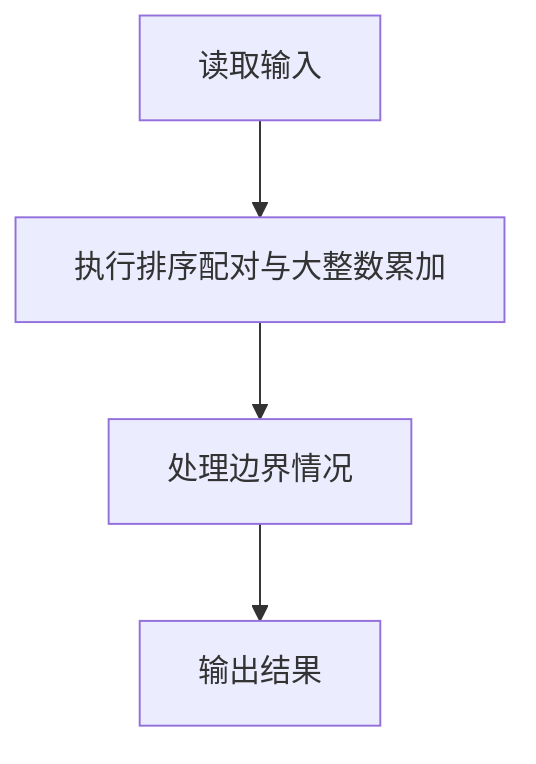
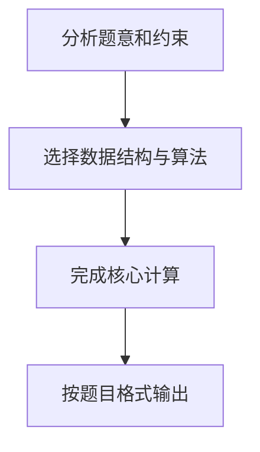

在火星上有个魔法商店，提供魔法优惠券。每个优惠券上印有一个整数面值 K，表示若你在购买某商品时使用这张优惠券，可以得到 K 倍该商品价值的回报！该商店还免费赠送一些有价值的商品，但是如果你在领取免费赠品时使用面值为正的优惠券，则必须倒贴给商店 K 倍该商品价值的金额……不过不要紧，还有面值为负的优惠券可以用！（真是神奇的火星）

例如，给定一组优惠券，面值分别为 1、2、4、-1；对应一组商品，价值为火星币 M7、6、−2、−3，其中负的价值表示该商品是免费赠品。我们可以将优惠券 3（面值 4）用在商品 1（价值 7）上，得到 M28 的回报；优惠券 2（面值 2）用在商品 2（价值 6）上，得到 M12 的回报；优惠券 4（面值 -1）用在商品 4（价值 -3）上，得到 M3 的回报。但是如果一不小心把优惠券 3（面值 4）用在商品 4（价值 -3）上，你必须倒贴给商店 M12。同样，当你一不小心把优惠券 4（面值 -1）用在商品 1（价值 7）上，你必须倒贴给商店 M7。

规定每张优惠券和每件商品都只能被使用一次，求你可以得到的最大回报。

**输入格式**

输入有两行：
- 第一行首先给出优惠券的个数 N，随后给出 N 个优惠券的整数面值。
- 第二行首先给出商品的个数 M，随后给出 M 个商品的整数价值。

其中 N 和 M 的范围为 [1, 10^6]，所有数据的绝对值不超过 2^30，数字间以空格分隔。

**输出格式**

输出可以得到的最大回报。

**输入样例**

```in
4 1 2 4 -1
4 7 6 -2 -3
```

**输出样例**

```out
43
```

## 解题思路

本题采用排序配对与大整数累加，围绕题目给出的数据结构和约束完成核心计算，并处理边界情况。

## 代码流程说明

1. 读取题目规定的输入数据。
2. 使用排序配对与大整数累加完成主要处理。
3. 处理边界情况并整理结果。
4. 按指定格式输出结果。

## 代码实现


```c
/*
 * 魔法优惠券问题 - C语言实现
 * 
 * 【实现原理】
 * 这是一个贪心算法问题。要最大化优惠券与商品配对的总回报，需要遵循以下策略：
 * 
 * 1. 将优惠券和商品分别按升序排序
 * 2. 使用双指针法：
 *    - 左指针从最小元素开始（可能是负数）
 *    - 右指针从最大元素开始（可能是正数）
 * 3. 比较两端乘积：
 *    - 如果左边两个负数相乘（结果为正数），乘积大于右边两个正数相乘，则取左边配对
 *    - 否则取右边配对
 *    - 当遇到正数与负数相乘（结果为负数）时，停止该方向的配对
 * 4. 累加所有有效配对的乘积，得到最大回报
 * 
 * 【贪心策略证明】
 * - 对于正数：最大的正数应该与最大的正数相乘，才能得到最大的乘积
 * - 对于负数：最小的负数应该与最小的负数相乘，因为负数×负数=正数，且绝对值越大结果越大
 * - 正数与负数相乘会产生负回报，应避免这种配对
 * 
 * 【时间复杂度】
 * O(N log N + M log M)，其中N是优惠券数量，M是商品数量
 * 主要开销来自排序操作
 */

#include <stdio.h>
#include <stdlib.h>
#include <stdint.h>

#define BIG_BASE 1000000000U
#define BIG_DIGITS 16

typedef struct {
    uint32_t digit[BIG_DIGITS];
    int size;
} BigInteger;

static void add_u64(BigInteger *value, uint64_t addend) {
    int i = 0;
    uint64_t carry = 0;

    while (addend != 0 || carry != 0) {
        uint64_t part = addend % BIG_BASE;
        uint64_t sum = (uint64_t)value->digit[i] + part + carry;
        value->digit[i] = (uint32_t)(sum % BIG_BASE);
        carry = sum / BIG_BASE;
        addend /= BIG_BASE;
        if (i + 1 > value->size) {
            value->size = i + 1;
        }
        i++;
    }
}

static void print_big_integer(const BigInteger *value) {
    int i;

    if (value->size == 0) {
        puts("0");
        return;
    }
    printf("%u", value->digit[value->size - 1]);
    for (i = value->size - 2; i >= 0; i--) {
        printf("%09u", value->digit[i]);
    }
    putchar('\n');
}

// 比较函数，用于qsort升序排序
int cmp(const void *a, const void *b) {
    long long left = *(const long long *)a;
    long long right = *(const long long *)b;
    return (left > right) - (left < right);
}

int main() {
    // 乘积本身可以放入long long，但所有乘积的总和可能超过64位整数。
    int n, m;
    BigInteger res = {{0}, 0};
    
    // 读取优惠券数量和优惠券数组
    scanf("%d", &n);
    long long *coupons = (long long *)malloc(n * sizeof(long long));
    for (int i = 0; i < n; i++) {
        scanf("%lld", &coupons[i]);
    }
    
    // 读取商品数量和商品数组
    scanf("%d", &m);
    long long *products = (long long *)malloc(m * sizeof(long long));
    for (int i = 0; i < m; i++) {
        scanf("%lld", &products[i]);
    }
    
    // 对优惠券数组和商品数组进行升序排序
    qsort(coupons, n, sizeof(long long), cmp);
    qsort(products, m, sizeof(long long), cmp);
    
    // 初始化双指针：左指针从数组头部开始，右指针从数组尾部开始
    int left_c = 0, left_p = 0;
    int right_c = n - 1, right_p = m - 1;
    
    // 处理正数部分：从右向左配对最大的正数
    while (right_c >= left_c && right_p >= left_p) {
        // 如果两个正数相乘，累加结果并移动指针
        if (coupons[right_c] > 0 && products[right_p] > 0) {
            add_u64(&res, (uint64_t)(coupons[right_c] * products[right_p]));
            right_c--;
            right_p--;
        } else {
            // 如果遇到非正数配对，停止正数部分处理
            break;
        }
    }
    
    // 处理负数部分：从左向右配对最小的负数（负数×负数=正数）
    while (left_c <= right_c && left_p <= right_p) {
        // 如果两个负数相乘（结果为正），累加结果并移动指针
        if (coupons[left_c] < 0 && products[left_p] < 0) {
            add_u64(&res, (uint64_t)(coupons[left_c] * products[left_p]));
            left_c++;
            left_p++;
        } else {
            // 如果遇到非负数配对，停止负数部分处理
            break;
        }
    }
    
    // 输出最大回报
    print_big_integer(&res);
    
    // 释放动态分配的内存
    free(coupons);
    free(products);
    
    return 0;
}
```

## 代码流程图



## 解题流程图


