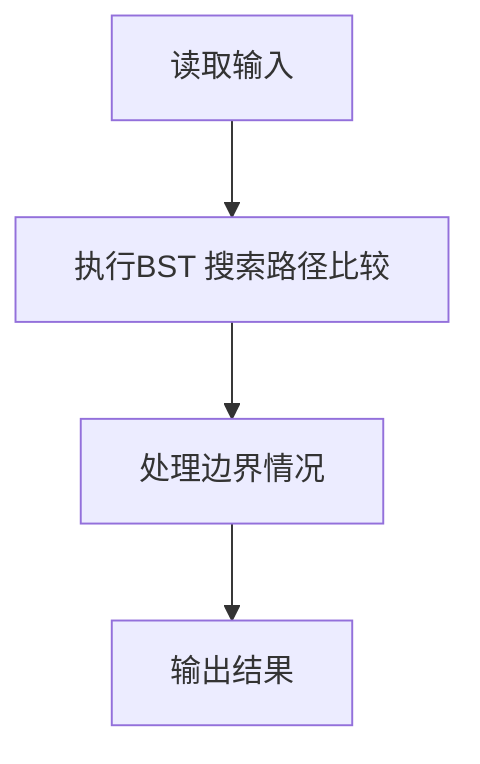
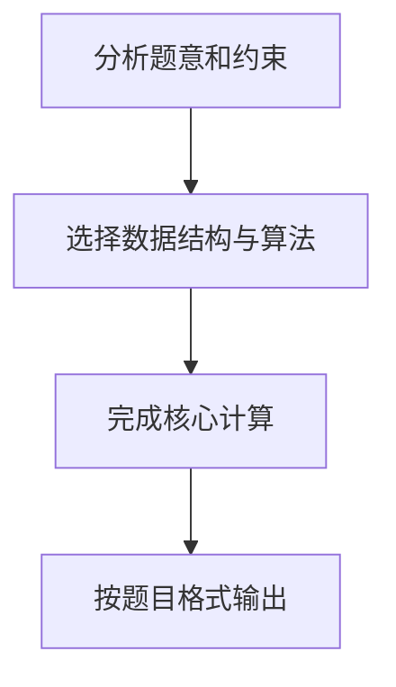

给定一个插入序列就可以唯一确定一棵二叉搜索树。然而，一棵给定的二叉搜索树却可以由多种不同的插入序列得到。例如分别按照序列{2, 1, 3}和{2, 3, 1}插入初始为空的二叉搜索树，都得到一样的结果。于是对于输入的各种插入序列，你需要判断它们是否能生成一样的二叉搜索树。

输入格式:
输入包含若干组测试数据。每组数据的第1行给出两个正整数N (≤10)和L，分别是每个序列插入元素的个数和需要检查的序列个数。第2行给出N个以空格分隔的正整数，作为初始插入序列。随后L行，每行给出N个插入的元素，属于L个需要检查的序列。

简单起见，我们保证每个插入序列都是1到N的一个排列。当读到N为0时，标志输入结束，这组数据不要处理。

输出格式:
对每一组需要检查的序列，如果其生成的二叉搜索树跟对应的初始序列生成的一样，输出“Yes”，否则输出“No”。

输入样例:
```in
4 2
3 1 4 2
3 4 1 2
3 2 4 1
2 1
2 1
1 2
0
```
输出样例:
```out
Yes
No
No
```

## 解题思路

本题采用BST 搜索路径比较，围绕题目给出的数据结构和约束完成核心计算，并处理边界情况。

## 代码流程说明

1. 读取题目规定的输入数据。
2. 使用BST 搜索路径比较完成主要处理。
3. 处理边界情况并整理结果。
4. 按指定格式输出结果。

## 代码实现


```c
/*
 * 实现过程：
 * 本题判断多个序列是否构成同一棵二叉搜索树，采用"分别建树 + 递归比较"的方法。
 *
 * 核心思路：
 * 1. 用初始序列构建一棵基准BST。
 * 2. 对每个待检查序列，也构建一棵BST。
 * 3. 递归比较两棵BST是否完全相同（结构相同且对应节点值相同）。
 *
 * BST插入规则：
 * - 小于当前节点值 → 插入左子树
 * - 大于当前节点值 → 插入右子树
 * - 等于当前节点值 → 不插入（忽略重复值）
 *
 * 两棵BST相同的判断（递归）：
 * - 都为空 → 相同
 * - 一个空一个非空 → 不同
 * - 根节点值不同 → 不同
 * - 递归比较左子树和右子树都相同 → 相同
 *
 * 关键点：
 * - 不同插入序列可能产生不同结构的BST，因此需要比较整棵树的结构和值。
 * - 每处理完一个待检查序列后释放其BST内存，避免内存泄漏。
 */

#include <stdio.h>   // 引入标准输入输出库
#include <stdlib.h>  // 引入标准库，用于malloc和free

typedef struct TreeNode {  // 定义二叉搜索树节点结构体
    int data;              // 节点存储的数据
    struct TreeNode *left, *right;  // 左子树和右子树指针
} *Tree;                  // 定义Tree为指向TreeNode的指针类型

Tree Insert(Tree T, int x) {       // 向BST中插入值为x的节点，返回树根
    if (!T) {                      // 如果当前树为空
        T = (Tree)malloc(sizeof(struct TreeNode));  // 分配新节点内存
        T->data = x;               // 设置新节点的数据
        T->left = T->right = NULL; // 新节点的左右子树初始化为空
    } else if (x < T->data) {      // 如果x小于当前节点值
        T->left = Insert(T->left, x);  // 递归插入左子树
    } else if (x > T->data) {      // 如果x大于当前节点值
        T->right = Insert(T->right, x); // 递归插入右子树
    }                              // 如果x等于当前节点值，不做任何操作
    return T;                      // 返回树根
}

int SameTree(Tree T1, Tree T2) {   // 判断两棵BST是否相同，相同返回1，否则返回0
    if (!T1 && !T2) return 1;      // 两棵树都为空，则相同
    if (!T1 || !T2) return 0;      // 一棵为空另一棵不为空，则不同
    if (T1->data != T2->data) return 0;  // 根节点值不同，则不同
    return SameTree(T1->left, T2->left) && SameTree(T1->right, T2->right); // 递归比较左右子树
}

void FreeTree(Tree T) {            // 释放树的所有节点内存
    if (T) {                       // 如果节点不为空
        FreeTree(T->left);         // 递归释放左子树
        FreeTree(T->right);        // 递归释放右子树
        free(T);                   // 释放当前节点
    }
}

int main() {                       // 主函数
    int N, L;                      // N为序列元素个数，L为待检查序列个数
    while (scanf("%d", &N) && N) { // 读取N，当N不为0时继续处理
        scanf("%d", &L);           // 读取L
        Tree T = NULL;             // 初始化初始BST为空
        for (int i = 0; i < N; i++) {  // 读取初始序列的N个数
            int x;                 // 临时变量存储读入的数
            scanf("%d", &x);       // 读取一个数
            T = Insert(T, x);      // 将该数插入初始BST
        }
        for (int i = 0; i < L; i++) {  // 处理L个待检查序列
            Tree T2 = NULL;        // 初始化待检查BST为空
            for (int j = 0; j < N; j++) {  // 读取待检查序列的N个数
                int x;             // 临时变量存储读入的数
                scanf("%d", &x);   // 读取一个数
                T2 = Insert(T2, x); // 将该数插入待检查BST
            }
            printf("%s\n", SameTree(T, T2) ? "Yes" : "No"); // 比较两棵树，输出结果
            FreeTree(T2);          // 释放待检查BST的内存
        }
        FreeTree(T);               // 释放初始BST的内存
    }
    return 0;                      // 程序正常结束
}
```

## 代码流程图



## 解题流程图


