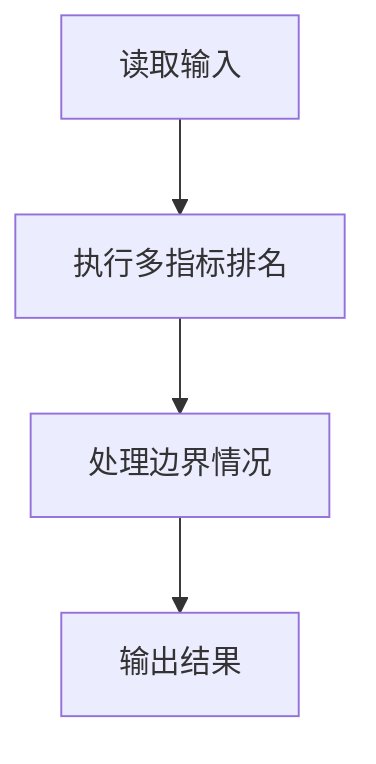
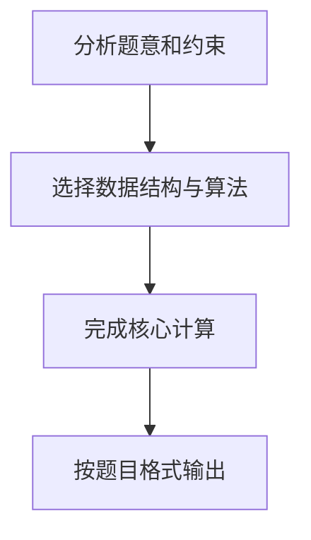

## 7-40 奥运排行榜

- **分值：** 25分

## 题目描述

每年奥运会各大媒体都会公布一个排行榜，但是细心的读者发现，不同国家的排行榜略有不同。比如中国金牌总数列第一的时候，中国媒体就公布“金牌榜”；而美国的奖牌总数第一，于是美国媒体就公布“奖牌榜”。如果人口少的国家公布一个“国民人均奖牌榜”，说不定非洲的国家会成为榜魁…… 现在就请你写一个程序，对每个前来咨询的国家按照对其最有利的方式计算它的排名。

## 输入格式

输入的第一行给出两个正整数N和M（\le 224，因为世界上共有224个国家和地区），分别是参与排名的国家和地区的总个数、以及前来咨询的国家的个数。为简单起见，我们把国家从0 ~ N-1编号。之后有N行输入，第i行给出编号为i-1的国家的金牌数、奖牌数、国民人口数（单位为百万），数字均为[0,1000]区间内的整数，用空格分隔。最后面一行给出M个前来咨询的国家的编号，用空格分隔。

## 输出格式

在一行里顺序输出前来咨询的国家的`排名:计算方式编号`。其排名按照对该国家最有利的方式计算；计算方式编号为：金牌榜=1，奖牌榜=2，国民人均金牌榜=3，国民人均奖牌榜=4。输出间以空格分隔，输出结尾不能有多余空格。

若某国在不同排名方式下有相同名次，则输出编号最小的计算方式。

## 输入样例
```
4 4
51 100 1000
36 110 300
6 14 32
5 18 40
0 1 2 3
```

## 输出样例
```
1:1 1:2 1:3 1:4
```

## 解题思路

本题采用多指标排名，围绕题目给出的数据结构和约束完成核心计算，并处理边界情况。

## 代码流程说明

1. 读取题目规定的输入数据。
2. 使用多指标排名完成主要处理。
3. 处理边界情况并整理结果。
4. 按指定格式输出结果。

## 代码实现


```c
/*
 * 实现原理：
 * 本题要求对每个前来咨询的国家，按照4种排名方式（金牌榜、奖牌榜、国民人均金牌榜、
 * 国民人均奖牌榜）中对其最有利的方式计算排名。
 *
 * 算法步骤：
 * 1. 读取N个国家的金牌数、奖牌数、人口数。
 * 2. 对每种排名方式，计算每个国家的得分并排序，分配名次（同分同名次）。
 * 3. 对于每个咨询国家，在4种排名方式中找到其最佳名次（名次数字最小），
 *    若名次相同则选择编号最小的排名方式。
 * 4. 按格式输出结果。
 */

#include <stdio.h>
#include <stdlib.h>

/* 国家数据结构体 */
typedef struct {
    int gold;   /* 金牌数 */
    int total;  /* 奖牌总数 */
    int pop;    /* 人口数（单位：百万） */
} Country;

/* 排名项结构体，用于排序 */
typedef struct {
    int idx;         /* 国家原始编号 */
    double score;    /* 该排名方式下的得分 */
} RankItem;

/* qsort 比较函数：按 score 降序排列 */
int cmp_desc(const void *a, const void *b) {
    RankItem *ra = (RankItem *)a;
    RankItem *rb = (RankItem *)b;
    /* 注意：qsort 要求返回负数/零/正数，这里 rb->score - ra->score 实现降序 */
    if (rb->score > ra->score) return 1;
    if (rb->score < ra->score) return -1;
    return 0;
}

int main() {
    int N, M;
    scanf("%d %d", &N, &M);

    /* 读取各国数据 */
    Country countries[N];
    for (int i = 0; i < N; i++) {
        scanf("%d %d %d", &countries[i].gold, &countries[i].total, &countries[i].pop);
    }

    /* rank[4][N] 存储每个国家在4种方式下的名次 */
    int rank[4][N];

    /* 分别处理4种排名方式 */
    for (int method = 0; method < 4; method++) {
        RankItem items[N];

        /* 计算每个国家在当前排名方式下的得分 */
        for (int i = 0; i < N; i++) {
            items[i].idx = i;
            switch (method) {
                case 0:  /* 金牌榜 */
                    items[i].score = countries[i].gold;
                    break;
                case 1:  /* 奖牌榜 */
                    items[i].score = countries[i].total;
                    break;
                case 2:  /* 国民人均金牌榜 */
                    if (countries[i].pop > 0) {
                        items[i].score = (double)countries[i].gold / countries[i].pop;
                    } else {
                        /* 人口为0时，得分设为极大值以确保排名靠前 */
                        items[i].score = countries[i].gold * 1e9;
                    }
                    break;
                case 3:  /* 国民人均奖牌榜 */
                    if (countries[i].pop > 0) {
                        items[i].score = (double)countries[i].total / countries[i].pop;
                    } else {
                        items[i].score = countries[i].total * 1e9;
                    }
                    break;
            }
        }

        /* 按得分降序排序 */
        qsort(items, N, sizeof(RankItem), cmp_desc);

        /* 分配名次：相同得分获得相同名次，后续名次顺延 */
        int currentRank = 1;
        for (int i = 0; i < N; i++) {
            if (i > 0 && items[i].score < items[i - 1].score) {
                /* 当前得分与前一名不同，名次更新为 i+1（跳过并列的人数） */
                currentRank = i + 1;
            }
            rank[method][items[i].idx] = currentRank;
        }
    }

    /* 读取咨询国家的编号 */
    int queries[M];
    for (int i = 0; i < M; i++) {
        scanf("%d", &queries[i]);
    }

    /* 对每个咨询国家找出对其最有利的排名方式 */
    for (int i = 0; i < M; i++) {
        int q = queries[i];
        int bestRank = N + 1;    /* 初始化为最大可能名次+1 */
        int bestMethod = 0;      /* 初始化为0，表示未确定 */

        /* 遍历4种排名方式，找最佳名次 */
        for (int m = 0; m < 4; m++) {
            int r = rank[m][q];
            /* 更新条件：名次更小，或名次相同时方式编号更小 */
            if (r < bestRank || (r == bestRank && (m + 1) < bestMethod)) {
                bestRank = r;
                bestMethod = m + 1;  /* 方式编号从1开始 */
            }
        }

        /* 格式化输出 */
        if (i > 0) printf(" ");
        printf("%d:%d", bestRank, bestMethod);
    }
    printf("\n");

    return 0;
}
```

## 代码流程图



## 解题流程图


