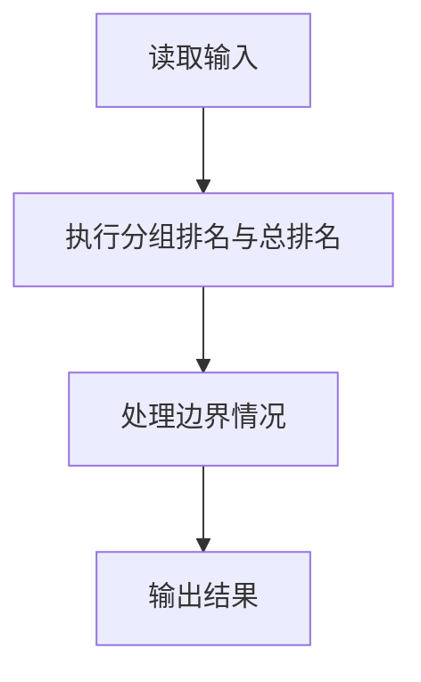
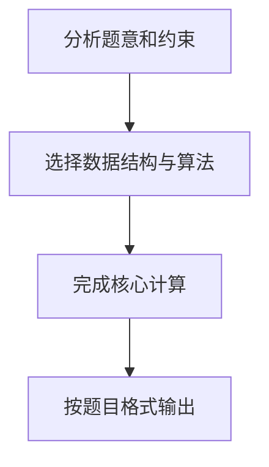

## 7-41 PAT排名汇总

- **分值：** 25分

## 题目描述

计算机程序设计能力考试（Programming Ability Test，简称PAT）旨在通过统一组织的在线考试及自动评测方法客观地评判考生的算法设计与程序设计实现能力，科学的评价计算机程序设计人才，为企业选拔人才提供参考标准（网址http://www.patest.cn）。

每次考试会在若干个不同的考点同时举行，每个考点用局域网，产生本考点的成绩。考试结束后，各个考点的成绩将即刻汇总成一张总的排名表。

现在就请你写一个程序自动归并各个考点的成绩并生成总排名表。

## 输入格式

输入的第一行给出一个正整数N（\le100），代表考点总数。随后给出N个考点的成绩，格式为：首先一行给出正整数K（\le300），代表该考点的考生总数；随后K行，每行给出1个考生的信息，包括考号（由13位整数字组成）和得分（为[0,100]区间内的整数），中间用空格分隔。

## 输出格式

首先在第一行里输出考生总数。随后输出汇总的排名表，每个考生的信息占一行，顺序为：考号、最终排名、考点编号、在该考点的排名。其中考点按输入给出的顺序从1到N编号。考生的输出须按最终排名的非递减顺序输出，获得相同分数的考生应有相同名次，并按考号的递增顺序输出。

## 输入样例
```
2
5
1234567890001 95
1234567890005 100
1234567890033 95
1234567890002 77
1234567890004 85
4
1234567890013 95
1234567890011 25
1234567890014 100
1234567890042 95
```

## 输出样例
```
9
1234567890005 1 1 1
1234567890014 1 2 1
1234567890001 3 1 2
1234567890013 3 2 2
1234567890033 3 1 2
1234567890042 3 2 2
1234567890004 7 1 4
1234567890002 8 1 5
1234567890011 9 2 4
```

**鸣谢厦门大学郑旭玲老师补充数据！**

## 解题思路

本题采用分组排名与总排名，围绕题目给出的数据结构和约束完成核心计算，并处理边界情况。

## 代码流程说明

1. 读取题目规定的输入数据。
2. 使用分组排名与总排名完成主要处理。
3. 处理边界情况并整理结果。
4. 按指定格式输出结果。

## 代码实现


```c
/*
 * ============================================================
 * 实现原理：
 *   1. 读取考点总数 N，遍历每个考点读取该考点的考生数据。
 *   2. 对每个考点内部，按成绩降序、考号升序排序，计算考点内排名
 *      （同分同名次）。
 *   3. 将所有考生合并到一个全局数组中，按成绩降序、考号升序排序，
 *      计算最终排名（同分同名次）。
 *   4. 输出考生总数，然后按最终排名顺序输出每个考生的考号、最终排名、
 *      考点编号、考点内排名。
 *
 * 复杂度：O(M log M)，其中 M 为考生总数（最多 100*300 = 30000）。
 * ============================================================
 */

#include <stdio.h>
#include <stdlib.h>
#include <string.h>

/* 最大考生总数：N <= 100, K <= 300，最多 30000 名考生 */
#define MAX_STUDENTS 30000

/* 考生信息结构体 */
typedef struct {
    char id[14];        /* 考号，13位数字 + 1位结束符 */
    int score;          /* 得分 */
    int site_id;        /* 考点编号（从 1 开始） */
    int site_rank;      /* 在考点内的排名 */
    int final_rank;     /* 最终排名 */
} Student;

/* 全局比较函数：按成绩降序，成绩相同按考号升序 */
int cmp(const void *a, const void *b) {
    const Student *s1 = (const Student *)a;
    const Student *s2 = (const Student *)b;
    if (s1->score != s2->score) {
        return s2->score - s1->score;  /* 成绩高的在前 */
    }
    return strcmp(s1->id, s2->id);     /* 成绩相同，考号小的在前 */
}

int main() {
    Student students[MAX_STUDENTS];    /* 全局考生数组 */
    int total = 0;                     /* 考生总数 */
    int N;                             /* 考点总数 */

    /* 读取考点总数 */
    scanf("%d", &N);

    /* 遍历每个考点 */
    for (int site = 1; site <= N; site++) {
        int K;  /* 当前考点考生数 */
        scanf("%d", &K);

        int start = total;  /* 当前考点考生在全局数组中的起始位置 */

        /* 读取当前考点的 K 名考生 */
        for (int i = 0; i < K; i++) {
            scanf("%s %d", students[total].id, &students[total].score);
            students[total].site_id = site;
            total++;
        }

        /* 对当前考点的考生进行排序（按成绩降序、考号升序） */
        qsort(students + start, K, sizeof(Student), cmp);

        /* 计算考点内排名（同分同名次） */
        for (int i = 0; i < K; i++) {
            int idx = start + i;
            if (i == 0) {
                students[idx].site_rank = 1;  /* 第一名 */
            } else if (students[idx].score == students[idx - 1].score) {
                students[idx].site_rank = students[idx - 1].site_rank;  /* 同分同名次 */
            } else {
                students[idx].site_rank = i + 1;  /* 正常排名 = 位置 + 1 */
            }
        }
    }

    /* 对所有考生进行全局排序（按成绩降序、考号升序） */
    qsort(students, total, sizeof(Student), cmp);

    /* 计算最终排名（同分同名次） */
    for (int i = 0; i < total; i++) {
        if (i == 0) {
            students[i].final_rank = 1;  /* 第一名 */
        } else if (students[i].score == students[i - 1].score) {
            students[i].final_rank = students[i - 1].final_rank;  /* 同分同名次 */
        } else {
            students[i].final_rank = i + 1;  /* 正常排名 = 位置 + 1 */
        }
    }

    /* 输出结果 */
    printf("%d\n", total);  /* 考生总数 */
    for (int i = 0; i < total; i++) {
        printf("%s %d %d %d\n",
               students[i].id,
               students[i].final_rank,
               students[i].site_id,
               students[i].site_rank);
    }

    return 0;
}
```

## 代码流程图



## 解题流程图


