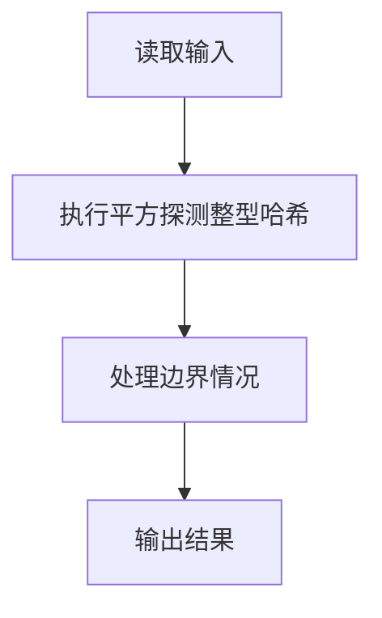
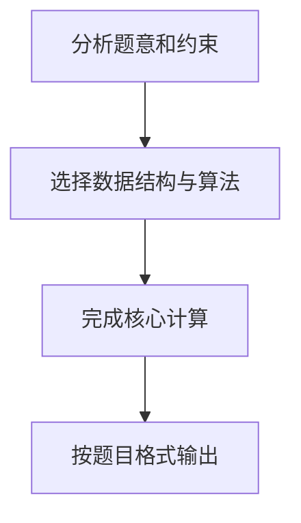

## 7-42 整型关键字的散列映射

- **分值：** 25分

## 题目描述

给定一系列整型关键字和素数 p，用除留余数法定义的散列函数 H(key) = key \% p 将关键字映射到长度为 p 的散列表中。用线性探测法解决冲突。

## 输入格式

输入第一行首先给出两个正整数 n（\le 1000）和 p（\ge n 的最小素数），分别为待插入的关键字总数、以及散列表的长度。第二行给出 n 个整型关键字。数字间以空格分隔。

## 输出格式

在一行内输出每个整型关键字在散列表中的位置。数字间以空格分隔，但行末尾不得有多余空格。

## 输入样例
```
4 5
24 15 61 88
```

## 输出样例
```
4 0 1 3
```

## 解题思路

本题采用平方探测整型哈希，围绕题目给出的数据结构和约束完成核心计算，并处理边界情况。

## 代码流程说明

1. 读取题目规定的输入数据。
2. 使用平方探测整型哈希完成主要处理。
3. 处理边界情况并整理结果。
4. 按指定格式输出结果。

## 代码实现


```c
/*
 * 7-42 整型关键字的散列映射
 * 
 * 实现原理：
 * 本程序使用除留余数法作为散列函数：H(key) = key % p
 * 其中 p 是散列表的长度（也是题目给出的素数）
 * 使用线性探测法（Linear Probing）解决冲突：
 *   - 当插入一个关键字时，首先计算其初始散列地址 pos = key % p
 *   - 如果该地址已被占用，则依次探测下一个位置：pos = (pos + 1) % p
 *   - 重复上述过程，直到找到空位置为止
 * 
 * 重复关键字处理：
 *   - 插入前先线性探测，若发现 key 已存在，则直接返回已有位置，不重复插入
 * 
 * 线性探测的优点是实现简单，缺点是容易产生聚集现象（primary clustering）
 */

#include <stdio.h>
#include <stdlib.h>
#include <string.h>

#define MAX_N 1000  // 最大关键字数量（n <= 1000）

int main() {
    int n, p;  // n: 关键字数量, p: 散列表长度（素数，>= n）
    int keys[MAX_N];  // 存储输入的关键字
    int result[MAX_N];  // 存储每个关键字的插入位置
    
    // 读取关键字数量n和散列表长度p
    if (scanf("%d %d", &n, &p) != 2) {
        return 0;
    }
    
    // 读取n个整型关键字
    for (int i = 0; i < n; i++) {
        scanf("%d", &keys[i]);
    }
    
    // 动态分配散列表，大小为 p（p 可能大于 1000，如 n=1000 时 p=1009）
    int *hashTable = (int*)malloc(p * sizeof(int));
    // 初始化散列表，所有位置设为-1（表示空）
    memset(hashTable, -1, p * sizeof(int));
    
    // 对每个关键字进行散列插入
    for (int i = 0; i < n; i++) {
        int key = keys[i];
        
        // 计算初始散列地址：除留余数法
        int pos = key % p;
        
        // 线性探测：寻找 key 是否已存在，或找到空位置
        // 如果 key 已存在，直接返回已有位置；否则找到空位置插入
        while (hashTable[pos] != -1 && hashTable[pos] != key) {
            pos = (pos + 1) % p;
        }
        
        if (hashTable[pos] == -1) {
            // 空位置，插入新关键字
            hashTable[pos] = key;
        }
        // 无论 key 是旧的还是新的，pos 就是要输出的位置
        result[i] = pos;
    }
    
    // 输出结果：每个关键字在散列表中的位置
    for (int i = 0; i < n; i++) {
        if (i > 0) {
            printf(" ");
        }
        printf("%d", result[i]);
    }
    printf("\n");
    
    // 释放动态分配的内存
    free(hashTable);
    
    return 0;
}
```

## 代码流程图



## 解题流程图


