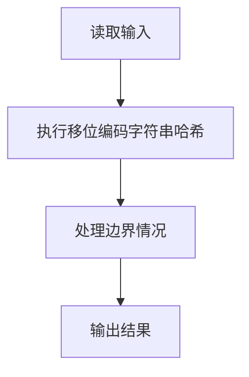
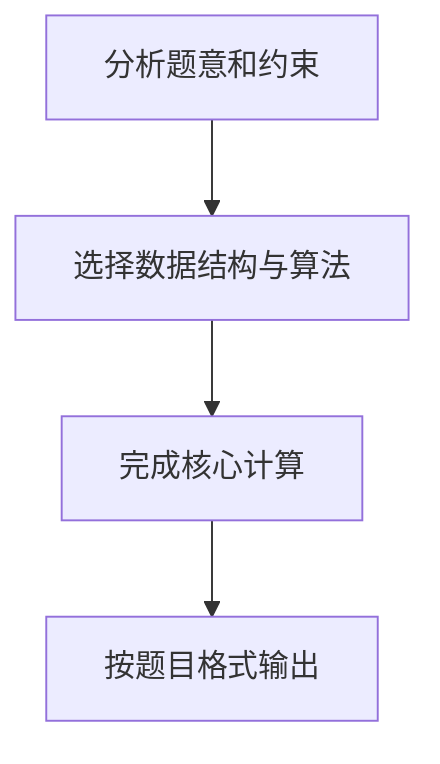

## 7-43 字符串关键字的散列映射

- **分值：** 25分

## 题目描述

给定一系列由大写英文字母组成的字符串关键字和素数P，用移位法定义的散列函数H(Key)将关键字Key中的最后3个字符映射为整数，每个字符占5位；再用除留余数法将整数映射到长度为P的散列表中。例如将字符串`AZDEG`插入长度为1009的散列表中，我们首先将26个大写英文字母顺序映射到整数0~25；再通过移位将其映射为3\times 32^2 + 4 \times 32 + 6 = 3206；然后根据表长得到3206 \% 1009 = 179，即是该字符串的散列映射位置。

发生冲突时请用平方探测法解决。

## 输入格式

输入第一行首先给出两个正整数N（\le 500）和P（\ge 2N的最小素数），分别为待插入的关键字总数、以及散列表的长度。第二行给出N个字符串关键字，每个长度不超过8位，其间以空格分隔。

## 输出格式

在一行内输出每个字符串关键字在散列表中的位置。数字间以空格分隔，但行末尾不得有多余空格。

## 输入样例1
```
4 11
HELLO ANNK ZOE LOLI
```

## 输出样例1
```
3 10 4 0
```

## 输入样例2
```
6 11
LLO ANNA NNK ZOJ INNK AAA
```

## 输出样例2
```
3 0 10 9 6 1
```

## 样例说明

以样例 1 中的 HELLO 为例：
- HELLO 长度为 5，取最后 3 个字符 LLO
- L=11, L=11, O=14
- 移位计算：11×32² + 11×32 + 14 = 11630
- 除留余数：11630 % 11 = 3，即位置为 3

## 解题思路

本题采用移位编码字符串哈希，围绕题目给出的数据结构和约束完成核心计算，并处理边界情况。

## 代码流程说明

1. 读取题目规定的输入数据。
2. 使用移位编码字符串哈希完成主要处理。
3. 处理边界情况并整理结果。
4. 按指定格式输出结果。

## 代码实现


```c
/*
 * 7-43 字符串关键字的散列映射
 *
 * 实现原理：
 * 1. 移位法：将字符串关键字的最后3个字符映射为整数，每个字符占5位（基数32）
 *    - 大写字母A-Z映射为整数0-25
 *    - 取最后3个字符，若不足3位则按实际长度处理
 *    - 计算公式：key = c1*32^2 + c2*32 + c3
 *
 * 2. 除留余数法：将上述整数对P取余，得到散列表位置
 *    - hash(key) = key % P
 *
 * 3. 平方探测法解决冲突：
 *    - 当位置被占用时，尝试新位置：(hash(key) + i*i) % P，i从0开始递增
 *    - 若仍然冲突，继续增加i直到找到空位
 *
 * 4. 散列表维护：
 *    - 使用字符串数组存储已插入的关键字
 *    - 使用标记数组判断位置是否已被占用
 */

#include <stdio.h>      // 标准输入输出库
#include <string.h>     // 字符串处理库
#include <stdlib.h>     // 标准库函数

#define MAX_LEN 10       // 字符串最大长度（题目要求不超过8位，加一个结束符）
#define MAX_N 501        // 最大关键字数量（题目要求N≤500）

// 散列表指针：存储已插入的关键字，大小根据P动态分配
char (*hashTable)[MAX_LEN];

// 标记数组指针：标记散列表位置是否已被占用，0表示空，1表示已占用
int *occupied;

/*
 * 计算字符串关键字的散列值（移位法）
 * 参数：key - 字符串关键字
 * 返回：散列整数值
 */
int getHash(char *key) {
    int len = strlen(key);              // 获取字符串长度
    int hash = 0;                       // 初始化散列值为0
    int start = len - 3;                // 计算起始位置（取最后3个字符）

    // 如果字符串长度小于3，从第0个字符开始
    if (start < 0) {
        start = 0;
    }

    // 遍历最后3个字符（或更少，如果字符串较短）
    for (int i = start; i < len; i++) {
        hash = hash * 32 + (key[i] - 'A');  // 移位并累加：每个字符占5位，基数为32
    }

    return hash;                        // 返回计算得到的散列值
}

/*
 * 将关键字插入散列表（使用双向平方探测法解决冲突）
 * 参数：key - 字符串关键字，P - 散列表大小
 * 返回：插入位置的索引
 *
 * 探测序列：h, h+1², h-1², h+2², h-2², h+3², ...
 * 即交替尝试 +i² 和 -i²
 */
int insert(char *key, int P) {
    int h = getHash(key) % P;           // 计算初始散列位置
    int pos = h;                        // 当前探测位置
    int i = 0;                          // 平方探测的步数

    // 检查该关键字是否已在散列表中
    if (occupied[pos] && strcmp(hashTable[pos], key) == 0) {
        return pos;                     // 若已存在，直接返回该位置
    }

    // 使用双向平方探测法寻找空位或已存在相同关键字的位置
    while (occupied[pos]) {
        i++;                            // 增加探测步数
        if (i % 2 == 1) {                // 奇数 i: 尝试 +i²
            pos = (h + (i/2 + 1) * (i/2 + 1)) % P;
        } else {                         // 偶数 i: 尝试 -i²
            pos = (h - (i/2) * (i/2)) % P;
        }
        if (pos < 0) pos += P;          // 处理负数取模

        // 检查新位置是否已有相同关键字
        if (occupied[pos] && strcmp(hashTable[pos], key) == 0) {
            return pos;                 // 若找到相同关键字，返回该位置
        }
    }

    // 找到空位，插入关键字
    strcpy(hashTable[pos], key);        // 将关键字复制到散列表
    occupied[pos] = 1;                  // 标记该位置已被占用

    return pos;                         // 返回插入位置
}

int main() {
    int N, P;                           // N为关键字总数，P为散列表大小（素数）
    char keys[MAX_N][MAX_LEN];          // 存储所有待插入的关键字

    // 读取输入
    scanf("%d %d", &N, &P);             // 读取N和P
    for (int i = 0; i < N; i++) {
        scanf("%s", keys[i]);           // 读取N个字符串关键字
    }

    // 动态分配散列表和标记数组，大小为P以确保足够
    hashTable = (char (*)[MAX_LEN])malloc(P * sizeof(char[MAX_LEN]));
    occupied = (int *)malloc(P * sizeof(int));
    memset(occupied, 0, P * sizeof(int));  // 将所有位置标记为未占用

    // 依次插入每个关键字并输出位置
    for (int i = 0; i < N; i++) {
        int pos = insert(keys[i], P);   // 插入关键字并获取位置

        // 输出位置，数字间用空格分隔
        if (i == 0) {
            printf("%d", pos);          // 第一个数字前不加空格
        } else {
            printf(" %d", pos);         // 后续数字前加空格
        }
    }
    printf("\n");                       // 输出结束后换行

    // 释放动态分配的内存
    free(hashTable);
    free(occupied);

    return 0;                           // 程序正常结束
}
```

## 代码流程图



## 解题流程图


