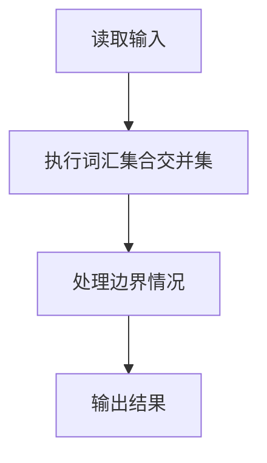
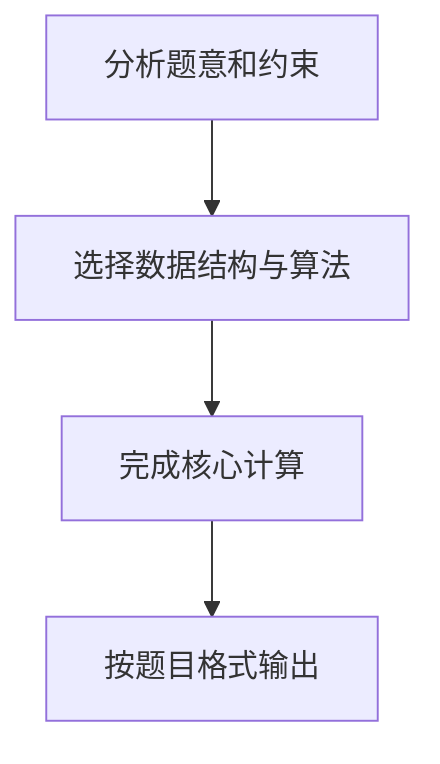

## 7-44 基于词频的文件相似度

- **分值：** 30分

## 题目描述

实现一种简单原始的文件相似度计算，即以两文件的公共词汇占总词汇的比例来定义相似度。为简化问题，这里不考虑中文（因为分词太难了），只考虑长度不小于3、且不超过10的英文单词，长度超过10的只考虑前10个字母。

## 输入格式

输入首先给出正整数N（\le 100），为文件总数。随后按以下格式给出每个文件的内容：首先给出文件正文，最后在一行中只给出一个字符`#`，表示文件结束。在N个文件内容结束之后，给出查询总数M（\le 10^4），随后M行，每行给出一对文件编号，其间以空格分隔。这里假设文件按给出的顺序从1到N编号。

## 输出格式

针对每一条查询，在一行中输出两文件的相似度，即两文件的公共词汇量占两文件总词汇量的百分比，精确到小数点后1位。注意这里的一个“单词”只包括仅由英文字母组成的、长度不小于3、且不超过10的英文单词，长度超过10的只考虑前10个字母。单词间以任何非英文字母隔开。另外，大小写不同的同一单词被认为是相同的单词，例如“You”和“you”是同一个单词。

## 输入样例
```
3
Aaa Bbb Ccc
#
Bbb Ccc Ddd
#
Aaa2 ccc Eee
is at Ddd@Fff
#
2
1 2
1 3
```

## 输出样例
```
50.0%
33.3%
```

## 样例说明

- 文件 1 的词汇集合：{Aaa, Bbb, Ccc}
- 文件 2 的词汇集合：{Bbb, Ccc, Ddd}
- 文件 3 的词汇集合：{ccc, Eee, Ddd, Fff}（Aaa2 因含数字被过滤，is/at 长度不足 3）
- 查询 1 2：公共词汇 {Bbb, Ccc}，总词汇 {Aaa, Bbb, Ccc, Ddd}，相似度 = 2/4 = 50.0%
- 查询 1 3：公共词汇 {Ccc}，总词汇 {Aaa, Bbb, Ccc, Eee, Ddd, Fff}，相似度 = 1/6 ≈ 33.3%

## 解题思路

本题采用词汇集合交并集，围绕题目给出的数据结构和约束完成核心计算，并处理边界情况。

## 代码流程说明

1. 读取题目规定的输入数据。
2. 使用词汇集合交并集完成主要处理。
3. 处理边界情况并整理结果。
4. 按指定格式输出结果。

## 代码实现


```javascript
const fs = require("fs");
const raw = fs.readFileSync(0, "utf8");
// 每个文件保存去重后的单词集合；交集/并集直接计算 Jaccard 相似度。
const lines = raw.split(/\r?\n/);
const n = Number(lines[0]);
let lineAt = 1;
const files = [];
for (let i = 0; i < n; i++) {
  const words = new Set();
  while (lineAt < lines.length && lines[lineAt] !== "#") {
    for (const word of lines[lineAt++].toLowerCase().match(/[a-z]+/g) || [])
      if (word.length >= 3) words.add(word);
  }
  lineAt++;
  files.push(words);
}
const queryTokens = lines.slice(lineAt).join(" ").trim().split(/\s+/);
let at = 0;
const m = Number(queryTokens[at++]),
  queries = queryTokens;
const output = [];
for (let i = 0; i < m; i++) {
  const a = Number(queries[at++]) - 1,
    b = Number(queries[at++]) - 1;
  let inter = 0;
  for (const word of files[a]) if (files[b].has(word)) inter++;
  const union = files[a].size + files[b].size - inter;
  output.push(`${(union ? (inter * 100) / union : 0).toFixed(1)}%`);
}
console.log(output.join("\n"));
```

## 代码流程图



## 解题流程图


