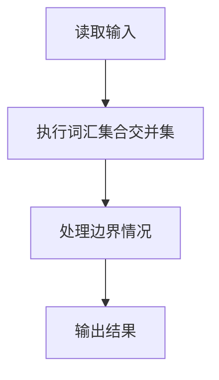
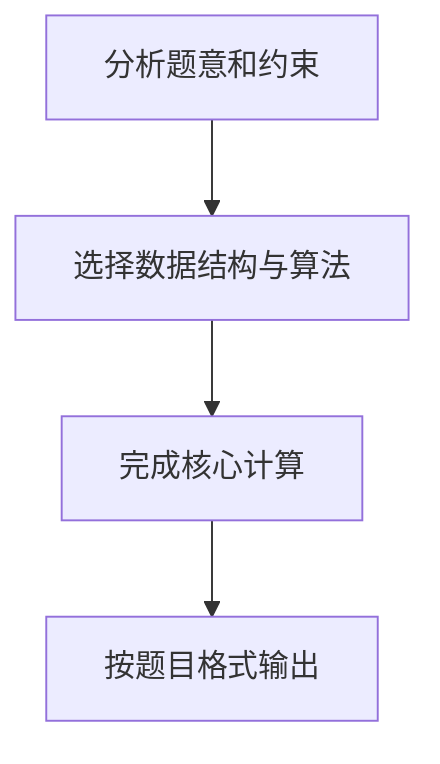

# 7-44 基于词频的文件相似度

- **分值：** 30分

## 题目描述

实现一种简单原始的文件相似度计算，即以两文件的公共词汇占总词汇的比例来定义相似度。为简化问题，这里不考虑中文（因为分词太难了），只考虑长度不小于3、且不超过10的英文单词，长度超过10的只考虑前10个字母。

## 输入格式

输入首先给出正整数$$N$$（$$\le 100$$），为文件总数。随后按以下格式给出每个文件的内容：首先给出文件正文，最后在一行中只给出一个字符`#`，表示文件结束。在$$N$$个文件内容结束之后，给出查询总数$$M$$（$$\le 10^4$$），随后$$M$$行，每行给出一对文件编号，其间以空格分隔。这里假设文件按给出的顺序从1到$$N$$编号。

## 输出格式

针对每一条查询，在一行中输出两文件的相似度，即两文件的公共词汇量占两文件总词汇量的百分比，精确到小数点后1位。注意这里的一个“单词”只包括仅由英文字母组成的、长度不小于3、且不超过10的英文单词，长度超过10的只考虑前10个字母。单词间以任何非英文字母隔开。另外，大小写不同的同一单词被认为是相同的单词，例如“You”和“you”是同一个单词。

## 输入样例
```
3
Aaa Bbb Ccc
#
Bbb Ccc Ddd
#
Aaa2 ccc Eee
is at Ddd@Fff
#
2
1 2
1 3
```

## 输出样例
```
50.0%
33.3%
```

## 样例说明

- 文件 1 的词汇集合：{Aaa, Bbb, Ccc}
- 文件 2 的词汇集合：{Bbb, Ccc, Ddd}
- 文件 3 的词汇集合：{ccc, Eee, Ddd, Fff}（Aaa2 因含数字被过滤，is/at 长度不足 3）
- 查询 1 2：公共词汇 {Bbb, Ccc}，总词汇 {Aaa, Bbb, Ccc, Ddd}，相似度 = 2/4 = 50.0%
- 查询 1 3：公共词汇 {Ccc}，总词汇 {Aaa, Bbb, Ccc, Eee, Ddd, Fff}，相似度 = 1/6 ≈ 33.3%

## 解题思路

本题采用词汇集合交并集，围绕题目给出的数据结构和约束完成核心计算，并处理边界情况。

## 代码流程说明

1. 读取题目规定的输入数据。
2. 使用词汇集合交并集完成主要处理。
3. 处理边界情况并整理结果。
4. 按指定格式输出结果。

## 代码实现


```c
/*
 * 内存优化版实现：
 * 1. 全局唯一哈希表存储所有单词，每个单词分配唯一ID，避免重复存储
 * 2. 每个文件用char数组标记单词是否存在（1字节/单词），大幅节省内存
 * 3. 预计算所有文件对的相似度，M=1e4查询直接O(1)输出
 * 内存占用分析（最坏情况10万单词）：
 *    - 全局哈希表数组：约80KB (100003 * 8B)
 *    - 单词节点：10万 * 24B ≈ 2.4MB
 *    - 文件标记数组：100文件 * 10万B ≈ 10MB
 *    - 相似度矩阵：100*100*4B ≈ 40KB
 *    总计约13MB，远低于64MB限制
 */
#include <stdio.h>
#include <stdlib.h>
#include <string.h>
#include <ctype.h>

#define MAX_WORD_LEN 11
#define HASH_TABLE_SIZE 100003
#define MAX_FILES 101
#define MAX_LINE_LEN 4096
#define INITIAL_WORD_CAP 1024

typedef struct WordNode {
    char word[MAX_WORD_LEN];
    int id;
    struct WordNode *next;
} WordNode;

static WordNode *global_table[HASH_TABLE_SIZE];
static int total_words = 0;

static char *file_words[MAX_FILES];
static int file_size[MAX_FILES];
static int word_capacity = 0;

static float sim_matrix[MAX_FILES][MAX_FILES];

static unsigned int hash(const char *str) {
    unsigned int h = 0;
    while (*str) {
        h = h * 31 + (unsigned char)(*str);
        str++;
    }
    return h % HASH_TABLE_SIZE;
}

static void ensure_capacity(int needed) {
    int new_cap, i;
    char *new_arr;
    if (needed <= word_capacity) return;
    new_cap = word_capacity == 0 ? INITIAL_WORD_CAP : word_capacity;
    while (new_cap < needed) new_cap *= 2;
    for (i = 1; i < MAX_FILES; i++) {
        if (file_words[i] == NULL) {
            new_arr = (char *)calloc(new_cap, sizeof(char));
        } else {
            new_arr = (char *)realloc(file_words[i], new_cap * sizeof(char));
            memset(new_arr + word_capacity, 0, (new_cap - word_capacity) * sizeof(char));
        }
        file_words[i] = new_arr;
    }
    word_capacity = new_cap;
}

static int get_or_add_word(const char *word) {
    unsigned int idx = hash(word);
    WordNode *p = global_table[idx];
    while (p != NULL) {
        if (strcmp(p->word, word) == 0) {
            return p->id;
        }
        p = p->next;
    }
    WordNode *new_node = (WordNode *)malloc(sizeof(WordNode));
    strcpy(new_node->word, word);
    new_node->id = total_words;
    new_node->next = global_table[idx];
    global_table[idx] = new_node;
    total_words++;
    ensure_capacity(total_words);
    return new_node->id;
}

static void mark_word_in_file(int file_id, int word_id) {
    if (!file_words[file_id][word_id]) {
        file_words[file_id][word_id] = 1;
        file_size[file_id]++;
    }
}

static void trim_newline(char *str) {
    int len = strlen(str);
    while (len > 0 && (str[len-1] == '\n' || str[len-1] == '\r')) {
        str[len-1] = '\0';
        len--;
    }
}

static void process_line(int file_id, const char *line) {
    char word[MAX_WORD_LEN];
    int wlen = 0;
    int i, wid;
    for (i = 0; line[i] != '\0'; i++) {
        char c = line[i];
        if (isalpha((unsigned char)c)) {
            if (wlen < MAX_WORD_LEN - 1) {
                word[wlen++] = tolower((unsigned char)c);
            }
        } else {
            if (wlen >= 3) {
                word[wlen] = '\0';
                wid = get_or_add_word(word);
                mark_word_in_file(file_id, wid);
            }
            wlen = 0;
        }
    }
    if (wlen >= 3) {
        word[wlen] = '\0';
        wid = get_or_add_word(word);
        mark_word_in_file(file_id, wid);
    }
}

static void process_file(int file_id) {
    char line[MAX_LINE_LEN];
    file_size[file_id] = 0;
    while (fgets(line, sizeof(line), stdin) != NULL) {
        trim_newline(line);
        if (strcmp(line, "#") == 0) {
            break;
        }
        process_line(file_id, line);
    }
}

static void precompute_similarity(int N) {
    int i, j, k, inter;
    for (i = 1; i <= N; i++) {
        sim_matrix[i][i] = 100.0f;
        for (j = i + 1; j <= N; j++) {
            inter = 0;
            for (k = 0; k < total_words; k++) {
                if (file_words[i][k] && file_words[j][k]) {
                    inter++;
                }
            }
            int uni = file_size[i] + file_size[j] - inter;
            float sim = (float)inter / uni * 100.0f;
            sim_matrix[i][j] = sim;
            sim_matrix[j][i] = sim;
        }
    }
}

static void free_all() {
    int i;
    WordNode *p, *tmp;
    for (i = 0; i < HASH_TABLE_SIZE; i++) {
        p = global_table[i];
        while (p != NULL) {
            tmp = p;
            p = p->next;
            free(tmp);
        }
        global_table[i] = NULL;
    }
    for (i = 1; i < MAX_FILES; i++) {
        if (file_words[i] != NULL) {
            free(file_words[i]);
            file_words[i] = NULL;
        }
    }
    total_words = 0;
    word_capacity = 0;
}

int main() {
    int N, M, i;
    int a, b;
    char line[MAX_LINE_LEN];
    
    memset(global_table, 0, sizeof(global_table));
    memset(file_words, 0, sizeof(file_words));
    memset(file_size, 0, sizeof(file_size));
    
    fgets(line, sizeof(line), stdin);
    sscanf(line, "%d", &N);
    
    for (i = 1; i <= N; i++) {
        process_file(i);
    }
    
    precompute_similarity(N);
    
    fgets(line, sizeof(line), stdin);
    sscanf(line, "%d", &M);
    
    for (i = 0; i < M; i++) {
        fgets(line, sizeof(line), stdin);
        sscanf(line, "%d %d", &a, &b);
        printf("%.1f%%\n", sim_matrix[a][b]);
    }
    
    free_all();
    
    return 0;
}
```

## 代码流程图



## 解题流程图


