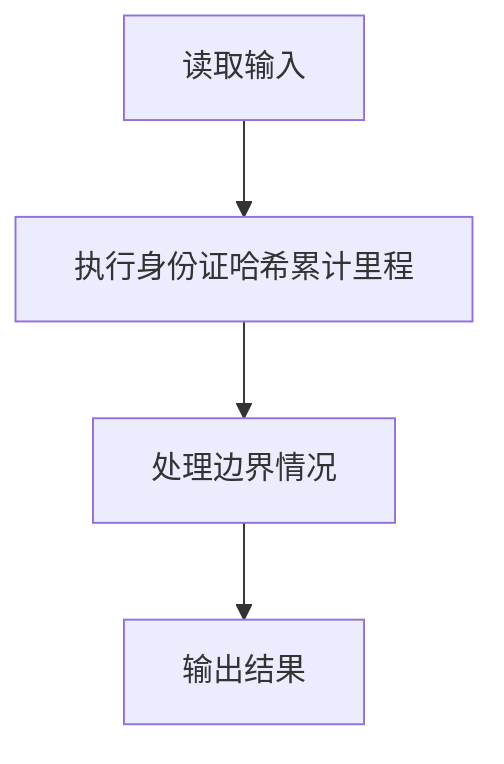
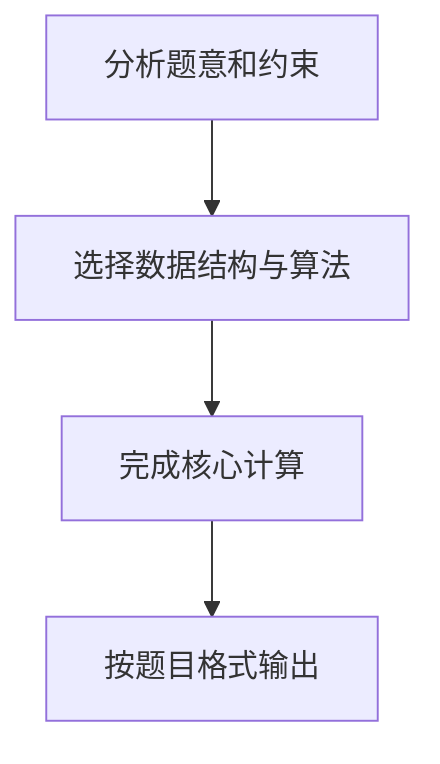

## 7-45 航空公司VIP客户查询

- **分值：** 25分

## 题目描述

不少航空公司都会提供优惠的会员服务，当某顾客飞行里程累积达到一定数量后，可以使用里程积分直接兑换奖励机票或奖励升舱等服务。现给定某航空公司全体会员的飞行记录，要求实现根据身份证号码快速查询会员里程积分的功能。

## 输入格式

输入首先给出两个正整数N（\le 10^5）和K（\le 500）。其中K是最低里程，即为照顾乘坐短程航班的会员,航空公司还会将航程低于K公里的航班也按K公里累积。随后N行，每行给出一条飞行记录。飞行记录的输入格式为：`18位身份证号码（空格）飞行里程`。其中身份证号码由17位数字加最后一位校验码组成，校验码的取值范围为0~9和x共11个符号；飞行里程单位为公里，是(0, 15 000]区间内的整数。然后给出一个正整数M（\le 10^5），随后给出M行查询人的身份证号码。

## 输出格式

对每个查询人，给出其当前的里程累积值。如果该人不是会员，则输出`No Info`。每个查询结果占一行。

## 输入样例
```
4 500
330106199010080419 499
110108198403100012 15000
120104195510156021 800
330106199010080419 1
4
120104195510156021
110108198403100012
330106199010080419
33010619901008041x
```

## 输出样例
```
800
15000
1000
No Info
```

## 样例说明

- 会员 `330106199010080419` 的两次飞行记录：
  - 第一次飞行 499 公里，低于 K=500，按 500 公里累积
  - 第二次飞行 1 公里，低于 K=500，按 500 公里累积
  - 总计：500 + 500 = 1000 公里
- 会员 `110108198403100012` 飞行 15000 公里，直接累积 15000 公里
- 会员 `120104195510156021` 飞行 800 公里，高于 K=500，直接累积 800 公里
- 查询 `33010619901008041x` 不存在于会员记录中，输出 `No Info`

## 解题思路

本题采用身份证哈希累计里程，围绕题目给出的数据结构和约束完成核心计算，并处理边界情况。

## 代码流程说明

1. 读取题目规定的输入数据。
2. 使用身份证哈希累计里程完成主要处理。
3. 处理边界情况并整理结果。
4. 按指定格式输出结果。

## 代码实现


```c
/*
 * 实现原理：
 * 本题要求根据身份证号码快速查询会员的里程累积值，数据规模 N 和 M 均可达 10^5，
 * 需要高效的键值对存储与查询结构。C语言标准库未提供内置哈希表，因此本程序自行实现
 * 一个基于"链地址法（拉链法）"的哈希表：
 *   1. 使用 BKDR 哈希算法将 18 位身份证字符串映射为一个整数哈希值；
 *   2. 哈希表大小取一个足够大的素数 HASH_SIZE = 200003，以减少冲突概率；
 *   3. 每个哈希桶中存放一个链表，链表节点存储身份证号（key）和累计里程（value）；
 *   4. 插入时：若该身份证已存在，则累加里程（低于 K 按 K 算），否则创建新节点头插法加入桶；
 *   5. 查询时：计算哈希值定位到桶，遍历链表比较身份证字符串，找到即返回里程，否则返回 "No Info"。
 * 时间复杂度：插入平均 O(1)，查询平均 O(1)，整体 O(N+M)，可以满足 10^5 规模的时间要求。
 */

#include <stdio.h>   /* 引入标准输入输出头文件，用于 scanf、printf */
#include <stdlib.h>  /* 引入标准库头文件，用于 malloc、exit */
#include <string.h>  /* 引入字符串处理头文件，用于 strcmp、strcpy */

#define HASH_SIZE 200003  /* 哈希表桶的数量，取一个大于 2*10^5 的素数以减少冲突 */
#define ID_LEN 19         /* 身份证号最大长度（18位 + 结束符 '\0'） */

/* 哈希表节点结构体：拉链法链表节点 */
typedef struct HashNode {
    char id[ID_LEN];          /* 存储身份证号码字符串 */
    int miles;                /* 存储该会员累计里程 */
    struct HashNode *next;    /* 指向链表下一个节点的指针 */
} HashNode;

/* 哈希表结构体：本质是一个节点指针数组 */
typedef struct {
    HashNode *buckets[HASH_SIZE];  /* 哈希桶数组，每个元素是链表头指针 */
} HashMap;

/* 全局哈希表实例 */
HashMap map;

/*
 * BKDR 哈希函数：将字符串映射为无符号整数
 * 参数 str：待哈希的身份证字符串
 * 返回值：哈希值（对 HASH_SIZE 取模后得到桶下标）
 */
unsigned int hash(const char *str) {
    unsigned int seed = 131;  /* BKDR 算法种子，常用 31、131、1313 等素数 */
    unsigned int h = 0;       /* 初始化哈希值为 0 */
    while (*str) {            /* 遍历字符串每个字符直到结束符 */
        h = h * seed + (*str++);  /* BKDR 核心公式：hash = hash * seed + ch */
    }
    return h % HASH_SIZE;     /* 对桶数取模，得到桶下标 */
}

/*
 * 初始化哈希表：将所有桶的头指针置空
 */
void hashmap_init() {
    int i;                              /* 循环变量 */
    for (i = 0; i < HASH_SIZE; i++) {   /* 遍历所有哈希桶 */
        map.buckets[i] = NULL;          /* 将每个桶的链表头置为 NULL，表示空链表 */
    }
}

/*
 * 向哈希表中插入/更新一条飞行记录
 * 参数 id：身份证号码
 * 参数 add：本次飞行里程（已经在外部处理好 K 值规则后传入）
 */
void hashmap_put(const char *id, int add) {
    unsigned int idx = hash(id);        /* 计算身份证对应的哈希桶下标 */
    HashNode *p = map.buckets[idx];     /* 取得该桶链表的头指针 */
    while (p != NULL) {                 /* 遍历该桶的链表，查找该身份证是否已存在 */
        if (strcmp(p->id, id) == 0) {   /* 使用 strcmp 精确比较身份证字符串 */
            p->miles += add;            /* 若已存在，则累加本次里程 */
            return;                     /* 更新完成，直接返回 */
        }
        p = p->next;                    /* 未找到则继续向后遍历 */
    }
    /* 若未找到该身份证，创建新节点 */
    HashNode *node = (HashNode *)malloc(sizeof(HashNode));  /* 动态分配新节点内存 */
    strcpy(node->id, id);               /* 将身份证号复制到新节点中 */
    node->miles = add;                  /* 设置本次里程为初始值（已处理K规则） */
    node->next = map.buckets[idx];      /* 新节点指向原链表头，头插法 */
    map.buckets[idx] = node;            /* 更新桶头指针为新节点 */
}

/*
 * 根据身份证号查询累计里程
 * 参数 id：待查询的身份证号码
 * 返回值：若存在返回累计里程指针，不存在返回 NULL
 */
int* hashmap_get(const char *id) {
    unsigned int idx = hash(id);        /* 计算哈希桶下标 */
    HashNode *p = map.buckets[idx];     /* 取得该桶链表头指针 */
    while (p != NULL) {                 /* 遍历链表 */
        if (strcmp(p->id, id) == 0) {   /* 字符串比较找到对应节点 */
            return &p->miles;           /* 返回里程值的指针 */
        }
        p = p->next;                    /* 继续向后查找 */
    }
    return NULL;                        /* 遍历完未找到，返回 NULL 表示不存在 */
}

/*
 * 释放哈希表申请的所有堆内存，防止内存泄漏（PTA评测可不调用，但作为良好习惯）
 */
void hashmap_free() {
    int i;                              /* 循环变量 */
    for (i = 0; i < HASH_SIZE; i++) {   /* 遍历所有哈希桶 */
        HashNode *p = map.buckets[i];   /* 取得当前桶链表头 */
        while (p != NULL) {             /* 遍历链表逐个释放节点 */
            HashNode *tmp = p;          /* 暂存当前节点指针 */
            p = p->next;                /* 指针后移 */
            free(tmp);                  /* 释放暂存的节点内存 */
        }
        map.buckets[i] = NULL;          /* 置空头指针 */
    }
}

/*
 * 主函数：程序入口
 */
int main() {
    int N, K;                           /* N：飞行记录条数；K：最低累积里程 */
    int i;                              /* 循环变量 */
    scanf("%d %d", &N, &K);            /* 读取 N 和 K */
    hashmap_init();                     /* 初始化哈希表 */
    for (i = 0; i < N; i++) {           /* 循环读取 N 条飞行记录 */
        char id[ID_LEN];                /* 存储身份证号的字符数组 */
        int mile;                       /* 存储本次飞行里程 */
        scanf("%s %d", id, &mile);     /* 读取身份证号和本次里程 */
        int add = mile >= K ? mile : K; /* 里程累积规则：低于 K 按 K 算 */
        hashmap_put(id, add);           /* 将本次记录插入/更新到哈希表 */
    }
    int M;                              /* 查询次数 M */
    scanf("%d", &M);                   /* 读取 M */
    for (i = 0; i < M; i++) {           /* 循环处理 M 次查询 */
        char id[ID_LEN];                /* 存储待查询身份证号 */
        scanf("%s", id);               /* 读取待查询身份证号 */
        int *res = hashmap_get(id);     /* 在哈希表中查询 */
        if (res != NULL) {              /* 查询结果不为空，说明是会员 */
            printf("%d\n", *res);       /* 输出累计里程 */
        } else {                        /* 查询结果为空，不是会员 */
            printf("No Info\n");        /* 输出 No Info */
        }
    }
    hashmap_free();                     /* 释放哈希表内存 */
    return 0;                           /* 程序正常结束，返回 0 */
}
```

## 代码流程图



## 解题流程图


