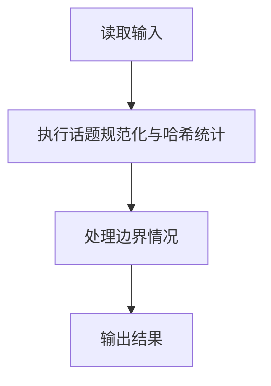
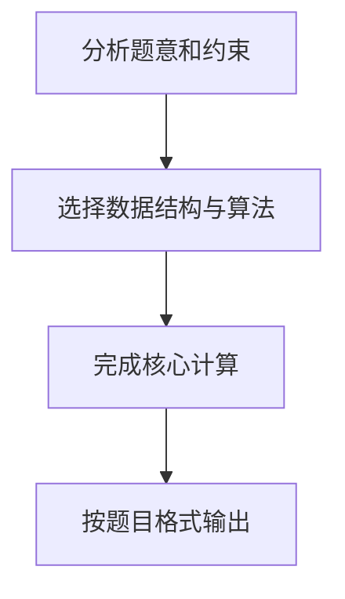

## 7-46 新浪微博热门话题

- **分值：** 30分

## 题目描述

新浪微博可以在发言中嵌入“话题”，即将发言中的话题文字写在一对“#”之间，就可以生成话题链接，点击链接可以看到有多少人在跟自己讨论相同或者相似的话题。新浪微博还会随时更新热门话题列表，并将最热门的话题放在醒目的位置推荐大家关注。

本题目要求实现一个简化的热门话题推荐功能，从大量英文（因为中文分词处理比较麻烦）微博中解析出话题，找出被最多条微博提到的话题。

## 输入格式

输入说明：输入首先给出一个正整数 n（\le 10^5），随后 n 行，每行给出一条英文微博，其长度不超过 140 个字符。任何包含在一对最近的“#”中的内容均被认为是一个话题，如果长度超过40个字符，则只保留前40个字符。输入保证“#”成对出现。

## 输出格式

第一行输出被最多条微博提到的话题，第二行输出其被提到的微博条数。如果这样的话题不唯一，则输出按字母序最小的话题，并在第三行输出 `And k more ...`，其中 `k` 是另外几条热门话题的条数。输入保证至少存在一条话题。

注意：两条话题被认为是相同的，如果在去掉所有非英文字母和数字的符号、并忽略大小写区别后，它们是相同的字符串；同时它们有完全相同的分词。输出时除首字母大写外，只保留小写英文字母和数字，并用一个空格分隔原文中的单词。

## 输入样例
```
4
This is a #test of topic#.
Another #Test of topic.#
This is a #Hot# #Hot# topic
Another #hot!# #Hot# topic
```

## 输出样例
```
Hot
2
And 1 more ...
```

## 注意事项

两条话题被认为是相同的，如果在去掉所有非英文字母和数字的符号、并忽略大小写区别后，它们是相同的字符串；同时它们有完全相同的分词。输出时除首字母大写外，只保留小写英文字母和数字，并用一个空格分隔原文中的单词。

## 解题思路

本题采用话题规范化与哈希统计，围绕题目给出的数据结构和约束完成核心计算，并处理边界情况。

## 代码流程说明

1. 读取题目规定的输入数据。
2. 使用话题规范化与哈希统计完成主要处理。
3. 处理边界情况并整理结果。
4. 按指定格式输出结果。

## 代码实现


```c
/*
 * 实现原理：
 * 1. 哈希表存储话题计数，key 为标准化后的全小写字符串
 * 2. 标准化：所有非字母数字字符均作为分词分隔符（转为空格），多个连续空格合并为一个，
 *    去除首尾空格，字母转小写；这样 "test-of" 与 "test of" 视为相同，而 "testof" 视为不同
 * 3. 用 last_weibo 字段记录该话题最近出现的微博编号，同一条微博内重复出现只计一次
 * 4. 遍历哈希表找最大计数，并列则按字母序选最小，并统计并列第一的数量
 * 5. 输出时仅将首字母大写（原 key 全小写）
 *
 * 题目规定话题原文超过40个字符时只保留前40个字符，再进行标准化和计数。
 */

#include <stdio.h>
#include <stdlib.h>
#include <string.h>
#include <ctype.h>

#define MAX_LINE    160
#define MAX_TOPIC   145
#define HASH_SIZE   100003

typedef struct HashNode {
    char key[MAX_TOPIC];
    int count;
    int last_weibo;
    struct HashNode *next;
} HashNode;

typedef struct {
    HashNode *table[HASH_SIZE];
} HashTable;

static void initHashTable(HashTable *ht) {
    memset(ht->table, 0, sizeof(ht->table));
}

static unsigned int hashFunc(const char *str) {
    unsigned int hash = 0;
    while (*str) {
        hash = hash * 31 + (unsigned char)*str++;
    }
    return hash % HASH_SIZE;
}

/* 标准化话题：非字母数字字符一律作为分词分隔符，合并多余空格，全小写 */
static void normalizeTopic(const char *raw, char *key) {
    int kp = 0;
    int in_word = 0;
    for (int i = 0; raw[i] != '\0'; i++) {
        unsigned char c = (unsigned char)raw[i];
        if (isalnum(c)) {
            if (!in_word && kp > 0 && kp < MAX_TOPIC - 1) {
                key[kp++] = ' ';
            }
            in_word = 1;
            if (kp < MAX_TOPIC - 1) {
                key[kp++] = (char)tolower(c);
            }
        } else {
            /* 任何非字母数字字符（含空格、标点）都结束当前单词，作为分词分隔符 */
            in_word = 0;
        }
    }
    while (kp > 0 && key[kp - 1] == ' ') kp--;
    key[kp] = '\0';
}

static void insertOrUpdate(HashTable *ht, const char *key, int weibo_idx) {
    unsigned int idx = hashFunc(key);
    HashNode *node = ht->table[idx];
    while (node != NULL) {
        if (strcmp(node->key, key) == 0) {
            if (node->last_weibo != weibo_idx) {
                node->count++;
                node->last_weibo = weibo_idx;
            }
            return;
        }
        node = node->next;
    }
    HashNode *newNode = (HashNode*)malloc(sizeof(HashNode));
    strcpy(newNode->key, key);
    newNode->count = 1;
    newNode->last_weibo = weibo_idx;
    newNode->next = ht->table[idx];
    ht->table[idx] = newNode;
}

static void processWeibo(HashTable *ht, const char *line, int weibo_idx) {
    const char *p = line;
    while ((p = strchr(p, '#')) != NULL) {
        const char *start = p + 1;
        const char *end = strchr(start, '#');
        if (end == NULL) break;

        char raw[MAX_LINE];
        int topic_len = (int)(end - start);
        if (topic_len > 40) topic_len = 40;
        memcpy(raw, start, topic_len);
        raw[topic_len] = '\0';

        char key[MAX_TOPIC];
        normalizeTopic(raw, key);

        if (key[0] != '\0') {
            insertOrUpdate(ht, key, weibo_idx);
        }
        p = end + 1;
    }
}

static void findMax(HashTable *ht, char *best_key, int *max_count, int *tie_count) {
    *max_count = 0;
    *tie_count = 0;
    best_key[0] = '\0';

    for (int i = 0; i < HASH_SIZE; i++) {
        for (HashNode *node = ht->table[i]; node != NULL; node = node->next) {
            if (node->count > *max_count) {
                *max_count = node->count;
            }
        }
    }
    int total_max = 0;
    for (int i = 0; i < HASH_SIZE; i++) {
        for (HashNode *node = ht->table[i]; node != NULL; node = node->next) {
            if (node->count == *max_count) {
                total_max++;
                if (best_key[0] == '\0' || strcmp(node->key, best_key) < 0) {
                    strcpy(best_key, node->key);
                }
            }
        }
    }
    *tie_count = total_max - 1;
}

static void freeHashTable(HashTable *ht) {
    for (int i = 0; i < HASH_SIZE; i++) {
        HashNode *node = ht->table[i];
        while (node != NULL) {
            HashNode *next = node->next;
            free(node);
            node = next;
        }
    }
}

int main(void) {
    HashTable ht;
    initHashTable(&ht);

    int n;
    if (scanf("%d", &n) != 1) return 0;
    getchar();

    for (int i = 0; i < n; i++) {
        char line[MAX_LINE];
        if (fgets(line, MAX_LINE, stdin) == NULL) break;
        int len = (int)strlen(line);
        while (len > 0 && (line[len-1] == '\n' || line[len-1] == '\r')) {
            line[--len] = '\0';
        }
        processWeibo(&ht, line, i);
    }

    char best_key[MAX_TOPIC];
    int max_count, tie_count;
    findMax(&ht, best_key, &max_count, &tie_count);

    if (best_key[0] != '\0') {
        best_key[0] = (char)toupper((unsigned char)best_key[0]);
    }
    printf("%s\n%d", best_key, max_count);
    if (tie_count > 0) {
        printf("\nAnd %d more ...", tie_count);
    }

    freeHashTable(&ht);
    return 0;
}
```

## 代码流程图



## 解题流程图


