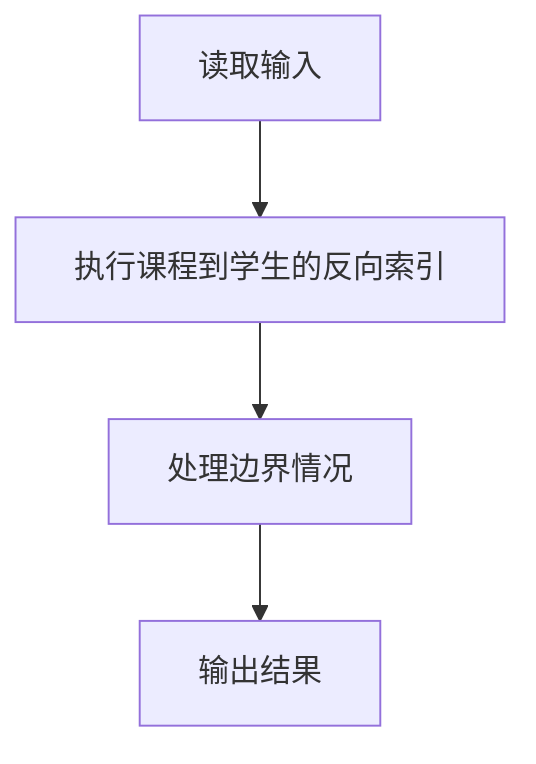
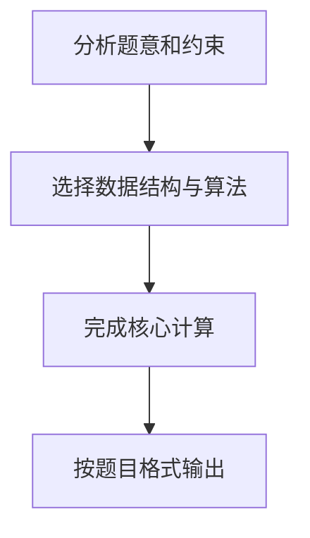

# 7-47 打印选课学生名单

- **分值：** 25分

## 题目描述

假设全校有最多40000名学生和最多2500门课程。现给出每个学生的选课清单，要求输出每门课的选课学生名单。

## 输入格式

输入的第一行是两个正整数：N（$$\le$$40000），为全校学生总数；K（$$\le$$2500），为总课程数。此后N行，每行包括一个学生姓名（3个大写英文字母+1位数字）、一个正整数C（$$\le$$20）代表该生所选的课程门数、随后是C个课程编号。简单起见，课程从1到K编号。

## 输出格式

顺序输出课程1到K的选课学生名单。格式为：对每一门课，首先在一行中输出课程编号和选课学生总数（之间用空格分隔），之后在第二行按字典序输出学生名单，每个学生名字占一行。

## 输入样例
```
10 5
ZOE1 2 4 5
ANN0 3 5 2 1
BOB5 5 3 4 2 1 5
JOE4 1 2
JAY9 4 1 2 5 4
FRA8 3 4 2 5
DON2 2 4 5
AMY7 1 5
KAT3 3 5 4 2
LOR6 4 2 4 1 5
```

## 输出样例
```
1 4
ANN0
BOB5
JAY9
LOR6
2 7
ANN0
BOB5
FRA8
JAY9
JOE4
KAT3
LOR6
3 1
BOB5
4 7
BOB5
DON2
FRA8
JAY9
KAT3
LOR6
ZOE1
5 9
AMY7
ANN0
BOB5
DON2
FRA8
JAY9
KAT3
LOR6
ZOE1
```

## 样例说明

以课程 1 为例：
- 选课学生：ANN0、BOB5、JAY9、LOR6（共 4 人）
- 按字典序排序后输出

## 解题思路

本题采用课程到学生的反向索引，围绕题目给出的数据结构和约束完成核心计算，并处理边界情况。

## 代码流程说明

1. 读取题目规定的输入数据。
2. 使用课程到学生的反向索引完成主要处理。
3. 处理边界情况并整理结果。
4. 按指定格式输出结果。

## 代码实现


```c
/*
 * 实现原理：
 * 1. 使用字符指针数组的数组来存储每门课程的学生名单
 * 2. 动态分配内存存储每个学生姓名（4个字符+结束符）
 * 3. 读取每个学生的选课信息，将姓名添加到对应课程的数组中
 * 4. 使用qsort对每门课程的学生名单按字典序排序
 * 5. 按课程编号从1到K的顺序输出结果
 */

#include <stdio.h>   // 标准输入输出头文件
#include <stdlib.h>  // 标准库头文件，包含malloc、qsort等
#include <string.h>  // 字符串处理头文件

#define MAX_NAME_LEN 5  // 学生姓名最大长度（3字母+1数字+结束符）
#define MAX_STUDENTS 40001  // 最大学生数
#define MAX_COURSES 2501    // 最大课程数

// 比较函数，用于qsort按字典序排序字符串
int cmp(const void *a, const void *b) {
    // 将void指针转换为char**，再解引用得到字符串指针
    return strcmp(*(char **)a, *(char **)b);
}

int main() {
    int N, K;  // N为学生总数，K为课程总数
    char name[MAX_NAME_LEN];  // 临时存储学生姓名
    int C;  // 每个学生选的课程数
    int course;  // 课程编号

    // 读取学生总数和课程总数
    scanf("%d %d", &N, &K);

    // 定义课程数组：每个课程是一个char**，指向存储学生姓名的指针数组
    char **courses[MAX_COURSES];
    // 每个课程的当前学生数
    int count[MAX_COURSES] = {0};
    // 每个课程的容量（用于动态扩容）
    int capacity[MAX_COURSES];

    // 初始化每门课程的容量为16（初始分配空间）
    for (int i = 1; i <= K; i++) {
        capacity[i] = 16;  // 初始容量设为16
        // 分配指针数组空间，每个元素是char*类型
        courses[i] = (char **)malloc(sizeof(char *) * capacity[i]);
    }

    // 读取N个学生的信息
    for (int i = 0; i < N; i++) {
        // 读取学生姓名和选课门数
        scanf("%s %d", name, &C);

        // 读取C门课程
        for (int j = 0; j < C; j++) {
            scanf("%d", &course);  // 读取课程编号

            // 如果当前课程的学生数已达容量，需要扩容
            if (count[course] >= capacity[course]) {
                capacity[course] *= 2;  // 容量翻倍
                // 重新分配更大的内存空间
                courses[course] = (char **)realloc(courses[course], sizeof(char *) * capacity[course]);
            }

            // 为学生姓名分配内存空间
            courses[course][count[course]] = (char *)malloc(sizeof(char) * MAX_NAME_LEN);
            // 将姓名复制到新分配的内存中
            strcpy(courses[course][count[course]], name);
            // 该课程学生数加1
            count[course]++;
        }
    }

    // 按课程编号顺序输出
    for (int i = 1; i <= K; i++) {
        // 使用qsort对当前课程的学生名单按字典序排序
        qsort(courses[i], count[i], sizeof(char *), cmp);

        // 输出课程编号和选课人数
        printf("%d %d\n", i, count[i]);

        // 输出每个学生的姓名
        for (int j = 0; j < count[i]; j++) {
            printf("%s\n", courses[i][j]);
        }
    }

    // 释放内存（可选，程序结束系统会自动回收，但良好习惯）
    for (int i = 1; i <= K; i++) {
        for (int j = 0; j < count[i]; j++) {
            free(courses[i][j]);  // 释放每个姓名字符串
        }
        free(courses[i]);  // 释放指针数组
    }

    return 0;  // 程序正常结束
}
```

## 代码流程图



## 解题流程图



以课程 5 为例：
- 选课学生：AMY7、ANN0、BOB5、DON2、FRA8、JAY9、KAT3、LOR6、ZOE1（共 9 人）
- 按字典序排序后输出
