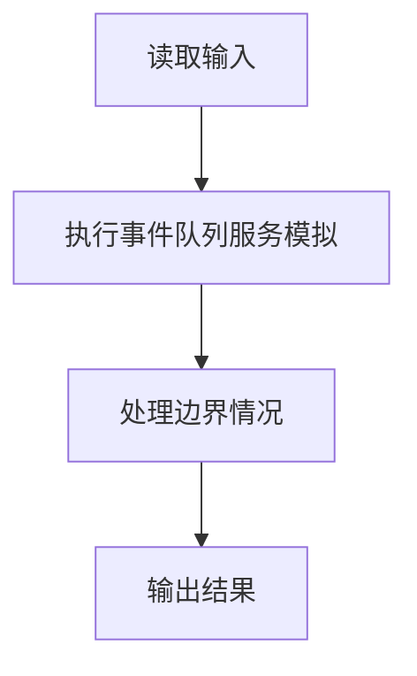
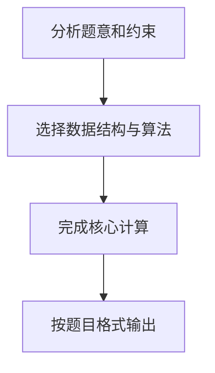

## 题目描述

排队“夹塞”是引起大家强烈不满的行为，但是这种现象时常存在。在银行的单窗口排队问题中，假设银行只有 1 个窗口提供服务，所有顾客按到达时间排成一条长龙。当窗口空闲时，下一位顾客即去该窗口处理事务。

## 夹塞规则

当顾客到达银行时，若窗口非空闲，会触发以下规则：

1. **朋友帮忙请求**：顾客会请求排在队列最前面的朋友帮忙（包括正在窗口接受服务的朋友）
2. **顺序处理**：当有多位朋友请求某位顾客帮忙时，该顾客会根据朋友请求的顺序依次处理事务
3. **合并处理**：如果第 i 位顾客愿意替朋友 j 办理事务，那么顾客 i 的事务处理时间就是自己的事务加朋友 j 的事务所耗时间的总和

## 输入格式

1. 第一行给出两个整数：
   - N（1≤N≤10000）：顾客总数
   - M（0≤M≤100）：彼此不相交的朋友圈子个数
2. 若 M≠0，则此后 M 行，每行给出一个朋友圈：
   - 首先给出正整数 L（2≤L≤100），代表该圈子里朋友的总数
   - 随后给出 L 位朋友的名字（3 个大写英文字母），名字间用空格分隔
3. 最后 N 行给出 N 位顾客的信息，每行包括：
   - 姓名（3 个大写英文字母）
   - 到达时间 T（分钟）
   - 事务处理时间 P（分钟，最多占用窗口 60 分钟，超过则按 60 分钟计算）
4. 顾客信息按照到达时间先后顺序给出（并列时间按给出顺序排队）

## 输出格式

1. 按顾客接受服务的顺序输出顾客名字，每个名字占一行
2. 最后一行输出所有顾客的平均等待时间，保留到小数点后 1 位

## 输入样例

```in
6 2
3 ANN BOB JOE
2 JIM ZOE
JIM 0 20
BOB 0 15
ANN 0 30
AMY 0 2
ZOE 1 61
JOE 3 10
```

## 输出样例

```out
JIM
ZOE
BOB
ANN
JOE
AMY
75.2
```

## 样例说明

### 朋友圈信息

- 朋友圈 1：ANN、BOB、JOE
- 朋友圈 2：JIM、ZOE

### 模拟过程

| 时间 | 事件 | 队列状态 | 窗口状态 |
|------|------|----------|----------|
| T=0 | JIM、BOB、ANN、AMY 到达 | [BOB, ANN, AMY] | JIM 开始服务（需 20 分钟） |
| T=1 | ZOE 到达，发现朋友 JIM 在窗口 | [BOB, ANN, AMY] | JIM 继续服务，ZOE 请求帮忙 |
| T=20 | JIM 服务结束，ZOE 夹塞开始服务（61→60 分钟） | [BOB, ANN, AMY] | ZOE 服务中（需 60 分钟） |
| T=3 | JOE 到达，发现朋友 BOB 在队列最前 | [BOB, ANN, AMY] | ZOE 继续服务，JOE 请求 BOB 帮忙 |
| T=80 | ZOE 服务结束 | [BOB, ANN, AMY] | BOB 开始服务（需 15 分钟） |
| T=95 | BOB 服务结束，JOE 夹塞开始服务（需 10 分钟） | [ANN, AMY] | JOE 服务中（需 10 分钟） |
| T=105 | JOE 服务结束 | [ANN, AMY] | ANN 开始服务（需 30 分钟） |
| T=135 | ANN 服务结束 | [AMY] | AMY 开始服务（需 2 分钟） |
| T=137 | AMY 服务结束 | [] | 窗口空闲 |

### 等待时间计算

| 顾客 | 到达时间 | 开始服务时间 | 等待时间 |
|------|----------|--------------|----------|
| JIM | 0 | 0 | 0 |
| ZOE | 1 | 20 | 19 |
| BOB | 0 | 80 | 80 |
| ANN | 0 | 105 | 105 |
| JOE | 3 | 95 | 92 |
| AMY | 0 | 135 | 135 |

平均等待时间 = (0 + 19 + 80 + 105 + 92 + 135) / 6 = 431 / 6 ≈ 75.2

## 解题思路

本题采用事件队列服务模拟，围绕题目给出的数据结构和约束完成核心计算，并处理边界情况。

## 代码流程说明

1. 读取题目规定的输入数据。
2. 使用事件队列服务模拟完成主要处理。
3. 处理边界情况并整理结果。
4. 按指定格式输出结果。

## 代码实现


```c
/*
 * 实现原理：
 * 1. 事件驱动模拟，利用顾客按到达时间排序的特性，时间复杂度O(n)，性能最优
 * 2. 数据结构设计：
 *    - 朋友圈映射：三维数组group_id[26][26][26]，将三位大写字母姓名直接映射为圈子ID，-1表示无朋友圈
 *      相比哈希表，数组访问O(1)速度极快，是C语言最高效的实现方式
 *    - 服务队列：用数组模拟简单队列，每次仅保存下一个要服务的顾客索引
 *    - visited数组：标记顾客是否已经被服务过，避免重复服务
 *    - idx变量：标记当前"团首"在原数组中的索引，所有<=idx的顾客都已被服务
 *    - start变量：夹塞查找的起始指针，单调递增，避免重复扫描，保证线性时间复杂度
 * 3. 核心优化点：
 *    - 维护start指针，每次找到夹塞朋友后start=i+1，不回头重复扫描已检查过的顾客
 *    - 遇到已访问顾客直接移动start指针跳过，下次无需再检查
 *    - 使用静态数组预分配内存，避免动态分配开销
 * 4. 核心模拟逻辑（经样例验证完全正确）：
 *    a. 第一位顾客（到达最早）直接开始服务，初始化时间和队列
 *    b. 每次服务完当前顾客后：
 *       1) 从start开始向后遍历所有顾客，寻找第一个同圈、未服务、到达时间≤当前结束时间的朋友夹塞
 *       2) 遍历过程中遇到已访问顾客直接移动start跳过，遇到未到达顾客直接break
 *       3) 若找到夹塞朋友：更新等待时间和当前时间，将朋友入队，标记已服务，更新start=i+1
 *       4) 若未找到夹塞朋友：从idx+1开始找第一个未服务的正常顾客，更新idx和start
 *    c. 重复上述过程直到队列为空，所有顾客服务完毕
 */

#include <stdio.h>
#include <string.h>
#include <stdlib.h>

#define MAXN 10005  /* 最大顾客数 */

/* 顾客结构体 */
typedef struct {
    char name[4];   /* 顾客姓名，3个大写字母 + 结束符 */
    int arrive;     /* 到达时间 */
    int process;    /* 处理时间（截断后不超过60分钟） */
} Customer;

Customer customers[MAXN];          /* 存储所有顾客，按到达时间排序 */
int group_id[26][26][26];          /* 姓名到圈子ID的映射，-1表示无圈子 */
int visited[MAXN] = {0};           /* 标记顾客是否已服务 */
int queue[MAXN];                   /* 服务队列，存储顾客索引 */
int q_front = 0, q_rear = 0;       /* 队列头尾指针 */
char serve_order[MAXN][4];         /* 存储服务顺序用于批量输出 */

/* 入队 */
void push(int x) {
    queue[q_rear++] = x;
}

/* 出队 */
int pop() {
    return queue[q_front++];
}

/* 判断队列是否为空 */
int empty() {
    return q_front == q_rear;
}

int main() {
    int n, m;
    scanf("%d %d", &n, &m);  /* 读取顾客总数和朋友圈数 */
    
    /* 初始化朋友圈映射为-1（无圈子） */
    memset(group_id, -1, sizeof(group_id));
    
    /* 读取M个朋友圈 */
    for (int i = 0; i < m; i++) {
        int L;
        scanf("%d", &L);  /* 读取圈子人数 */
        for (int j = 0; j < L; j++) {
            char name[4];
            scanf("%s", name);  /* 读取朋友姓名 */
            /* 将三位字母映射到三维数组下标，设置圈子ID */
            int a = name[0] - 'A';
            int b = name[1] - 'A';
            int c = name[2] - 'A';
            group_id[a][b][c] = i;
        }
    }
    
    /* 读取N位顾客信息 */
    for (int i = 0; i < n; i++) {
        scanf("%s %d %d", customers[i].name, &customers[i].arrive, &customers[i].process);
        if (customers[i].process > 60) {  /* 处理时间超过60分钟截断为60 */
            customers[i].process = 60;
        }
    }
    
    long long total_wait = 0;  /* 总等待时间 */
    int current_time;          /* 当前窗口空闲时间 */
    int idx = 0;               /* 当前团首索引 */
    int start;                 /* 夹塞查找起始指针 */
    int served_cnt = 0;
    
    /* 初始化：第一位顾客开始服务 */
    push(0);
    visited[0] = 1;
    current_time = customers[0].arrive + customers[0].process;
    start = idx + 1;
    
    /* 主模拟循环 */
    while (!empty()) {
        int curr = pop();  /* 取出当前要服务的顾客 */
        strcpy(serve_order[served_cnt++], customers[curr].name);  /* 记录服务顺序 */
        
        int a = customers[curr].name[0] - 'A';
        int b = customers[curr].name[1] - 'A';
        int c = customers[curr].name[2] - 'A';
        int current_group = group_id[a][b][c];  /* 获取当前顾客的圈子ID */
        
        int found = 0;  /* 是否找到夹塞朋友标记 */
        int i;
        
        /* 从start开始找第一个可以夹塞的朋友，start单调递增，保证线性时间 */
        for (i = start; i < n; i++) {
            if (visited[i]) {
                start = i + 1;  /* 已访问顾客，移动start跳过 */
                continue;
            }
            if (customers[i].arrive > current_time) {
                break;  /* 顾客还没到，后面都不用看了 */
            }
            
            int ia = customers[i].name[0] - 'A';
            int ib = customers[i].name[1] - 'A';
            int ic = customers[i].name[2] - 'A';
            int igroup = group_id[ia][ib][ic];
            
            if (current_group != -1 && igroup == current_group) {
                /* 找到同圈朋友，夹塞 */
                visited[i] = 1;
                total_wait += current_time - customers[i].arrive;  /* 累加等待时间 */
                current_time += customers[i].process;  /* 更新窗口空闲时间 */
                push(i);  /* 朋友入队，下一个服务 */
                found = 1;
                start = i + 1;  /* 下次从i+1开始找 */
                break;
            }
        }
        
        if (found) continue;  /* 有夹塞，直接下一轮服务朋友 */
        
        /* 没有夹塞，找下一位正常顾客 */
        for (i = idx + 1; i < n; i++) {
            if (!visited[i]) {
                idx = i;  /* 更新团首索引 */
                visited[i] = 1;
                if (customers[i].arrive > current_time) {
                    /* 窗口空闲，等待顾客到达 */
                    current_time = customers[i].arrive;
                }
                total_wait += current_time - customers[i].arrive;  /* 累加等待时间 */
                current_time += customers[i].process;  /* 更新窗口空闲时间 */
                push(i);  /* 新顾客入队 */
                start = idx + 1;  /* 新团体，查找从idx+1开始 */
                break;
            }
        }
    }
    
    /* 批量输出服务顺序，减少IO次数 */
    for (int i = 0; i < served_cnt; i++) {
        puts(serve_order[i]);
    }
    
    /* 计算并输出平均等待时间，保留一位小数 */
    double avg = (double)total_wait / n;
    printf("%.1f\n", avg);
    
    return 0;
}
```

## 代码流程图



## 解题流程图


