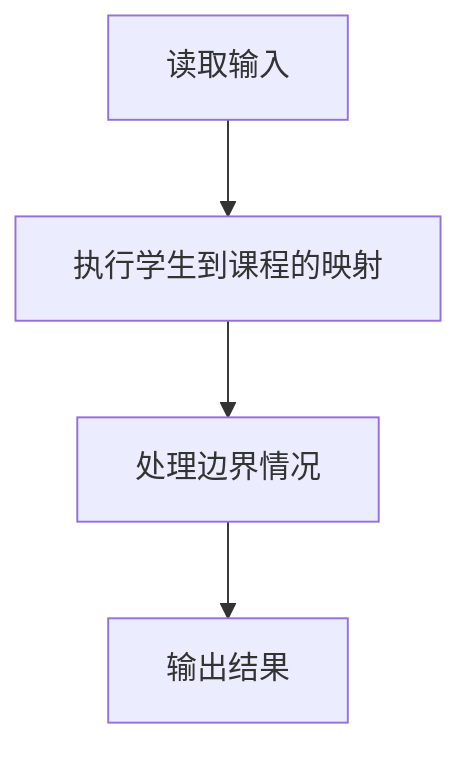
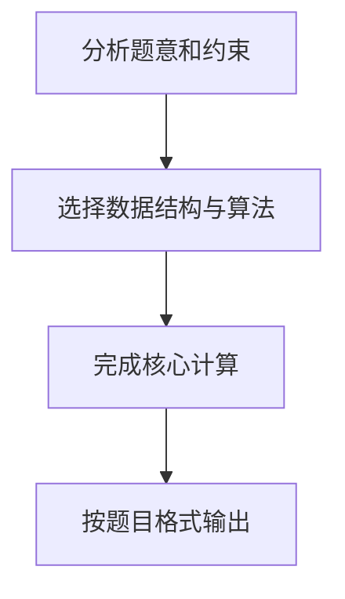

## 7-49 打印学生选课清单

- **分值：** 25分

## 题目描述

假设全校有最多40000名学生和最多2500门课程。现给出每门课的选课学生名单，要求输出每个前来查询的学生的选课清单。注意：每门课程的选课人数不可超过 200 人。

## 输入格式

输入的第一行是两个正整数：N（\le40000），为前来查询课表的学生总数；K（\le2500），为总课程数。此后顺序给出课程1到K的选课学生名单。格式为：对每一门课，首先在一行中输出课程编号（简单起见，课程从1到K编号）和选课学生总数（之间用空格分隔），之后在第二行给出学生名单，相邻两个学生名字用1个空格分隔。学生姓名由3个大写英文字母+1位数字组成。选课信息之后，在一行内给出了N个前来查询课表的学生的名字，相邻两个学生名字用1个空格分隔。

## 输出格式

对每位前来查询课表的学生，首先输出其名字，随后在同一行中输出一个正整数C，代表该生所选的课程门数，随后按递增顺序输出C个课程的编号。相邻数据用1个空格分隔，注意行末不能输出多余空格。

## 输入样例
```
10 5
1 4
ANN0 BOB5 JAY9 LOR6
2 7
ANN0 BOB5 FRA8 JAY9 JOE4 KAT3 LOR6
3 1
BOB5
4 7
BOB5 DON2 FRA8 JAY9 KAT3 LOR6 ZOE1
5 9
AMY7 ANN0 BOB5 DON2 FRA8 JAY9 KAT3 LOR6 ZOE1
ZOE1 ANN0 BOB5 JOE4 JAY9 FRA8 DON2 AMY7 KAT3 LOR6
```

## 输出样例
```
ZOE1 2 4 5
ANN0 3 1 2 5
BOB5 5 1 2 3 4 5
JOE4 1 2
JAY9 4 1 2 4 5
FRA8 3 2 4 5
DON2 2 4 5
AMY7 1 5
KAT3 3 2 4 5
LOR6 4 1 2 4 5
```

## 解题思路

本题采用学生到课程的映射，围绕题目给出的数据结构和约束完成核心计算，并处理边界情况。

## 代码流程说明

1. 读取题目规定的输入数据。
2. 使用学生到课程的映射完成主要处理。
3. 处理边界情况并整理结果。
4. 按指定格式输出结果。

## 代码实现


```c
/*
 * 实现原理：
 *   1. 学生姓名编码：姓名由3个大写字母+1位数字组成，共26^3*10=175760种可能。
 *      将姓名映射为整数索引：idx = (s[0]-'A')*6760 + (s[1]-'A')*260 + (s[2]-'A')*10 + (s[3]-'0')
 *   2. 将所有选课记录存储在一个扁平数组中，每条记录包含(学生编码, 课程编号)。
 *      总选课记录数 ≤ 2500*200 = 500000。
 *   3. 对选课记录数组按学生编码排序（次关键字为课程编号），使用qsort。
 *   4. 查询时，对每个学生编码做两次二分查找，确定该生在排序数组中的起止位置，
 *      直接输出对应范围内的课程编号（已按课程编号递增排列）。
 */

#include <stdio.h>   /* 标准输入输出 */
#include <stdlib.h>  /* qsort */

#define MAX_ENROLL 500000  /* 最大选课记录数：2500门课 * 200人/课 */
#define MAX_STU    175760  /* 最大学生编码数：26^3 * 10 */

/* 选课记录结构体 */
typedef struct {
    int stu_id;    /* 学生编码 */
    int course_id; /* 课程编号 */
} Enroll;

Enroll enrolls[MAX_ENROLL]; /* 全局选课记录数组 */
int enroll_cnt = 0;          /* 当前选课记录总数 */

/*
 * 将学生姓名编码为整数索引
 * 姓名格式：3个大写字母 + 1位数字，如 ANN0
 * 编码：26进制字母部分 + 10进制数字部分
 */
int encode(const char *name) {
    return (name[0] - 'A') * 6760 +   /* 第1位字母，权重 26*26*10 = 6760 */
           (name[1] - 'A') * 260 +    /* 第2位字母，权重 26*10 = 260     */
           (name[2] - 'A') * 10 +     /* 第3位字母，权重 10              */
           (name[3] - '0');           /* 第4位数字，权重 1               */
}

/* qsort 比较函数：先按学生编码排序，再按课程编号排序 */
int cmp(const void *a, const void *b) {
    const Enroll *ea = (const Enroll *)a; /* 类型转换 */
    const Enroll *eb = (const Enroll *)b;
    if (ea->stu_id != eb->stu_id)             /* 学生编码不同 */
        return ea->stu_id - eb->stu_id;       /* 按学生编码升序 */
    return ea->course_id - eb->course_id;     /* 按课程编号升序 */
}

int main() {
    int N, K;                          /* N:查询学生数, K:课程总数 */
    scanf("%d %d", &N, &K);            /* 读取N和K */

    /* 读取每门课的选课名单 */
    for (int i = 0; i < K; i++) {      /* 遍历K门课程 */
        int cid, cnt;                  /* cid:课程编号, cnt:选课人数 */
        scanf("%d %d", &cid, &cnt);    /* 读取课程编号和选课人数 */
        for (int j = 0; j < cnt; j++) {/* 读取该课程的学生名单 */
            char name[5];              /* 学生姓名缓冲区（4字符+结束符） */
            scanf("%s", name);         /* 读取一个学生姓名 */
            enrolls[enroll_cnt].stu_id = encode(name);    /* 编码学生姓名 */
            enrolls[enroll_cnt].course_id = cid;           /* 记录课程编号 */
            enroll_cnt++;              /* 选课记录计数加1 */
        }
    }

    /* 对选课记录排序：按学生编码为主键，课程编号为次键 */
    qsort(enrolls, enroll_cnt, sizeof(Enroll), cmp);

    /* 处理每个查询 */
    for (int i = 0; i < N; i++) {      /* 遍历N个查询学生 */
        char name[5];                  /* 学生姓名缓冲区 */
        scanf("%s", name);             /* 读取查询的学生姓名 */
        int sid = encode(name);        /* 编码学生姓名 */

        /* 二分查找第一个stu_id >= sid的位置（下界） */
        int left = 0, right = enroll_cnt;
        while (left < right) {
            int mid = (left + right) / 2;          /* 取中点 */
            if (enrolls[mid].stu_id < sid)         /* 中点学生编码小于目标 */
                left = mid + 1;                    /* 收缩左边界 */
            else
                right = mid;                       /* 收缩右边界 */
        }
        int start = left;              /* 起始位置 */

        /* 二分查找第一个stu_id > sid的位置（上界） */
        left = 0; right = enroll_cnt;
        while (left < right) {
            int mid = (left + right) / 2;          /* 取中点 */
            if (enrolls[mid].stu_id <= sid)        /* 中点学生编码 ≤ 目标 */
                left = mid + 1;                    /* 收缩左边界 */
            else
                right = mid;                       /* 收缩右边界 */
        }
        int end = left;                /* 结束位置（不包含） */

        int cnt = end - start;         /* 该生选课门数 */
        printf("%s %d", name, cnt);    /* 输出姓名和选课门数 */
        for (int j = start; j < end; j++) {        /* 遍历该生的每门课 */
            printf(" %d", enrolls[j].course_id);   /* 输出课程编号 */
        }
        printf("\n");                  /* 换行 */
    }

    return 0;                          /* 程序正常结束 */
}
```

## 代码流程图



## 解题流程图


