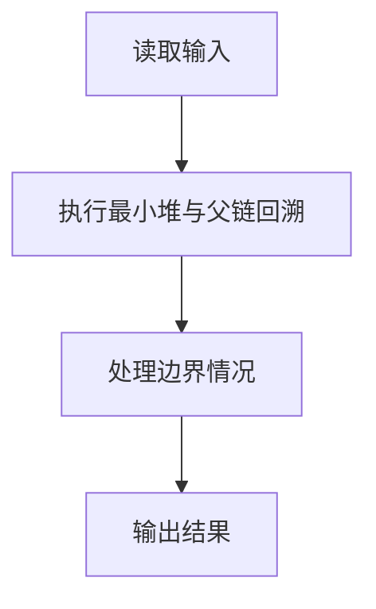
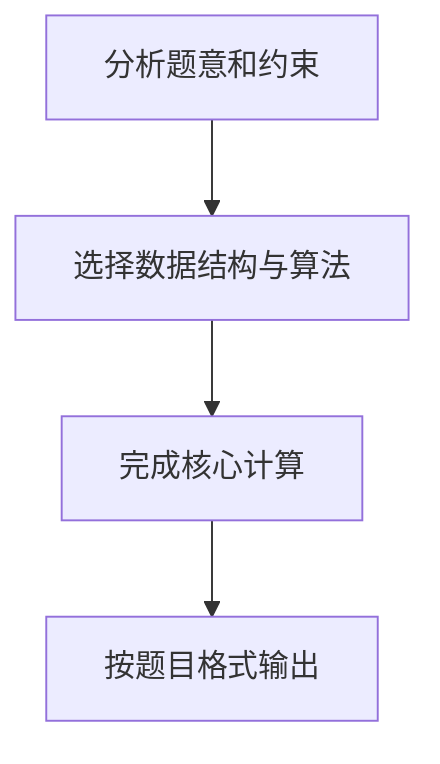

## 7-5 堆中的路径

- **分值：** 25分

## 题目描述

将一系列给定数字插入一个初始为空的最小堆 h。随后对任意给定的下标 i，打印从第 i 个结点到根结点的路径。

## 输入格式

每组测试第 1 行包含 2 个正整数 n 和 m (\le 10^3)，分别是插入元素的个数、以及需要打印的路径条数。下一行给出区间 [-10^4, 10^4] 内的 n 个要被插入一个初始为空的小顶堆的整数。最后一行给出 m 个下标。

## 输出格式

对输入中给出的每个下标 i，在一行中输出从第 i 个结点到根结点的路径上的数据。数字间以 1 个空格分隔，行末不得有多余空格。

## 输入样例
```
5 3
46 23 26 24 10
5 4 3
```

## 输出样例
```
24 23 10
46 23 10
26 10
```

## 解题思路

本题采用最小堆与父链回溯，围绕题目给出的数据结构和约束完成核心计算，并处理边界情况。

## 代码流程说明

1. 读取题目规定的输入数据。
2. 使用最小堆与父链回溯完成主要处理。
3. 处理边界情况并整理结果。
4. 按指定格式输出结果。

## 代码实现


```c
/*
 * 实现过程：
 * 本题要求将一系列整数依次插入最小堆，然后查询从指定节点到根的路径。
 *
 * 数据结构：
 * - 用一维数组 heap[] 实现最小堆，采用 1-based 索引（下标0不用）。
 * - 对于节点 i：父节点为 i/2，左孩子为 2i，右孩子为 2i+1。
 *
 * 插入操作（上滤）：
 * 1. 将新元素放到堆数组末尾（size+1 的位置）。
 * 2. 若新元素比父节点小，则与父节点交换。
 * 3. 重复步骤2，直到新元素不小于父节点或已到达根节点。
 *
 * 路径查询：
 * - 从给定下标 idx 开始，依次输出 heap[idx]，然后 idx /= 2 向上走到父节点，
 *   直到 idx 为 0（越过了根节点），即得到从该节点到根的路径。
 *
 * 时间复杂度：每次插入 O(logN)，每次查询 O(logN)。
 */

#include <stdio.h>   // 标准输入输出库
#include <stdlib.h>  // 标准库

#define MAXN 1001    // 堆的最大容量，1-based 索引，最多存 1000 个元素

// 交换两个整数的值
void swap(int *a, int *b) {
    int t = *a;  // 暂存 a 的值
    *a = *b;     // 将 b 的值赋给 a
    *b = t;      // 将暂存的值赋给 b
}

// 向最小堆中插入一个元素（上滤操作）
// heap[]: 堆数组（1-based 索引）
// size:   指向当前堆大小的指针
// x:      待插入的值
void insert(int heap[], int *size, int x) {
    ++(*size);          // 堆大小加 1
    int i = *size;      // i 指向新元素应放入的位置（末尾）
    heap[i] = x;        // 将新元素放入末尾
    // 上滤：如果当前节点比父节点小，则与父节点交换，保持最小堆性质
    while (i > 1 && heap[i] < heap[i / 2]) {
        swap(&heap[i], &heap[i / 2]);  // 交换当前节点与父节点
        i /= 2;                         // 继续向上比较
    }
}

int main() {
    int n, m, heap[MAXN], size = 0;  // n: 插入元素个数, m: 查询次数, heap: 最小堆数组, size: 当前堆大小

    // 读入 n 和 m
    scanf("%d %d", &n, &m);
    // 逐个读入元素并插入最小堆
    for (int i = 0; i < n; i++) {
        int x;
        scanf("%d", &x);            // 读入待插入元素
        insert(heap, &size, x);     // 插入堆中
    }

    // 处理 m 次查询：输出从下标 idx 到根节点的路径
    for (int i = 0; i < m; i++) {
        int idx;
        scanf("%d", &idx);          // 读入要查询的堆下标（1-based）
        printf("%d", heap[idx]);    // 先输出当前节点值
        idx /= 2;                   // 移动到父节点
        // 不断向上遍历直到根节点（下标 0 表示结束）
        while (idx > 0) {
            printf(" %d", heap[idx]);  // 输出父节点值
            idx /= 2;                  // 继续向上移动
        }
        printf("\n");               // 每条路径输出换行
    }

    return 0;  // 程序正常结束
}
```

## 代码流程图



## 解题流程图


