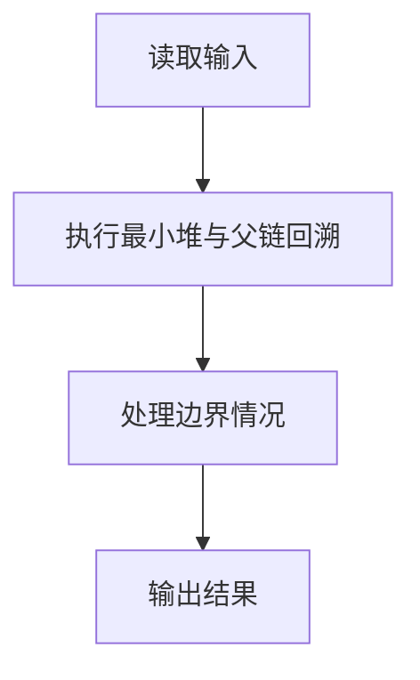
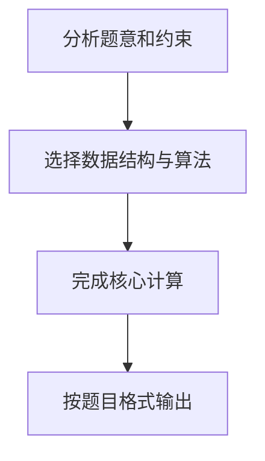

## 7-5 堆中的路径

- **分值：** 25分

## 题目描述

将一系列给定数字插入一个初始为空的最小堆 h。随后对任意给定的下标 i，打印从第 i 个结点到根结点的路径。

## 输入格式

每组测试第 1 行包含 2 个正整数 n 和 m (\le 10^3)，分别是插入元素的个数、以及需要打印的路径条数。下一行给出区间 [-10^4, 10^4] 内的 n 个要被插入一个初始为空的小顶堆的整数。最后一行给出 m 个下标。

## 输出格式

对输入中给出的每个下标 i，在一行中输出从第 i 个结点到根结点的路径上的数据。数字间以 1 个空格分隔，行末不得有多余空格。

## 输入样例
```
5 3
46 23 26 24 10
5 4 3
```

## 输出样例
```
24 23 10
46 23 10
26 10
```

## 解题思路

本题采用最小堆与父链回溯，围绕题目给出的数据结构和约束完成核心计算，并处理边界情况。

## 代码流程说明

1. 读取题目规定的输入数据。
2. 使用最小堆与父链回溯完成主要处理。
3. 处理边界情况并整理结果。
4. 按指定格式输出结果。

## 代码实现


```javascript
const fs = require("fs");
const raw = fs.readFileSync(0, "utf8");
const tokens = raw.trim() ? raw.trim().split(/\s+/) : [];
let at = 0;

// 建立小顶堆后，沿 parent = floor(index / 2) 回溯每个查询下标。
const [n, m] = [Number(tokens[at++]), Number(tokens[at++])];
const heap = [0];
for (let i = 0; i < n; i++) {
  let p = heap.length;
  heap.push(Number(tokens[at++]));
  while (p > 1 && heap[p] < heap[Math.floor(p / 2)]) {
    [heap[p], heap[Math.floor(p / 2)]] = [heap[Math.floor(p / 2)], heap[p]];
    p = Math.floor(p / 2);
  }
}
const out = [];
for (let i = 0; i < m; i++) {
  let p = Number(tokens[at++]),
    path = [];
  while (p > 0) {
    path.push(heap[p]);
    p = Math.floor(p / 2);
  }
  out.push(path.join(" "));
}
console.log(out.join("\n"));
```

## 代码流程图



## 解题流程图


