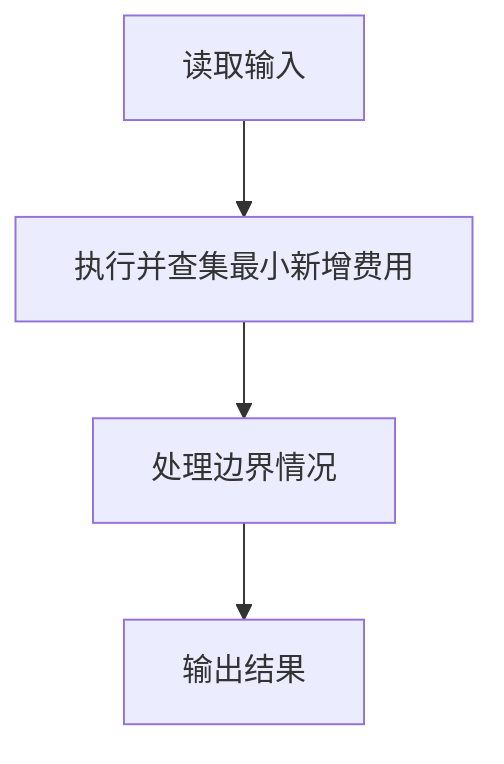
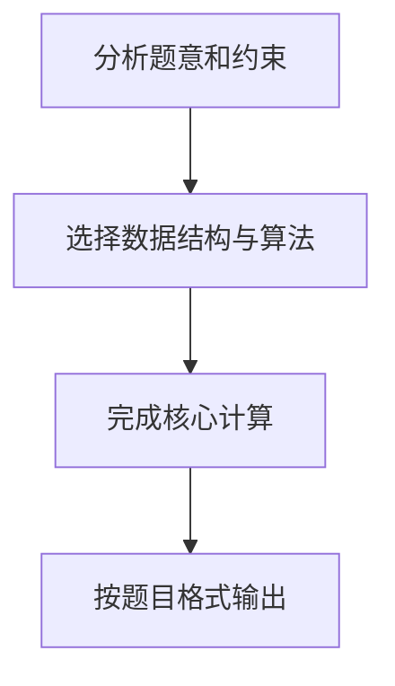

某地区经过对城镇交通状况的调查，得到现有城镇间快速道路的统计数据，并提出“畅通工程”的目标：使整个地区任何两个城镇间都可以实现快速交通（但不一定有直接的快速道路相连，只要互相间接通过快速路可达即可）。现得到城镇道路统计表，表中列出了任意两城镇间修建快速路的费用，以及该道路是否已经修通的状态。现请你编写程序，计算出全地区畅通需要的最低成本。

输入格式:
输入的第一行给出村庄数目N (1≤N≤100)；随后的N(N−1)/2行对应村庄间道路的成本及修建状态：每行给出4个正整数，分别是两个村庄的编号（从1编号到N），此两村庄间道路的成本，以及修建状态 — 1表示已建，0表示未建。

输出格式:
输出全省畅通需要的最低成本。

输入样例:
```in
4
1 2 1 1
1 3 4 0
1 4 1 1
2 3 3 0
2 4 2 1
3 4 5 0
```
输出样例:
```out
3
```

## 解题思路

本题采用并查集最小新增费用，围绕题目给出的数据结构和约束完成核心计算，并处理边界情况。

## 代码流程说明

1. 读取题目规定的输入数据。
2. 使用并查集最小新增费用完成主要处理。
3. 处理边界情况并整理结果。
4. 按指定格式输出结果。

## 代码实现


```c
/*
 * 实现原理：
 *   本题是典型的最小生成树（MST）问题，使用 Kruskal 算法 + 并查集求解。
 *   1. 已经修建的道路（状态为 1）费用视为 0，直接使用并查集将两端村庄合并。
 *   2. 未修建的道路（状态为 0）存入边列表，按费用从小到大排序。
 *   3. 遍历排序后的边列表，若边的两端村庄不在同一集合中，则修建该道路
 *      （累加费用），并合并两端村庄。
 *   4. 最终累加的费用即为全地区畅通需要的最低成本。
 */

#include <stdio.h>
#include <stdlib.h>

/* 边的结构体 */
typedef struct {
    int u;      /* 村庄 u 的编号 */
    int v;      /* 村庄 v 的编号 */
    int cost;   /* 修建费用 */
} Edge;

/* 并查集：查找根节点（路径压缩） */
int find(int parent[], int x) {
    if (parent[x] != x) {           /* 如果 x 不是根节点 */
        parent[x] = find(parent, parent[x]); /* 递归查找并压缩路径 */
    }
    return parent[x];               /* 返回 x 所在集合的根 */
}

/* 并查集：合并两个集合 */
void union_set(int parent[], int rank[], int a, int b) {
    int root_a = find(parent, a);   /* 查找 a 的根 */
    int root_b = find(parent, b);   /* 查找 b 的根 */
    if (root_a == root_b) return;   /* 已在同一集合中，无需合并 */
    /* 按秩合并：将秩小的树合并到秩大的树下 */
    if (rank[root_a] < rank[root_b]) {
        parent[root_a] = root_b;
    } else if (rank[root_a] > rank[root_b]) {
        parent[root_b] = root_a;
    } else {
        parent[root_b] = root_a;
        rank[root_a]++;             /* 秩相同时，新根秩加 1 */
    }
}

/* 比较函数：用于 qsort 按边权升序排序 */
int cmp(const void *a, const void *b) {
    Edge *e1 = (Edge *)a;
    Edge *e2 = (Edge *)b;
    return e1->cost - e2->cost;     /* 返回差值实现升序 */
}

int main() {
    int N;                          /* 村庄数目 */
    scanf("%d", &N);

    int M = N * (N - 1) / 2;        /* 总边数（完全图） */
    Edge *edges = (Edge *)malloc(M * sizeof(Edge)); /* 存储未修建的边 */
    int edge_cnt = 0;               /* 未修建边的数量 */

    int *parent = (int *)malloc((N + 1) * sizeof(int)); /* 并查集父节点数组 */
    int *rank   = (int *)malloc((N + 1) * sizeof(int)); /* 并查集秩数组 */

    /* 初始化并查集：每个村庄初始父节点指向自己 */
    for (int i = 1; i <= N; i++) {
        parent[i] = i;
        rank[i] = 0;
    }

    /* 读取所有边信息 */
    for (int i = 0; i < M; i++) {
        int u, v, cost, status;
        scanf("%d %d %d %d", &u, &v, &cost, &status);
        if (status == 1) {
            /* 已修建的道路：直接合并两端村庄 */
            union_set(parent, rank, u, v);
        } else {
            /* 未修建的道路：存入边列表 */
            edges[edge_cnt].u = u;
            edges[edge_cnt].v = v;
            edges[edge_cnt].cost = cost;
            edge_cnt++;
        }
    }

    /* 对未修建的道路按费用从小到大排序 */
    qsort(edges, edge_cnt, sizeof(Edge), cmp);

    int total_cost = 0;             /* 记录最低总成本 */
    /* Kruskal 算法：遍历排序后的边 */
    for (int i = 0; i < edge_cnt; i++) {
        int u = edges[i].u;
        int v = edges[i].v;
        /* 如果 u 和 v 不在同一集合中，则修建此道路 */
        if (find(parent, u) != find(parent, v)) {
            total_cost += edges[i].cost; /* 累加费用 */
            union_set(parent, rank, u, v); /* 合并两端 */
        }
    }

    printf("%d\n", total_cost);      /* 输出最低成本 */

    free(edges);                     /* 释放内存 */
    free(parent);
    free(rank);
    return 0;
}
```

## 代码流程图



## 解题流程图


