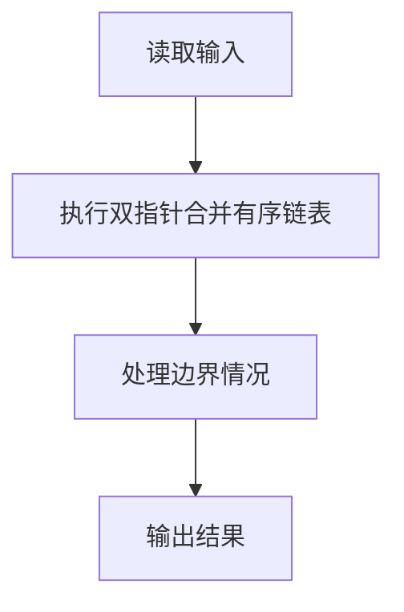
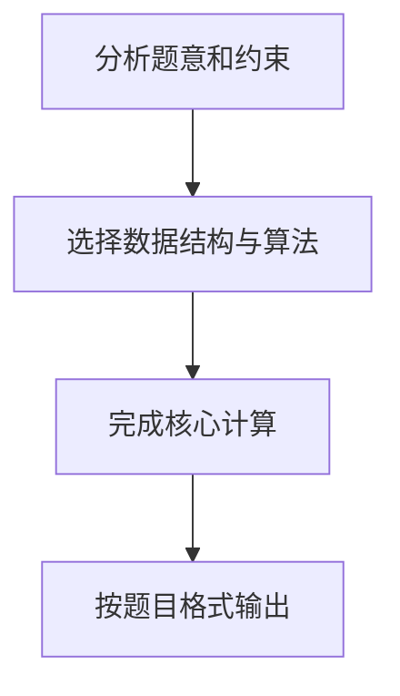

## 7-51 两个有序链表序列的合并

- **分值：** 20分

## 题目描述

已知两个非降序链表序列S1与S2，设计函数构造出S1与S2合并后的新的非降序链表S3。

## 输入格式

输入分两行，分别在每行给出由若干个正整数构成的非降序序列，用-1表示序列的结尾（-1不属于这个序列）。数字用空格间隔。

## 输出格式

在一行中输出合并后新的非降序链表，数字间用空格分开，结尾不能有多余空格；若新链表为空，输出`NULL`。

## 输入样例
```
1 3 5 -1
2 4 6 8 10 -1
```

## 输出样例
```
1 2 3 4 5 6 8 10
```

## 解题思路

本题采用双指针合并有序链表，围绕题目给出的数据结构和约束完成核心计算，并处理边界情况。

## 代码流程说明

1. 读取题目规定的输入数据。
2. 使用双指针合并有序链表完成主要处理。
3. 处理边界情况并整理结果。
4. 按指定格式输出结果。

## 代码实现


```javascript
const fs = require("fs");
const raw = fs.readFileSync(0, "utf8");
const tokens = raw.trim() ? raw.trim().split(/\s+/) : [];
let at = 0;

// 双指针每次取较小元素；等值时两边都保留，符合合并定义。
function readSequence() {
  const a = [];
  while (at < tokens.length) {
    const x = Number(tokens[at++]);
    if (x < 0) break;
    a.push(x);
  }
  return a;
}
const a = readSequence(),
  b = readSequence(),
  out = [];
let i = 0,
  j = 0;
while (i < a.length || j < b.length)
  out.push(j === b.length || (i < a.length && a[i] <= b[j]) ? a[i++] : b[j++]);
console.log(out.join(" "));
```

## 代码流程图



## 解题流程图


