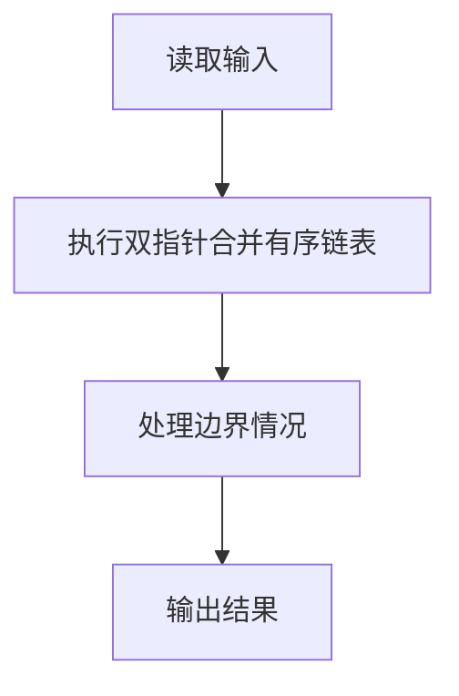
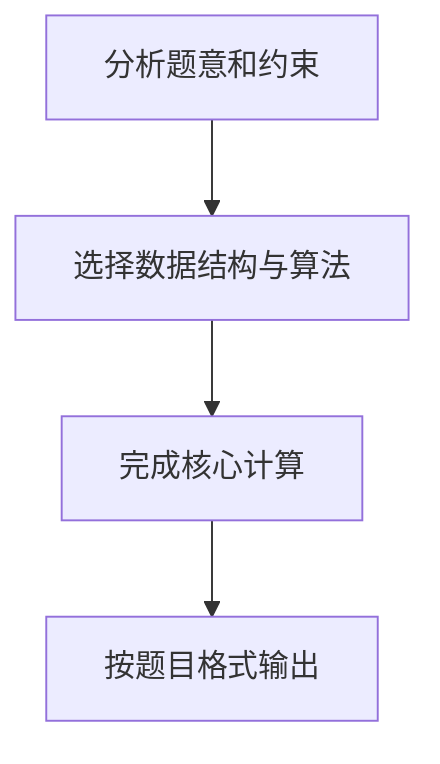

## 7-51 两个有序链表序列的合并

- **分值：** 20分

## 题目描述

已知两个非降序链表序列S1与S2，设计函数构造出S1与S2合并后的新的非降序链表S3。

## 输入格式

输入分两行，分别在每行给出由若干个正整数构成的非降序序列，用-1表示序列的结尾（-1不属于这个序列）。数字用空格间隔。

## 输出格式

在一行中输出合并后新的非降序链表，数字间用空格分开，结尾不能有多余空格；若新链表为空，输出`NULL`。

## 输入样例
```
1 3 5 -1
2 4 6 8 10 -1
```

## 输出样例
```
1 2 3 4 5 6 8 10
```

## 解题思路

本题采用双指针合并有序链表，围绕题目给出的数据结构和约束完成核心计算，并处理边界情况。

## 代码流程说明

1. 读取题目规定的输入数据。
2. 使用双指针合并有序链表完成主要处理。
3. 处理边界情况并整理结果。
4. 按指定格式输出结果。

## 代码实现


```c
/*
 * ============================================================
 * 实现原理：
 * 1. 定义链表节点结构体 Node，包含数据域 data 和指针域 next
 * 2. 从标准输入读取两个非降序序列（以 -1 结尾），分别构建两个有序链表
 * 3. 使用双指针归并法合并两个有序链表：
 *    - 比较两个链表当前节点的值，将较小者接入新链表
 *    - 移动较小者所在链表的指针
 *    - 重复直到其中一个链表遍历完
 *    - 将剩余链表直接接入新链表尾部
 * 4. 输出合并后的链表，若为空则输出 NULL
 *
 * 时间复杂度：O(m + n)，其中 m, n 为两个链表的长度
 * 空间复杂度：O(1)（合并过程不创建新节点，仅修改指针）
 * ============================================================
 */

#include <stdio.h>  /* 包含标准输入输出库 */
#include <stdlib.h> /* 包含标准库（malloc, free） */

/* 定义链表节点结构体 */
typedef struct Node {
    int data;           /* 节点存储的数据值 */
    struct Node* next;  /* 指向下一个节点的指针 */
} Node;

/*
 * 函数：create_node
 * 功能：创建一个值为 val 的新节点
 * 参数：val - 新节点的数据值
 * 返回值：指向新创建节点的指针
 */
Node* create_node(int val) {
    Node* node = (Node*)malloc(sizeof(Node)); /* 为新节点分配内存 */
    node->data = val;                          /* 设置节点的数据值 */
    node->next = NULL;                         /* 新节点的 next 指针初始化为空 */
    return node;                               /* 返回新节点的指针 */
}

/*
 * 函数：read_list
 * 功能：从标准输入读取一个非降序序列（以 -1 结尾），构建链表
 * 返回值：指向链表头节点的指针
 */
Node* read_list() {
    Node *head = NULL;  /* 链表头指针，初始为空 */
    Node *tail = NULL;  /* 链表尾指针，用于尾插法构建链表 */
    int val;            /* 存储每次读取的数值 */

    while (1) {                                        /* 循环读取，直到遇到 -1 */
        scanf("%d", &val);                             /* 从标准输入读取一个整数 */
        if (val == -1) break;                          /* 遇到 -1 则结束读取 */
        Node* node = create_node(val);                 /* 为当前值创建新节点 */
        if (head == NULL) {                            /* 如果链表为空 */
            head = node;                               /* 新节点作为头节点 */
            tail = node;                               /* 尾指针也指向该节点 */
        } else {                                       /* 链表非空 */
            tail->next = node;                         /* 将新节点接到链表尾部 */
            tail = node;                               /* 更新尾指针指向新节点 */
        }
    }
    return head;                                       /* 返回链表头指针 */
}

/*
 * 函数：merge_lists
 * 功能：合并两个非降序链表为一个新的非降序链表
 * 参数：list1 - 第一个有序链表的头指针
 *        list2 - 第二个有序链表的头指针
 * 返回值：指向合并后链表头节点的指针
 * 注意：该函数通过修改指针来合并，不创建新节点
 */
Node* merge_lists(Node* list1, Node* list2) {
    Node dummy;           /* 哑节点，简化边界处理 */
    dummy.next = NULL;    /* 初始化哑节点的 next 指针 */
    Node* tail = &dummy;  /* tail 指向当前合并链表的尾部 */

    while (list1 != NULL && list2 != NULL) {  /* 两个链表都还有节点时 */
        if (list1->data <= list2->data) {      /* 如果 list1 当前节点值较小 */
            tail->next = list1;                /* 将 list1 节点接入合并链表 */
            list1 = list1->next;               /* list1 指针后移 */
        } else {                               /* list2 当前节点值较小 */
            tail->next = list2;                /* 将 list2 节点接入合并链表 */
            list2 = list2->next;               /* list2 指针后移 */
        }
        tail = tail->next;                     /* 合并链表尾指针后移 */
    }

    /* 将剩余未遍历完的链表直接接入合并链表尾部 */
    if (list1 != NULL) {                       /* 如果 list1 还有剩余节点 */
        tail->next = list1;                    /* 将 list1 剩余部分接入 */
    }
    if (list2 != NULL) {                       /* 如果 list2 还有剩余节点 */
        tail->next = list2;                    /* 将 list2 剩余部分接入 */
    }

    return dummy.next;                         /* 返回合并后链表的头指针 */
}

/*
 * 函数：print_list
 * 功能：输出链表，数字间用空格分开，结尾无多余空格
 * 参数：head - 链表头指针
 */
void print_list(Node* head) {
    if (head == NULL) {                        /* 如果链表为空 */
        printf("NULL\n");                      /* 输出 NULL */
        return;                                /* 结束函数 */
    }
    Node* cur = head;                          /* 遍历指针，从链表头开始 */
    while (cur != NULL) {                      /* 遍历链表每个节点 */
        printf("%d", cur->data);               /* 输出当前节点的数据值 */
        if (cur->next != NULL) {               /* 如果当前节点不是最后一个 */
            printf(" ");                       /* 输出空格分隔符 */
        }
        cur = cur->next;                       /* 指针后移 */
    }
    printf("\n");                              /* 输出换行符 */
}

/*
 * 函数：free_list
 * 功能：释放链表占用的内存
 * 参数：head - 链表头指针
 */
void free_list(Node* head) {
    Node* cur = head;                          /* 当前遍历节点 */
    while (cur != NULL) {                      /* 遍历链表 */
        Node* temp = cur;                      /* 暂存当前节点 */
        cur = cur->next;                       /* 指针后移 */
        free(temp);                            /* 释放当前节点内存 */
    }
}

/*
 * 主函数
 */
int main() {
    Node* list1 = read_list();                 /* 读取第一个有序链表序列 */
    Node* list2 = read_list();                 /* 读取第二个有序链表序列 */

    Node* merged = merge_lists(list1, list2);  /* 归并合并两个有序链表 */

    print_list(merged);                        /* 输出合并后的链表 */

    free_list(merged);                         /* 释放合并后链表的内存 */

    return 0;                                  /* 程序正常结束 */
}
```

## 代码流程图



## 解题流程图


