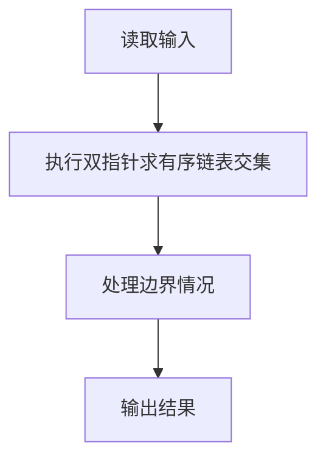
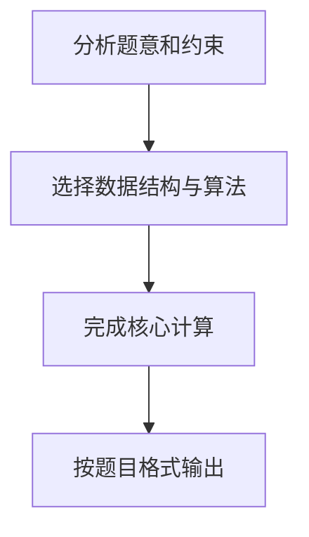

# 7-52 两个有序链表序列的交集

- **分值：** 20分

## 题目描述

已知两个非降序链表序列S1与S2，设计函数构造出S1与S2的交集新链表S3。

## 输入格式

输入分两行，分别在每行给出由若干个正整数构成的非降序序列，用$$-1$$表示序列的结尾（$$-1$$不属于这个序列）。数字用空格间隔。

## 输出格式

在一行中输出两个输入序列的交集序列，数字间用空格分开，结尾不能有多余空格；若新链表为空，输出`NULL`。

## 输入样例
```
1 2 5 -1
2 4 5 8 10 -1
```

## 输出样例
```
2 5
```

## 解题思路

本题采用双指针求有序链表交集，围绕题目给出的数据结构和约束完成核心计算，并处理边界情况。

## 代码流程说明

1. 读取题目规定的输入数据。
2. 使用双指针求有序链表交集完成主要处理。
3. 处理边界情况并整理结果。
4. 按指定格式输出结果。

## 代码实现


```c
/**
 * 两个有序链表序列的交集 - C语言实现
 * 
 * 实现原理：
 * 1. 采用双指针法遍历两个有序链表，时间复杂度O(n+m)
 * 2. 初始化两个指针分别指向两个链表的头节点
 * 3. 比较两个指针指向的值：
 *    - 如果相等，将该值加入结果链表，同时移动两个指针
 *    - 如果不等，移动值较小的指针
 * 4. 由于输入链表是非降序的，交集结果也保持非降序
 * 5. 输入处理：从标准输入读取两个序列，用-1表示序列结束
 * 6. 输出处理：遍历结果链表输出，空链表输出NULL
 */

#include <stdio.h>
#include <stdlib.h>

// 链表节点结构体定义
typedef struct Node {
    int data;           // 节点数据
    struct Node* next;  // 指向下一个节点的指针
} Node;

/**
 * 创建新节点
 * @param data 节点数据
 * @return 新创建的节点指针
 */
Node* createNode(int data) {
    Node* newNode = (Node*)malloc(sizeof(Node));
    newNode->data = data;
    newNode->next = NULL;
    return newNode;
}

/**
 * 从标准输入读取序列并创建链表
 * @return 创建的链表头节点
 */
Node* readList() {
    int num;
    Node* head = NULL;   // 链表头节点
    Node* tail = NULL;   // 链表尾节点
    
    while (1) {
        scanf("%d", &num);
        if (num == -1) {  // -1表示序列结束
            break;
        }
        
        Node* newNode = createNode(num);
        if (head == NULL) {
            head = newNode;  // 第一个节点作为头节点
            tail = newNode;
        } else {
            tail->next = newNode;  // 添加到链表尾部
            tail = newNode;
        }
    }
    
    return head;
}

/**
 * 求两个有序链表的交集
 * @param list1 第一个有序链表
 * @param list2 第二个有序链表
 * @return 交集链表的头节点
 */
Node* getIntersection(Node* list1, Node* list2) {
    Node* p1 = list1;    // 指针p1遍历list1
    Node* p2 = list2;    // 指针p2遍历list2
    Node* resultHead = NULL;  // 结果链表头节点
    Node* resultTail = NULL;  // 结果链表尾节点
    
    // 双指针遍历两个链表
    while (p1 != NULL && p2 != NULL) {
        if (p1->data == p2->data) {
            // 找到公共元素，加入结果链表
            Node* newNode = createNode(p1->data);
            if (resultHead == NULL) {
                resultHead = newNode;
                resultTail = newNode;
            } else {
                resultTail->next = newNode;
                resultTail = newNode;
            }
            // 同时移动两个指针
            p1 = p1->next;
            p2 = p2->next;
        } else if (p1->data < p2->data) {
            // list1当前值较小，移动p1
            p1 = p1->next;
        } else {
            // list2当前值较小，移动p2
            p2 = p2->next;
        }
    }
    
    return resultHead;
}

/**
 * 打印链表内容
 * @param head 链表头节点
 */
void printList(Node* head) {
    if (head == NULL) {
        printf("NULL\n");  // 空链表输出NULL
        return;
    }
    
    Node* current = head;
    int isFirst = 1;
    
    while (current != NULL) {
        if (!isFirst) {
            printf(" ");  // 非第一个元素前输出空格
        }
        printf("%d", current->data);
        isFirst = 0;
        current = current->next;
    }
    printf("\n");
}

/**
 * 释放链表内存
 * @param head 链表头节点
 */
void freeList(Node* head) {
    Node* temp;
    while (head != NULL) {
        temp = head;
        head = head->next;
        free(temp);
    }
}

/**
 * 主函数
 */
int main() {
    // 读取两个有序链表
    Node* list1 = readList();
    Node* list2 = readList();
    
    // 求交集
    Node* intersection = getIntersection(list1, list2);
    
    // 输出结果
    printList(intersection);
    
    // 释放内存
    freeList(list1);
    freeList(list2);
    freeList(intersection);
    
    return 0;
}
```

## 代码流程图



## 解题流程图


