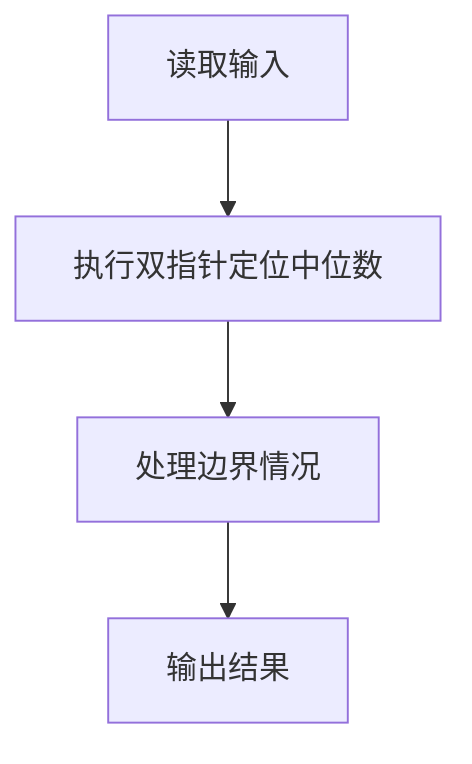
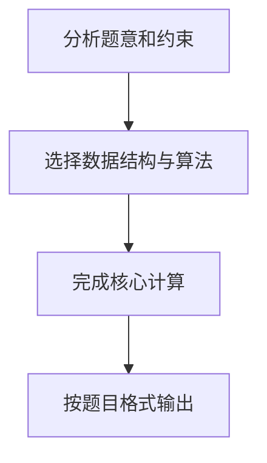

## 7-53 两个有序序列的中位数

- **分值：** 25分

## 题目描述

已知有两个等长的非降序序列S1, S2, 设计函数求S1与S2并集的中位数。有序序列A_0, A_1, \cdots, A_{N-1}的中位数指A_{(N-1)/2}的值,即第\lfloor(N+1)/2\rfloor个数（A_0为第1个数）。

## 输入格式

输入分三行。第一行给出序列的公共长度N（0<N\le100000），随后每行输入一个序列的信息，即N个非降序排列的整数。数字用空格间隔。

## 输出格式

在一行中输出两个输入序列的并集序列的中位数。

## 输入样例1
```
5
1 3 5 7 9
2 3 4 5 6
```

## 输出样例1
```
4
```

## 输入样例2
```
6
-100 -10 1 1 1 1
-50 0 2 3 4 5
```

## 输出样例2
```
1
```

## 样例说明

## 样例 1 分析

- S1 = [1, 3, 5, 7, 9]
- S2 = [2, 3, 4, 5, 6]
- 并集排序后：[1, 2, 3, 3, 4, 5, 5, 6, 7, 9]
- 总长度 N = 10，中位数位置为第 ⌊(10+1)/2⌋ = 5 个数（从 1 开始计数）
- 第 5 个数是 **4**

## 样例 2 分析

- S1 = [-100, -10, 1, 1, 1, 1]
- S2 = [-50, 0, 2, 3, 4, 5]
- 并集排序后：[-100, -50, -10, 0, 1, 1, 1, 1, 2, 3, 4, 5]
- 总长度 N = 12，中位数位置为第 ⌊(12+1)/2⌋ = 6 个数（从 1 开始计数）
- 第 6 个数是 **1**

## 解题思路

本题采用双指针定位中位数，围绕题目给出的数据结构和约束完成核心计算，并处理边界情况。

## 代码流程说明

1. 读取题目规定的输入数据。
2. 使用双指针定位中位数完成主要处理。
3. 处理边界情况并整理结果。
4. 按指定格式输出结果。

## 代码实现


```c
/**
 * 两个有序序列的中位数 - C语言实现
 * 
 * 实现原理：
 * 1. 题目要求：已知两个等长的非降序序列S1、S2，求它们并集的中位数
 * 2. 中位数定义：对于长度为M的有序序列A₀, A₁, ⋯, A_{M-1}，中位数指A_{(M-1)/2}的值
 *    即第⌊(M+1)/2⌋个数（从1开始计数）
 * 3. 由于两个序列长度均为N，合并后总长度为2N，中位数位置为第N个数（从1开始计数）
 *    对应索引为N-1（从0开始计数）
 * 4. 使用双指针法，遍历两个序列，找到第N小的元素即为中位数
 * 
 * 算法复杂度：
 * - 时间复杂度：O(N) - 只需遍历两个序列各一次
 * - 空间复杂度：O(1) - 只需常数额外空间
 */

#include <stdio.h>
#include <stdlib.h>

int main() {
    // 定义变量
    int N;              // 序列长度
    int i = 0, j = 0;   // 两个序列的遍历指针
    int count = 0;      // 计数器，记录当前找到的元素个数
    int median;         // 存储中位数
    
    // 读取序列长度
    scanf("%d", &N);
    
    // 分配内存存储两个序列
    int *s1 = (int *)malloc(N * sizeof(int));
    int *s2 = (int *)malloc(N * sizeof(int));
    
    // 读取第一个序列
    for (int k = 0; k < N; k++) {
        scanf("%d", &s1[k]);
    }
    
    // 读取第二个序列
    for (int k = 0; k < N; k++) {
        scanf("%d", &s2[k]);
    }
    
    // 双指针遍历，找到中位数
    // 合并后总长度为2N，中位数是第N个元素（从1开始计数）
    // 即遍历到第N-1个索引（从0开始计数）
    while (i < N && j < N) {
        // 如果已经找到第N个元素，立即停止
        if (count == N - 1) {
            median = (s1[i] < s2[j]) ? s1[i] : s2[j];
            count++;
            break;
        }
        
        if (s1[i] <= s2[j]) {
            // 如果s1当前元素较小，取s1[i]
            median = s1[i];
            i++;
        } else {
            // 如果s2当前元素较小，取s2[j]
            median = s2[j];
            j++;
        }
        count++;
    }
    
    // 如果s1还有剩余元素，继续取
    while (count < N && i < N) {
        median = s1[i];
        i++;
        count++;
    }
    
    // 如果s2还有剩余元素，继续取
    while (count < N && j < N) {
        median = s2[j];
        j++;
        count++;
    }
    
    // 输出中位数
    printf("%d\n", median);
    
    // 释放内存
    free(s1);
    free(s2);
    
    return 0;
}
```

## 代码流程图



## 解题流程图


