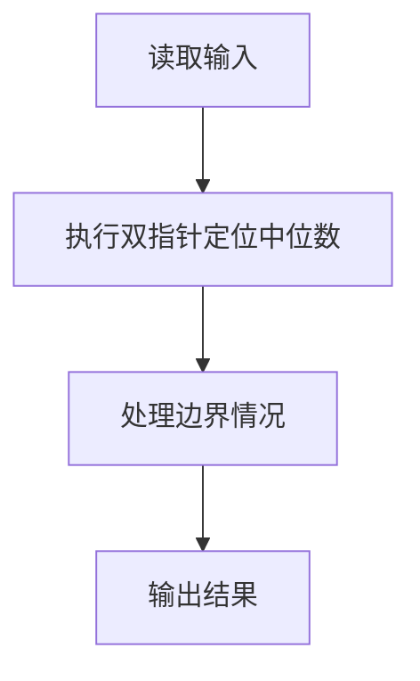
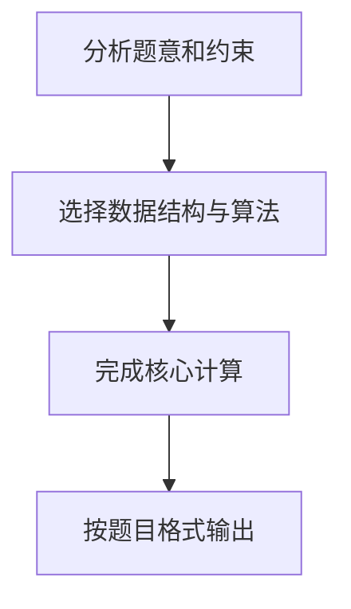

## 7-53 两个有序序列的中位数

- **分值：** 25分

## 题目描述

已知有两个等长的非降序序列S1, S2, 设计函数求S1与S2并集的中位数。有序序列A_0, A_1, \cdots, A_{N-1}的中位数指A_{(N-1)/2}的值,即第\lfloor(N+1)/2\rfloor个数（A_0为第1个数）。

## 输入格式

输入分三行。第一行给出序列的公共长度N（0<N\le100000），随后每行输入一个序列的信息，即N个非降序排列的整数。数字用空格间隔。

## 输出格式

在一行中输出两个输入序列的并集序列的中位数。

## 输入样例1
```
5
1 3 5 7 9
2 3 4 5 6
```

## 输出样例1
```
4
```

## 输入样例2
```
6
-100 -10 1 1 1 1
-50 0 2 3 4 5
```

## 输出样例2
```
1
```

## 样例说明

## 样例 1 分析

- S1 = [1, 3, 5, 7, 9]
- S2 = [2, 3, 4, 5, 6]
- 并集排序后：[1, 2, 3, 3, 4, 5, 5, 6, 7, 9]
- 总长度 N = 10，中位数位置为第 ⌊(10+1)/2⌋ = 5 个数（从 1 开始计数）
- 第 5 个数是 **4**

## 样例 2 分析

- S1 = [-100, -10, 1, 1, 1, 1]
- S2 = [-50, 0, 2, 3, 4, 5]
- 并集排序后：[-100, -50, -10, 0, 1, 1, 1, 1, 2, 3, 4, 5]
- 总长度 N = 12，中位数位置为第 ⌊(12+1)/2⌋ = 6 个数（从 1 开始计数）
- 第 6 个数是 **1**

## 解题思路

本题采用双指针定位中位数，围绕题目给出的数据结构和约束完成核心计算，并处理边界情况。

## 代码流程说明

1. 读取题目规定的输入数据。
2. 使用双指针定位中位数完成主要处理。
3. 处理边界情况并整理结果。
4. 按指定格式输出结果。

## 代码实现


```javascript
const fs = require("fs");
const raw = fs.readFileSync(0, "utf8");
const tokens = raw.trim() ? raw.trim().split(/\s+/) : [];
let at = 0;

// 两个等长有序序列合并后的第 N 个元素就是中位数（下标 N-1）。
const n = Number(tokens[at++]),
  a = Array.from({ length: n }, () => Number(tokens[at++])),
  b = Array.from({ length: n }, () => Number(tokens[at++]));
let i = 0,
  j = 0,
  value = 0;
for (let count = 0; count < n; count++)
  value = i < n && (j >= n || a[i] <= b[j]) ? a[i++] : b[j++];
console.log(value.toString());
```

## 代码流程图



## 解题流程图


