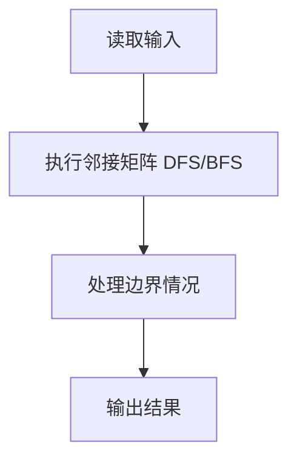
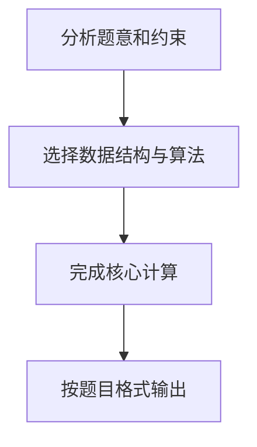

# 7-6 列出连通集

## 题目描述

给定一个有 **n** 个顶点和 **m** 条边的无向图，请用深度优先遍历（DFS）和广度优先遍历（BFS）分别列出其所有的连通集。假设顶点从 0 到 n−1 编号。进行搜索时，假设我们总是从编号最小的顶点出发，按编号递增的顺序访问邻接点。

## 输入格式

输入第 1 行给出 2 个整数 **n**（0 < n ≤ 10）和 **m**，分别是图的顶点数和边数。随后 m 行，每行给出一条边的两个端点。每行中的数字之间用 1 个空格分隔。

## 输出格式

按照 `{ v₁ v₂ ... vₖ }` 的格式，每行输出一个连通集。先输出 DFS 的结果，再输出 BFS 的结果。

## 输入样例

```
8 6
0 7
0 1
2 0
4 1
2 4
3 5
```

## 输出样例

```
{ 0 1 4 2 7 }
{ 3 5 }
{ 6 }
{ 0 1 2 7 4 }
{ 3 5 }
{ 6 }
```

## 解题思路

本题采用邻接矩阵 DFS/BFS，围绕题目给出的数据结构和约束完成核心计算，并处理边界情况。

## 代码流程说明

1. 读取题目规定的输入数据。
2. 使用邻接矩阵 DFS/BFS完成主要处理。
3. 处理边界情况并整理结果。
4. 按指定格式输出结果。

## 代码实现


```c
/*
 * 实现过程：
 * 本题要求对一个无向图分别用DFS和BFS列出所有连通集。
 *
 * 数据结构：
 * - 邻接矩阵 graph[N][N] 存储边，1=有边，0=无边。
 * - visited[] 数组标记顶点是否已访问。
 *
 * DFS连通集（递归）：
 * 1. 从编号0到n-1依次检查每个顶点，若未访问则发现新连通分量。
 * 2. 对新连通分量从该顶点开始递归DFS：标记已访问→输出→按编号递增顺序访问邻接顶点。
 * 3. 递归自然保证了深度优先的访问顺序。
 *
 * BFS连通集（队列）：
 * 1. 从编号0到n-1依次检查每个顶点，若未访问则发现新连通分量。
 * 2. 对新连通分量从该顶点开始BFS：入队→循环出队→输出→将未访问的邻接顶点入队。
 * 3. 队列保证了广度优先的层次访问顺序。
 *
 * 关键点：
 * - 遍历邻接顶点时必须按编号递增顺序，保证输出有序。
 * - BFS中顶点入队时就标记已访问，避免重复入队。
 * - 每次遍历完一个连通分量后输出花括号包裹的结果。
 */

#include <stdio.h>   // 标准输入输出库
#include <stdlib.h>  // 标准库（含内存操作）

#define MAXN 10       // 顶点数最大为10

int graph[MAXN][MAXN]; // 邻接矩阵，存储图的边信息
int visited[MAXN];     // 访问标记数组，0=未访问，1=已访问
int n, m;              // n=顶点数，m=边数
int first;             // 用于控制输出格式，标记是否为连通集的第一个元素

// 深度优先遍历（递归实现）
void dfs(int v) {
    visited[v] = 1;             // 标记当前顶点为已访问
    if (!first) {               // 如果不是第一个输出的元素
        printf(" ");            // 先输出一个空格分隔
    }
    printf("%d", v);            // 输出当前顶点编号
    first = 0;                  // 之后不再是第一个元素
    for (int i = 0; i < n; i++) { // 按编号递增顺序遍历所有顶点
        if (graph[v][i] && !visited[i]) { // 如果v到i有边且i未被访问
            dfs(i);             // 递归深度优先遍历i
        }
    }
}

// 广度优先遍历（队列实现）
void bfs(int start) {
    int queue[MAXN];            // 用数组模拟队列
    int front = 0, rear = 0;   // front=队首指针，rear=队尾指针
    visited[start] = 1;         // 标记起始顶点为已访问
    queue[rear++] = start;      // 起始顶点入队，rear后移

    while (front < rear) {      // 队列非空时持续处理
        int v = queue[front++]; // 队首元素出队，front后移
        if (!first) {           // 如果不是第一个输出的元素
            printf(" ");        // 先输出一个空格分隔
        }
        printf("%d", v);        // 输出当前顶点编号
        first = 0;              // 之后不再是第一个元素
        for (int i = 0; i < n; i++) { // 按编号递增顺序遍历所有顶点
            if (graph[v][i] && !visited[i]) { // 如果v到i有边且i未被访问
                visited[i] = 1;     // 标记i为已访问
                queue[rear++] = i;  // i入队，rear后移
            }
        }
    }
}

int main() {
    scanf("%d %d", &n, &m);     // 读入顶点数n和边数m

    // 初始化邻接矩阵
    for (int i = 0; i < n; i++) {     // 遍历所有行
        for (int j = 0; j < n; j++) { // 遍历所有列
            graph[i][j] = 0;          // 初始化为0，表示无边
        }
    }

    // 读入m条边
    for (int i = 0; i < m; i++) { // 循环m次
        int u, v;                 // 边的两个端点
        scanf("%d %d", &u, &v);   // 读入两个端点
        graph[u][v] = graph[v][u] = 1; // 无向图，设置双向边
    }

    // DFS 连通集
    for (int i = 0; i < n; i++) visited[i] = 0; // 重置访问标记数组
    for (int i = 0; i < n; i++) {   // 按编号从小到大的顺序检查每个顶点
        if (!visited[i]) {          // 如果顶点i未被访问，说明发现新连通分量
            printf("{ ");           // 输出左花括号
            first = 1;              // 标记为第一个元素
            dfs(i);                 // 从i开始深度优先遍历
            printf(" }\n");         // 输出右花括号并换行
        }
    }

    // BFS 连通集
    for (int i = 0; i < n; i++) visited[i] = 0; // 重置访问标记数组
    for (int i = 0; i < n; i++) {   // 按编号从小到大的顺序检查每个顶点
        if (!visited[i]) {          // 如果顶点i未被访问，说明发现新连通分量
            printf("{ ");           // 输出左花括号
            first = 1;              // 标记为第一个元素
            bfs(i);                 // 从i开始广度优先遍历
            printf(" }\n");         // 输出右花括号并换行
        }
    }

    return 0;                       // 程序正常结束
}
```

## 代码流程图



## 解题流程图


