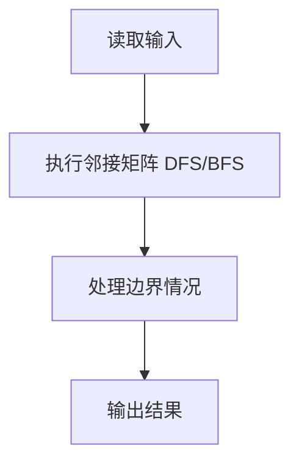
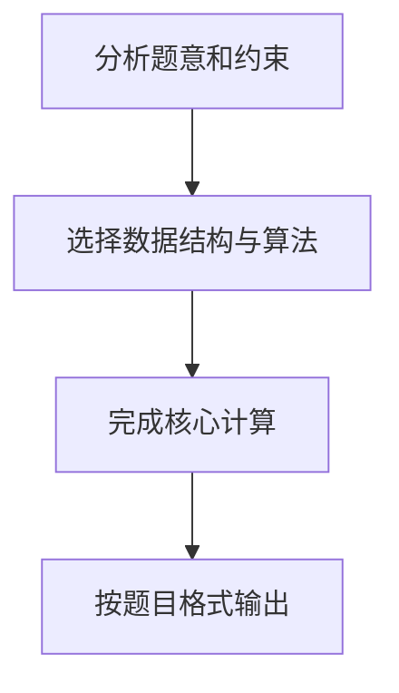

## 7-6 列出连通集

- **分值：** 25分

## 题目描述

给定一个有 n 个顶点和 m 条边的无向图，请用深度优先遍历（DFS）和广度优先遍历（BFS）分别列出其所有的连通集。假设顶点从 0 到 n-1 编号。进行搜索时，假设我们总是从编号最小的顶点出发，按编号递增的顺序访问邻接点。

## 输入格式

输入第 1 行给出 2 个整数 n (0<n\le 10) 和 m，分别是图的顶点数和边数。随后 m 行，每行给出一条边的两个端点。每行中的数字之间用 1 空格分隔。

## 输出格式

按照"{ v_1 v_2 ... v_k }"的格式，每行输出一个连通集。先输出 DFS 的结果，再输出 BFS 的结果。

## 输入样例
```
8 6
0 7
0 1
2 0
4 1
2 4
3 5
```

## 输出样例
```
{ 0 1 4 2 7 }
{ 3 5 }
{ 6 }
{ 0 1 2 7 4 }
{ 3 5 }
{ 6 }
```

## 解题思路

本题采用邻接矩阵 DFS/BFS，围绕题目给出的数据结构和约束完成核心计算，并处理边界情况。

## 代码流程说明

1. 读取题目规定的输入数据。
2. 使用邻接矩阵 DFS/BFS完成主要处理。
3. 处理边界情况并整理结果。
4. 按指定格式输出结果。

## 代码实现


```javascript
const fs = require("fs");
const raw = fs.readFileSync(0, "utf8");
const tokens = raw.trim() ? raw.trim().split(/\s+/) : [];
let at = 0;

// 邻接表配合 DFS、BFS 分别列出每个连通分量。
const n = Number(tokens[at++]),
  m = Number(tokens[at++]);
const graph = Array.from({ length: n }, () => []);
for (let i = 0; i < m; i++) {
  const u = Number(tokens[at++]),
    v = Number(tokens[at++]);
  graph[u].push(v);
  graph[v].push(u);
}
graph.forEach((list) => list.sort((a, b) => a - b));
const seen = Array(n).fill(false),
  out = [];
for (let start = 0; start < n; start++)
  if (!seen[start]) {
    const part = [];
    (function dfs(u) {
      seen[u] = true;
      part.push(u);
      for (const v of graph[u]) if (!seen[v]) dfs(v);
    })(start);
    out.push(`{ ${part.join(" ")} }`);
  }
seen.fill(false);
for (let start = 0; start < n; start++)
  if (!seen[start]) {
    const queue = [start],
      part = [];
    seen[start] = true;
    for (let head = 0; head < queue.length; head++) {
      const u = queue[head];
      part.push(u);
      for (const v of graph[u])
        if (!seen[v]) {
          seen[v] = true;
          queue.push(v);
        }
    }
    out.push(`{ ${part.join(" ")} }`);
  }
console.log(out.join("\n"));
```

## 代码流程图



## 解题流程图


