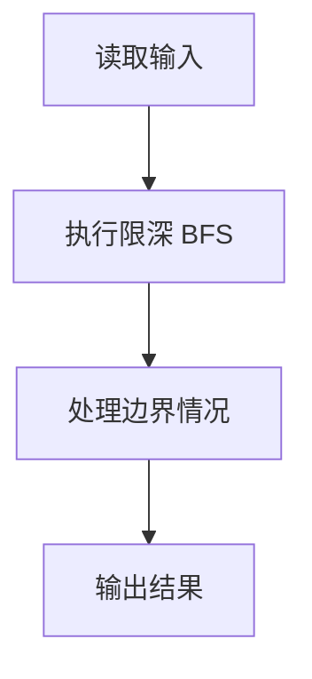
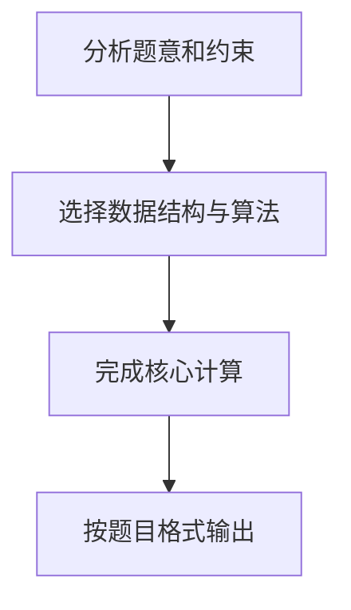

## 7-7 六度空间

- **分值：** 30分

## 题目描述

“六度空间”理论又称作“六度分隔（Six Degrees of Separation）”理论。这个理论可以通俗地阐述为：“你和任何一个陌生人之间所间隔的人不会超过六个，也就是说，最多通过五个人你就能够认识任何一个陌生人。”如图1所示。

<center>
<br>
图1  六度空间示意图</center>

“六度空间”理论虽然得到广泛的认同，并且正在得到越来越多的应用。但是数十年来，试图验证这个理论始终是许多社会学家努力追求的目标。然而由于历史的原因，这样的研究具有太大的局限性和困难。随着当代人的联络主要依赖于电话、短信、微信以及因特网上即时通信等工具，能够体现社交网络关系的一手数据已经逐渐使得“六度空间”理论的验证成为可能。

假如给你一个社交网络图，请你对每个节点计算符合“六度空间”理论的结点占结点总数的百分比。

## 输入格式

输入第1行给出两个正整数，分别表示社交网络图的结点数N（1<N\le 10^3，表示人数）、边数M（\le 33\times N，表示社交关系数）。随后的M行对应M条边，每行给出一对正整数，分别是该条边直接连通的两个结点的编号（节点从1到N编号）。

## 输出格式

对每个结点输出与该结点距离不超过6的结点数占结点总数的百分比，精确到小数点后2位。每个结节点输出一行，格式为“结点编号:（空格）百分比%”。

## 输入样例
```
10 9
1 2
2 3
3 4
4 5
5 6
6 7
7 8
8 9
9 10
```

## 输出样例
```
1: 70.00%
2: 80.00%
3: 90.00%
4: 100.00%
5: 100.00%
6: 100.00%
7: 100.00%
8: 90.00%
9: 80.00%
10: 70.00%
```

## 解题思路

本题采用限深 BFS，围绕题目给出的数据结构和约束完成核心计算，并处理边界情况。

## 代码流程说明

1. 读取题目规定的输入数据。
2. 使用限深 BFS完成主要处理。
3. 处理边界情况并整理结果。
4. 按指定格式输出结果。

## 代码实现


```c
/*
 * 实现过程：
 * 本题要求对每个结点计算与其距离不超过6的结点数占总数的百分比。
 *
 * 算法：对每个结点进行BFS，限制搜索深度为6。
 *
 * 数据结构：
 * - 邻接表（链表实现）：adj[i] 指向结点i的边链表头，适合稀疏图。
 * - visited[] 标记是否已访问，dist[] 记录到起点的距离。
 * - 数组模拟队列实现BFS。
 *
 * BFS过程（对每个结点start）：
 * 1. 初始化：起点入队，标记已访问，距离设0。
 * 2. 循环出队：每出队一个结点，count++。
 * 3. 若当前结点距离已达6，跳过其邻居（不再扩展）。
 * 4. 否则将未访问的邻居入队，标记已访问，距离=当前距离+1。
 * 5. 队列为空时BFS结束，count即为距离≤6的结点数。
 *
 * 输出：对每个结点输出 "编号: 百分比%"，百分比保留2位小数。
 *
 * 时间复杂度：O(N×(N+M))，空间复杂度：O(N+M)。
 *
 * 原题：7-7 六度空间
 * 对每个节点计算与其距离不超过6的结点数占结点总数的百分比。
 * N ≤ 10^3, M ≤ 33×N
 */

#include <stdio.h>              /* 标准输入输出：scanf, printf */
#include <stdlib.h>             /* 标准库：malloc, free */
#include <string.h>             /* 字符串操作：memset */

#define MAXN 1010               /* 最大结点数 */

/* 邻接表的边结点 */
typedef struct Edge {
    int to;                     /* 目标结点编号 */
    struct Edge *next;          /* 指向下一条边的指针 */
} Edge;

Edge *adj[MAXN];                /* 邻接表，adj[i] 表示结点i的边链表头 */
int visited[MAXN];              /* 访问标记数组，visited[i]==1 表示已访问 */
int dist[MAXN];                 /* 距离数组，dist[i] 记录结点i到起点的距离 */
int queue[MAXN];                /* BFS 使用的循环队列 */
int q_front, q_rear;            /* 队列的头指针和尾指针 */

/*
 * 添加一条无向边 u <-> v
 * 头插法将新边插入邻接表
 */
void add_edge(int u, int v) {
    Edge *e = (Edge *)malloc(sizeof(Edge)); /* 为新边分配内存 */
    e->to = v;                              /* 设置目标结点 */
    e->next = adj[u];                       /* 新边指向当前链表的第一个结点 */
    adj[u] = e;                             /* 更新链表头为新边 */
}

/*
 * 从 start 出发进行 BFS，返回距离 ≤ 6 的结点数（含自身）
 */
int bfs(int start) {
    int count = 0;                          /* count：记录可到达的结点数 */

    memset(visited, 0, sizeof(visited));    /* 重置访问标记数组，全部置0 */

    q_front = q_rear = 0;                   /* 初始化队列为空 */
    queue[q_rear++] = start;                /* 起点入队 */
    visited[start] = 1;                     /* 标记起点已访问 */
    dist[start] = 0;                        /* 起点距离自身为0 */

    while (q_front < q_rear) {              /* 队列非空时继续 BFS */
        int u = queue[q_front++];           /* 队首出队 */
        count++;                            /* 当前结点计入可达结点数 */

        if (dist[u] == 6) continue;         /* 已达上限距离6，不再向外扩展 */

        Edge *p = adj[u];                   /* 遍历结点 u 的所有邻接边 */
        while (p) {                         /* 邻接链表未遍历完 */
            int v = p->to;                  /* 获取邻居结点编号 */
            if (!visited[v]) {              /* 若该邻居未被访问过 */
                visited[v] = 1;             /* 标记为已访问 */
                dist[v] = dist[u] + 1;      /* 记录邻居到起点的距离 */
                queue[q_rear++] = v;        /* 邻居入队 */
            }
            p = p->next;                    /* 继续遍历下一条边 */
        }
    }
    return count;                           /* 返回距离≤6的结点总数 */
}

int main() {
    int N, M, i, u, v;                      /* N:结点数 M:边数 i:循环变量 u,v:边的两端 */

    scanf("%d %d", &N, &M);                 /* 读取结点数和边数 */

    /* 建图：读取M条边，构建无向图的邻接表 */
    for (i = 0; i < M; i++) {               /* 循环读取每一条边 */
        scanf("%d %d", &u, &v);             /* 读取边的两个端点 */
        add_edge(u, v);                     /* 添加无向边 u→v */
        add_edge(v, u);                     /* 添加无向边 v→u（对称） */
    }

    /* 对每个结点进行BFS并输出百分比 */
    for (i = 1; i <= N; i++) {              /* 遍历所有结点，编号从1开始 */
        int cnt = bfs(i);                   /* 从结点i出发BFS，得到可达结点数 */
        double pct = 100.0 * cnt / N;       /* 计算百分比 */
        printf("%d: %.2f%%\n", i, pct);     /* 输出格式：编号: 百分比% */
    }

    /* 释放邻接表占用的内存 */
    for (i = 1; i <= N; i++) {              /* 遍历每个结点的边链表 */
        Edge *p = adj[i];                   /* 取得链表头 */
        while (p) {                         /* 链表非空 */
            Edge *tmp = p;                  /* 暂存当前结点 */
            p = p->next;                    /* 移动到下一个结点 */
            free(tmp);                      /* 释放当前结点内存 */
        }
    }

    return 0;                               /* 程序正常结束 */
}
```

## 代码流程图



## 解题流程图


