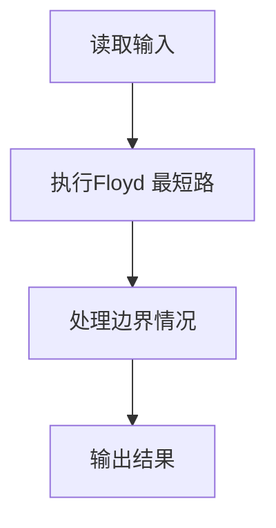
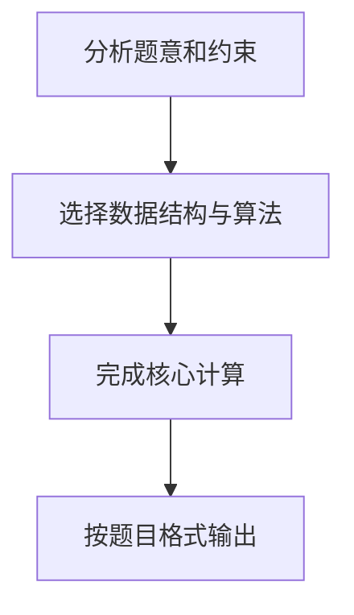

哈利·波特要考试了，他需要你的帮助。这门课学的是用魔咒将一种动物变成另一种动物的本事。例如将猫变成老鼠的魔咒是 haha，将老鼠变成鱼的魔咒是 hehe 等等。反方向变化的魔咒就是简单地将原来的魔咒倒过来念，例如 ahah 可以将老鼠变成猫。另外，如果想把猫变成鱼，可以通过念一个直接魔咒 lalala，也可以将猫变老鼠、老鼠变鱼的魔咒连起来念：hahahehe。

现在哈利·波特的手里有一本教材，里面列出了所有的变形魔咒和能变的动物。老师允许他自己带一只动物去考场，要考察他把这只动物变成任意一只指定动物的本事。于是他来问你：带什么动物去可以让最难变的那种动物（即该动物变为哈利·波特自己带去的动物所需要的魔咒最长）需要的魔咒最短？例如：如果只有猫、鼠、鱼，则显然哈利·波特应该带鼠去，因为鼠变成另外两种动物都只需要念 4 个字符；而如果带猫去，则至少需要念 6 个字符才能把猫变成鱼；同理，带鱼去也不是最好的选择。

输入格式:
输入说明：输入第 1 行给出两个正整数 n (≤100)和 m，其中 n 是考试涉及的动物总数，m 是用于直接变形的魔咒条数。为简单起见，我们将动物按 1~$$n编号。随后m行，每行给出了3个正整数，分别是两种动物的编号、以及它们之间变形需要的魔咒的长度(\le 100$$)，数字之间用空格分隔。

输出格式:
输出哈利·波特应该带去考场的动物的编号、以及最长的变形魔咒的长度，中间以空格分隔。如果只带1只动物是不可能完成所有变形要求的，则输出 0。如果有若干只动物都可以备选，则输出编号最小的那只。

输入样例:
```in
6 11
3 4 70
1 2 1
5 4 50
2 6 50
5 6 60
1 3 70
4 6 60
3 6 80
5 1 100
2 4 60
5 2 80
```

输出样例:
```out
4 70
```

## 解题思路

本题采用Floyd 最短路，围绕题目给出的数据结构和约束完成核心计算，并处理边界情况。

## 代码流程说明

1. 读取题目规定的输入数据。
2. 使用Floyd 最短路完成主要处理。
3. 处理边界情况并整理结果。
4. 按指定格式输出结果。

## 代码实现


```c
/*
 * 实现过程：
 * 本题要求找出一个动物，使得从该动物变到其他所有动物中最难变的那个（最大最短距离）
 * 在所有动物中最小。即求"最小化最大最短距离"的动物。
 *
 * 算法：Floyd-Warshall 全源最短路径 + 枚举选最优。
 *
 * 数据结构：
 * - dist[N][N] 距离矩阵，dist[i][j] 表示动物i变到动物j的最短咒语长度。
 * - 初始化：对角线为0，其余为INF（不可达）。
 *
 * 步骤：
 * 1. 读入n个动物、m条魔咒（无向边），构建距离矩阵（重边取最小值）。
 * 2. Floyd-Warshall：三重循环，以k为中间节点，尝试通过k中转缩短i到j的距离。
 *    状态转移：dist[i][j] = min(dist[i][j], dist[i][k] + dist[k][j])。
 * 3. 枚举每个动物i，计算从i出发到所有其他动物的最大最短距离cur_max。
 *    若存在不可达的动物（dist[i][j] >= INF），则i不合法。
 * 4. 在所有合法动物中，选取cur_max最小的那个作为答案。
 * 5. 若无合法动物（图不连通），输出0；否则输出动物编号和最大距离。
 *
 * 时间复杂度：O(N^3)，空间复杂度：O(N^2)。
 */

#include <stdio.h>   // 标准输入输出库
#include <string.h>  // 字符串处理库

#define N 105          // 最大顶点数（动物数量上限）
#define INF 0x3f3f3f3f // 无穷大，表示不可达（约为 1e9）

int dist[N][N];        // 全局距离矩阵，dist[i][j] 表示从动物 i 到动物 j 的最短咒语长度

int main() {
    int n, m;                            // n: 动物数量, m: 魔咒（边）数量
    scanf("%d %d", &n, &m);              // 读入 n 和 m

    // 初始化距离矩阵：自己到自己的距离为 0，其余为 INF（不可达）
    for (int i = 1; i <= n; i++) {
        for (int j = 1; j <= n; j++) {
            dist[i][j] = (i == j) ? 0 : INF;
        }
    }

    // 读入 m 条边（魔咒），无向图，取最小边权
    for (int i = 0; i < m; i++) {
        int a, b, w;
        scanf("%d %d %d", &a, &b, &w);   // 读入两个动物编号和魔咒长度
        if (w < dist[a][b]) {            // 如果有重边，保留最短的那条
            dist[a][b] = w;              // 设置 a 到 b 的距离
            dist[b][a] = w;              // 无向图，b 到 a 同样距离
        }
    }

    // Floyd-Warshall 算法：求所有顶点对之间的最短路径
    // k 为中间节点，尝试通过 k 来缩短 i 到 j 的距离
    for (int k = 1; k <= n; k++) {
        for (int i = 1; i <= n; i++) {
            for (int j = 1; j <= n; j++) {
                if (dist[i][k] < INF && dist[k][j] < INF) {  // 防止溢出：两条路径都可达才相加
                    int new_dist = dist[i][k] + dist[k][j];   // 经过 k 中转的新距离
                    if (new_dist < dist[i][j]) {              // 如果更短则更新
                        dist[i][j] = new_dist;
                    }
                }
            }
        }
    }

    int best_animal = 0;   // 最优动物编号，0 表示无解
    int best_max = INF;    // 最优动物对应的最难变（最大最短距离）的最小值

    // 枚举每个动物作为起点
    for (int i = 1; i <= n; i++) {
        int cur_max = 0;   // 从动物 i 出发，到其他动物的最大最短距离
        int ok = 1;        // 标记：从动物 i 出发是否能到达所有其他动物
        for (int j = 1; j <= n; j++) {
            if (dist[i][j] > cur_max) {
                cur_max = dist[i][j];     // 更新最大距离
            }
            if (dist[i][j] >= INF) {      // 存在不可达的动物，该起点不合法
                ok = 0;
                break;
            }
        }
        // 如果从动物 i 能到达所有动物，且最大距离更小，则更新最优解
        if (ok && cur_max < best_max) {
            best_max = cur_max;
            best_animal = i;
        }
    }

    // 输出结果
    if (best_animal == 0) {
        printf("0\n");                    // 图不连通，没有动物能变出所有动物
    } else {
        printf("%d %d\n", best_animal, best_max);  // 输出最优动物编号和最难变的距离
    }

    return 0;  // 程序正常结束
}
```

## 代码流程图



## 解题流程图


