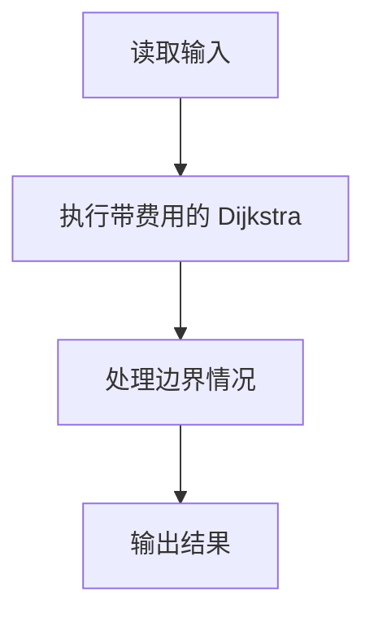
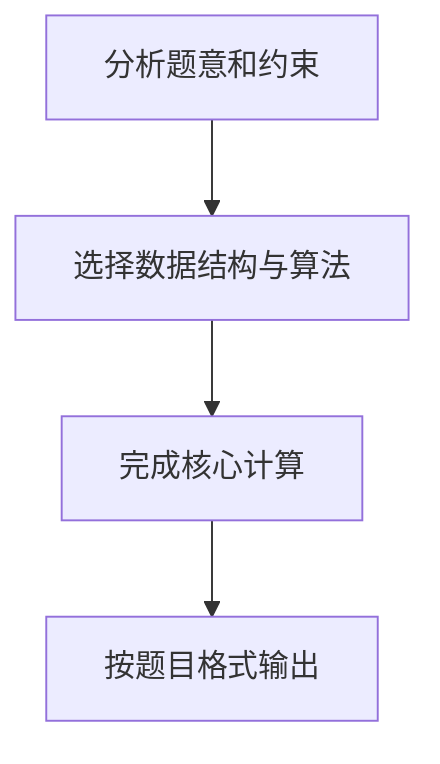

## 7-9 旅游规划

- **分值：** 25分

## 题目描述

有了一张自驾旅游路线图，你会知道城市间的高速公路长度、以及该公路要收取的过路费。现在需要你写一个程序，帮助前来咨询的游客找一条出发地和目的地之间的最短路径。如果有若干条路径都是最短的，那么需要输出最便宜的一条路径。

## 输入格式

输入说明：输入数据的第 1 行给出 4 个正整数 n、m、s、d，其中 n（2\le n\le 500）是城市的个数，顺便假设城市的编号为 0~(n-1)；m 是高速公路的条数；s 是出发地的城市编号；d 是目的地的城市编号。随后的 m 行中，每行给出一条高速公路的信息，分别是：城市 1、城市 2、高速公路长度、收费额，中间用空格分开，数字均为整数且不超过 500。输入保证解的存在。

## 输出格式

在一行里输出路径的长度和收费总额，数字间以空格分隔，输出结尾不能有多余空格。

## 输入样例
```
4 5 0 3
0 1 1 20
1 3 2 30
0 3 4 10
0 2 2 20
2 3 1 20
```

## 输出样例
```
3 40
```

## 解题思路

本题采用带费用的 Dijkstra，围绕题目给出的数据结构和约束完成核心计算，并处理边界情况。

## 代码流程说明

1. 读取题目规定的输入数据。
2. 使用带费用的 Dijkstra完成主要处理。
3. 处理边界情况并整理结果。
4. 按指定格式输出结果。

## 代码实现


```javascript
const fs = require("fs");
const raw = fs.readFileSync(0, "utf8");
const tokens = raw.trim() ? raw.trim().split(/\s+/) : [];
let at = 0;

// Dijkstra 的状态同时维护距离和费用；距离相等时保留费用更低的路径。
const [n, m, s, target] = [
  Number(tokens[at++]),
  Number(tokens[at++]),
  Number(tokens[at++]),
  Number(tokens[at++]),
];
const graph = Array.from({ length: n }, () => []);
for (let i = 0; i < m; i++) {
  const u = Number(tokens[at++]),
    v = Number(tokens[at++]),
    d = Number(tokens[at++]),
    c = Number(tokens[at++]);
  graph[u].push([v, d, c]);
  graph[v].push([u, d, c]);
}
const dist = Array(n).fill(Infinity),
  cost = Array(n).fill(Infinity),
  used = Array(n).fill(false);
dist[s] = 0;
cost[s] = 0;
for (let round = 0; round < n; round++) {
  let u = -1;
  for (let i = 0; i < n; i++)
    if (!used[i] && (u < 0 || dist[i] < dist[u])) u = i;
  if (u < 0) break;
  used[u] = true;
  for (const [v, d, c] of graph[u])
    if (
      dist[u] + d < dist[v] ||
      (dist[u] + d === dist[v] && cost[u] + c < cost[v])
    ) {
      dist[v] = dist[u] + d;
      cost[v] = cost[u] + c;
    }
}
console.log(`${dist[target]} ${cost[target]}`);
```

## 代码流程图



## 解题流程图


