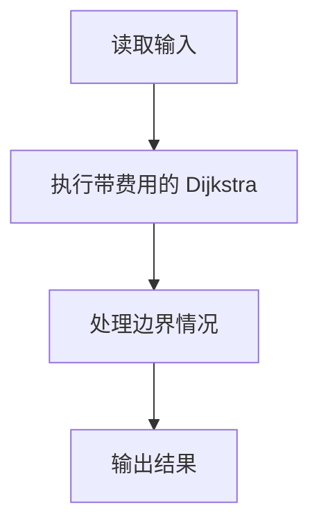
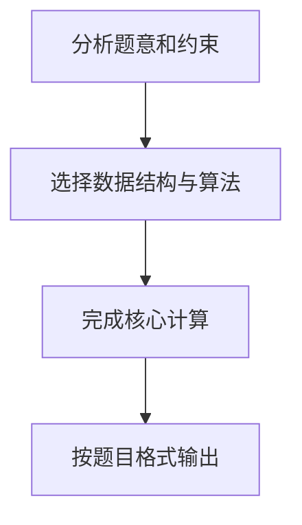

## 7-9 旅游规划

- **分值：** 25分

## 题目描述

有了一张自驾旅游路线图，你会知道城市间的高速公路长度、以及该公路要收取的过路费。现在需要你写一个程序，帮助前来咨询的游客找一条出发地和目的地之间的最短路径。如果有若干条路径都是最短的，那么需要输出最便宜的一条路径。

## 输入格式

输入说明：输入数据的第 1 行给出 4 个正整数 n、m、s、d，其中 n（2\le n\le 500）是城市的个数，顺便假设城市的编号为 0~(n-1)；m 是高速公路的条数；s 是出发地的城市编号；d 是目的地的城市编号。随后的 m 行中，每行给出一条高速公路的信息，分别是：城市 1、城市 2、高速公路长度、收费额，中间用空格分开，数字均为整数且不超过 500。输入保证解的存在。

## 输出格式

在一行里输出路径的长度和收费总额，数字间以空格分隔，输出结尾不能有多余空格。

## 输入样例
```
4 5 0 3
0 1 1 20
1 3 2 30
0 3 4 10
0 2 2 20
2 3 1 20
```

## 输出样例
```
3 40
```

## 解题思路

本题采用带费用的 Dijkstra，围绕题目给出的数据结构和约束完成核心计算，并处理边界情况。

## 代码流程说明

1. 读取题目规定的输入数据。
2. 使用带费用的 Dijkstra完成主要处理。
3. 处理边界情况并整理结果。
4. 按指定格式输出结果。

## 代码实现


```c
/*
 * 实现过程：
 * 本题要求从起点城市到终点城市的最短路径，若有多条则选收费最少的。
 * 即双关键字最短路：第一关键字为距离，第二关键字为收费。
 *
 * 算法：Dijkstra（朴素版，邻接矩阵）。
 *
 * 数据结构：
 * - graph_len[i][j] / graph_cost[i][j]：邻接矩阵，存储城市间公路长度和收费。
 * - dist_len[i] / dist_cost[i]：从起点到城市i的最短距离和对应最小收费。
 * - visited[i]：标记城市i是否已确定最短路径。
 *
 * 步骤：
 * 1. 读入城市数n、公路数m、起点s、终点d，构建邻接矩阵（重边取距离短或距离同收费低的）。
 * 2. 初始化dist数组为起点到各城市的直接距离和收费，标记起点已访问。
 * 3. Dijkstra主循环（重复n次）：
 *    a. 从未访问城市中选出dist_len最小的城市u。
 *    b. 标记u为已访问。
 *    c. 松弛：对每个未访问的邻接城市v，
 *       若经过u到v距离更短，则更新dist_len[v]和dist_cost[v]；
 *       若距离相同但收费更低，则仅更新dist_cost[v]。
 * 4. 输出dist_len[d]和dist_cost[d]。
 *
 * 时间复杂度：O(N^2)，空间复杂度：O(N^2)。
 */

#include <stdio.h>   // 标准输入输出库
#include <string.h>  // 字符串处理库（memset 等）

#define N 505          // 最大顶点数（城市数量上限）
#define INF 0x3f3f3f3f // 无穷大，表示不可达（约为 1e9）

int graph_len[N][N];   // 邻接矩阵：城市间公路的长度
int graph_cost[N][N];  // 邻接矩阵：城市间公路的收费
int dist_len[N];       // 从起点 s 到各城市的最短距离
int dist_cost[N];      // 从起点 s 到各城市的最小收费（在最短距离基础上）
int visited[N];        // 标记数组：记录顶点是否已确定最短路径

int main() {
    int n, m, s, d;                                     // n: 城市数, m: 公路数, s: 起点, d: 终点
    scanf("%d %d %d %d", &n, &m, &s, &d);                // 读入四个参数

    // 初始化邻接矩阵：自己到自己距离/收费为 0，其余为 INF（不可达）
    for (int i = 0; i < n; i++) {
        for (int j = 0; j < n; j++) {
            graph_len[i][j] = (i == j) ? 0 : INF;
            graph_cost[i][j] = (i == j) ? 0 : INF;
        }
    }

    // 读入 m 条公路，无向图
    for (int i = 0; i < m; i++) {
        int a, b, len, cost;
        scanf("%d %d %d %d", &a, &b, &len, &cost);       // 读入两个城市、公路长度和收费
        // 如果有重边：距离更短 或 距离相同但收费更低，则更新
        if (len < graph_len[a][b] ||
            (len == graph_len[a][b] && cost < graph_cost[a][b])) {
            graph_len[a][b] = len;                       // 设置 a 到 b 的距离
            graph_len[b][a] = len;                       // 无向图，对称设置
            graph_cost[a][b] = cost;                     // 设置 a 到 b 的收费
            graph_cost[b][a] = cost;                     // 无向图，对称设置
        }
    }

    // 初始化 dist 数组为起点 s 到各点的直接距离和收费
    for (int i = 0; i < n; i++) {
        dist_len[i] = graph_len[s][i];                   // 初始距离 = 从 s 直接到 i 的距离
        dist_cost[i] = graph_cost[s][i];                 // 初始收费 = 从 s 直接到 i 的收费
    }
    memset(visited, 0, sizeof(visited));                 // 全部标记为未访问
    visited[s] = 1;                                      // 起点已确定最短路径

    // Dijkstra 算法主循环：每次确定一个未访问的最近顶点
    for (int i = 0; i < n; i++) {
        int u = -1;                                      // 本轮选出的顶点，-1 表示未找到
        int min_len = INF;                               // 当前最小距离
        // 从未访问顶点中选出距离起点最近的顶点 u
        for (int j = 0; j < n; j++) {
            if (!visited[j] && dist_len[j] < min_len) {
                min_len = dist_len[j];
                u = j;
            }
        }
        if (u == -1) break;                              // 所有可达顶点已处理完，提前退出
        visited[u] = 1;                                  // 标记 u 为已确定

        // 松弛操作：尝试通过 u 更新其他未访问顶点
        for (int v = 0; v < n; v++) {
            if (!visited[v] && graph_len[u][v] < INF) {  // v 未访问且 u-v 有边
                int new_len = dist_len[u] + graph_len[u][v];   // 经过 u 到 v 的新距离
                int new_cost = dist_cost[u] + graph_cost[u][v]; // 经过 u 到 v 的新收费
                if (new_len < dist_len[v]) {                   // 新距离更短，更新
                    dist_len[v] = new_len;
                    dist_cost[v] = new_cost;
                } else if (new_len == dist_len[v] && new_cost < dist_cost[v]) {
                    dist_cost[v] = new_cost;                   // 距离相同但收费更低，更新收费
                }
            }
        }
    }

    // 输出从起点 s 到终点 d 的最短距离和最小收费
    printf("%d %d\n", dist_len[d], dist_cost[d]);
    return 0;  // 程序正常结束
}
```

## 代码流程图



## 解题流程图


